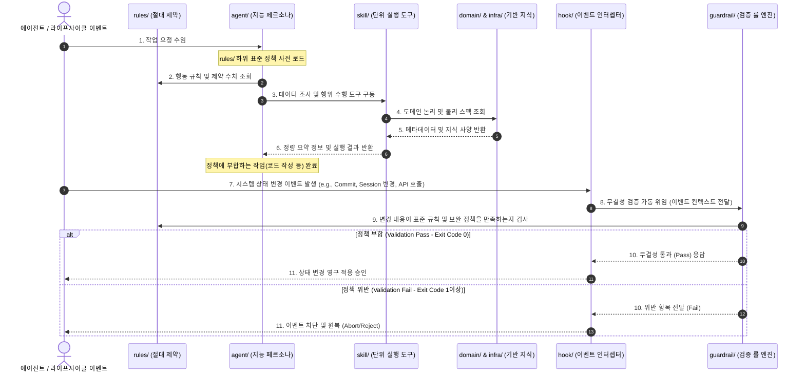

# GEMINI.md (인텔리전스 레이어 구조 및 관리 규정)

이 문서는 `intelligence/` (인텔리전스 및 에이전트 확장 레이어) 하위의 각 폴더별 역할 경계(Boundary), 상호 관계, 그리고 **스킬(SKILL)**, **가드레일(GUARDRAIL)**, **워크플로우(WORKFLOW)**, **훅(HOOK)** 폴더의 운영 규정을 정의하는 인텔리전스 전용 단일 진실 공급원(SSOT) 표준입니다.

루트 디렉터리의 [GEMINI.md](GEMINI.md)가 시스템 전체의 '행동 제약 및 대원칙'을 담당한다면, 본 문서는 **인텔리전스 레이어 내부의 데이터 흐름 및 폴더 구조를 통제하는 기술 명세**를 담당합니다.

---

## 1. 핵심 폴더별 정의 및 경계 (Boundary)

`intelligence/` 하위 폴더는 아래와 같이 소프트웨어 공학의 범용적 역할(추상화 레벨 및 책임 대상)에 따라 엄격히 격리되어 운영되어야 합니다. 특정 도구나 업무에 종속되지 않는 고수준 추상 설계를 통하여 폴더 간 내용 중첩 및 파편화를 원천 차단합니다.

| 폴더명 | 범용 패러다임 정의 (Role) | 주요 포함 내용 | 위반 제약 (Constraints) |
| :--- | :--- | :--- | :--- |
| **`rules/`** | 표준 정책 및 행동 규칙 규정 (Standard Policies) | 반드시 지켜야 하는 코딩 규칙, 커밋 규정, SQL 작성 원칙 (Must/Shall) | 구체적인 구현 튜토리얼이나 방법론(How-to)을 적지 마라. 순수 규칙만 기술할 것. |
| **`guide/`** | 기술 지침 및 아키텍처 가이드라인 (Architecture Guides) | 규칙을 준수하기 위한 최적의 구현 예시, 기술 적용 절차, 개념 설계 구조 | 정적 검사기 및 룰 엔진 실물 코드는 이곳에 두지 마라. (→ `guardrail/`로 이관) |
| **`prd/`** | 요구 사양 및 유스케이스 정의서 (Product Specifications) | 서비스 기획 요구 조건, 데이터 요구 사항, 유스케이스 및 화면 인터페이스 설계 명세 | 임의의 프로덕션 코드나 모의 데이터를 직접 구성하지 마라. (기획 정립에 집중) |
| **`domain/`** | 비즈니스 도메인 지식 원장 (Domain Knowledge) | 비즈니스 도메인 핵심 지표, 업무 지식, 데이터 용어 사전, 산식 명세 및 규칙 | 특정 물리 인프라, 커넥션, SQL 문자열, 포트 등 하드웨어 사양을 적지 마라. (→ `infra/`로) |
| **`infra/`** | 시스템 및 물리 인프라 사양 (Physical Infrastructure) | DB 물리 커넥션, 플랫폼 연동 스펙, 외부 API 엔드포인트 프로토콜, 환경 설정 | 도메인 비즈니스 전처리 공식이나 논리 연산 정책을 적지 마라. (→ `domain/`로) |
| **`agent/`** | 에이전트 페르소나 및 지능 격리 영역 (Persona Base) | 에이전트 역할 정의, 지시문(Prompt), 레지스트리 메타데이터 (`agents_registry.json`) | 직접 실행 가능한 툴, API, 쉘 가동형 스크립트 등 실행 코드를 두지 마라. (→ `skill/`로) |
| **`skill/`** | 에이전트 단위 실행 도구 (Executable Tools) | 에이전트가 자율 구동하는 API 연동부, DB 탐색, 원격 제어, 유틸리티 파이썬 스크립트 | 특정 변경을 통제하거나 소스 및 정책을 검사하는 목적의 검증기를 두지 마라. (→ `guardrail/`로) |
| **`workflow/`** | 다단계 협업 파이프라인 (Execution Pipelines) | 목적 달성을 위한 에이전트 및 컴포넌트 간 선형/비선형 작업 실행 절차서 (Run-book) | 정적이고 단발적인 특정 모듈 개발 지침은 이곳에 적지 마라. (→ `guide/`로 이관) |
| **`guardrail/`** | 추상 정책 및 무결성 검증 룰 엔진 (Validation Rule Engine) | 코드 정적 검증, 스키마 정합성 판별, 비즈니스 산식 위반 및 AI 보안 가드레일 검사기 | 이벤트 기동(Git Hook 등록, API 인터셉터 매핑 등)부의 실물을 작성하지 마라. (→ `hook/`로) |
| **`hook/`** | 다차원 라이프사이클 이벤트 인터셉터 (Event Interceptors) | Git Event, 세션 변경, DB CRUD 트랜잭션, API 호출 전후 등의 라이프사이클 가로채기 | 세부적인 가드레일 검사 로직을 하드코딩하지 마라. (→ `guardrail/`을 구동/라우팅할 것) |
| **`evals/`** | 정량 평가 및 룰셋 매트릭 (Evaluation Metrics) | 시스템 결과물의 정확도 및 안정성을 판별하기 위한 정량적 채점 셋, 골든 세트 | 작업 실행 중에 발생하는 휘발성 실행 이력이나 단순 덤프를 적지 마라. (→ `runs/`로) |
| **`runs/`** | 자율 작업 이력 및 아티팩트 보관 (Run Artifacts) | 에이전트 동작 추적(Trace) 로그, 중간 산출물, 임시 디버깅 레포트 보관 영역 | 영구 유지되어야 하는 공통 아키텍처 설정이나 표준 규정을 담지 마라. |
| **`note/`** | AI 읽기 금지 구역 (Private User Space) | 사용자의 자율 메모, 분석 개인 스크래치북 | 에이전트는 어떠한 경우에도 이 폴더의 존재를 읽거나(view), 검색(grep)해선 안 됨. |

---

## 2. 인텔리전스 3대 아키텍처 계층화 (Hierarchical Layers)

`intelligence/` 내부의 핵심 폴더 및 리소스들은 역할과 책임을 기준으로 아래와 같은 **3대 아키텍처 계층**으로 완전히 분리되어 관리됩니다.

```
┌────────────────────────────────────────────────────────┐
│             3. 통제 및 품질 레이어 (Control)           │
│  [rules/] ◀── [guardrail/] ◀── [hook/] ◀── [evals/]    │
└───────────┬────────────────────────────────────────────┘
            │ 룰셋 규정 강제, 라이프사이클 검역 통제 및 정량 채점 평가
            ▼
┌────────────────────────────────────────────────────────┐
│             2. 지능 및 도구 레이어 (Execution)         │
│      - [agent/] : 100% 순수 에이전트 지능 (No-Code)    │
│      - [skill/] : 실행 가능한 모듈형 단위 도구 (Tool)  │
│      - [workflow/] : 다단계 실행 협업 프로세스 (Run-book)│
└───────────┬────────────────────────────────────────────┘
            │ 절차 가동 및 도구를 통한 맥락 지식 확인
            ▼
┌────────────────────────────────────────────────────────┐
│             1. 맥락 및 지식 레이어 (Context Base)      │
│      - [prd/] : 요구 사양 및 화면 설계 명세서 (PRD)    │
│      - [domain/] : 비즈니스 도메인 지식 원장 (SSOT)    │
│      - [infra/] : 물리 시스템/인프라/DB 연동 규격      │
└────────────────────────────────────────────────────────┘
```

### (1) 맥락 및 지식 레이어 (Context & Knowledge Base)
* **대상 서브폴더**: `prd/`, `domain/`, `infra/`
* **역할**: 에이전트와 소스 코드가 참조해야 하는 기획 요구 사양(`prd/`), 비즈니스 공식 및 핵심 지표 정의(`domain/`), DB 물리 명세 및 통신 설정(`infra/`) 등 **기반 지식**을 전담 보관합니다.
* **설계 규칙**: 정적 정보 보관 전용이며, 구현을 자동화하거나 실행/검사하는 코드 및 지침은 일체 배제됩니다.

### (2) 지능 및 도구 레이어 (Intelligence & Automation Engine)
* **대상 서브폴더**: `agent/`, `skill/`, `workflow/`
* **역할**: 두뇌를 담당하는 페르소나(`agent/`), 에이전트가 호출하는 단위 스크립트(`skill/`), 다단계 순서대로 업무를 구동시키는 런북(`workflow/`)이 융합된 실행 엔진입니다.
* **설계 규칙**: 세 파트가 명확한 책임을 분배하여, 에이전트 문서는 오직 "지능", 스킬은 "도구", 워크플로우는 "순서"에 집중합니다.

### (3) 통제 및 품질 레이어 (Control, Safety & Quality)
* **대상 서브폴더**: `rules/`, `guardrail/`, `hook/`, `evals/`
* **역할**: 수립된 대법률(`rules/`)을 바탕으로 실질적인 무결성 검증(`guardrail/`)을 수행하고, 다양한 시스템 라이프사이클 상에서 이벤트를 인터셉트(`hook/`)하며, 정량적 점수 매트릭(`evals/`)을 통해 최종 승인을 결정하는 품질 보증층입니다.
* **설계 규칙**: 코드 및 데이터 정합성이 입증되지 않은 그 어떤 구현물도 배포 게이트를 패스하거나 시스템 상태를 영구 변경할 수 없도록 통제력을 행사합니다.

---

## 3. 에이전트 작업 시 폴더 간 유기적 데이터 흐름 (Data Flow Sequence)

에이전트가 개발 및 분석 업무를 수행하거나 라이프사이클 이벤트가 트리거될 때, 인텔리전스 3대 계층 간에는 아래와 같은 방향성을 지닌 유기적 데이터 흐름이 순차적으로 작동합니다.



### [IMPORTANT] 레이어 참조 제약 수칙 (Strict Dependency Rules)

1. **단방향 하향 참조**: 상위 레이어는 하위 레이어를 읽고 참조할 수 있으나, 하위 레이어(`prd/`, `domain/`, `infra/`)는 절대로 상위 레이어(`agent/`, `rules/`)에 대한 지식을 가지거나 상호참조해서는 안 됩니다.
2. **실행과 선언의 격리**: `domain/`과 `infra/`는 비즈니스/기술의 정적 정의 및 명세(선언)만 포함하며, 이를 가공하거나 가공 코드를 검사하는 파이썬 스크립트(실행)는 반드시 `skill/` 또는 `guardrail/`로 귀속시켜야 합니다.
3. **가드레일 의무화 (No Bypass)**: 새로 수립되는 모든 정량적 규칙 및 명 convention 제약은 반드시 `guardrail/`에 정적 검사 스크립트로 구현되어 `hook/`에 마운트되어야만 규칙으로서 실질적인 효력을 지닙니다.
4. **폴더별 로컬 GEMINI.md 비치 및 AI 신속 인지 규정 (Micro-Guideline)**:
   - `agent/`, `skill/`, `guardrail/`, `workflow/`, `hook/` 등 모든 핵심 서브폴더 하위에는 전용 `GEMINI.md` 파일을 비치합니다.
   - 각 로컬 `GEMINI.md`는 **[1. 로컬 핵심 제약(Local Rules) | 2. 파일 목록 인덱스 및 1줄 설명(Active Files) | 3. 변경 이력(Changelog)]**의 표준 3단계 구조를 가집니다.
   - 폴더 내 파일 추가/수정/삭제 시 **반드시 로컬 GEMINI.md 내의 Active Files 및 Changelog를 동시 업데이트**하여 AI가 폴더 전체를 전수 스캔하지 않고도 단 1초 만에 상황을 파악하도록 보장해야 합니다.
5. **실시간 오작동 자가 정제 및 GEMINI Sync Loop 수칙 (Self-Refinement Loop)**:
   - AI 에이전트가 작업 중 발생한 모든 오작동(구문 오류, 무결성 제약 위반, 요구 사항 불충분 등) 또는 사용자의 교정 피드백을 수용한 경우, 문제 원인을 상세 규명하여 사용자에게 피드백을 전달합니다.
   - 분석 결과는 [intelligence/runs/reverse-sync-prevention.md](intelligence/runs/reverse-sync-prevention.md) 내에 근본 원인(RCA) 및 재발방지책 형태로 즉시 추가 기재합니다.
   - 해당 오류를 영구적으로 예방할 수 있도록 `intelligence/rules/` 및 `intelligence/guide/` 산하의 가이드라인을 자율 검토 및 보강합니다.
   - 오류 발생 대상 폴더의 로컬 `GEMINI.md` 내 `[1. 로컬 핵심 제약(Local Rules)]` 조항에 방어용 예외 규칙을 신설 및 업데이트하고, `[3. 변경 이력(Changelog)]`에 수정 사항을 빠짐없이 명문화하여 향후 다른 에이전트들의 오작동을 즉시 차단하는 자가 피드백 루프를 수립합니다.
