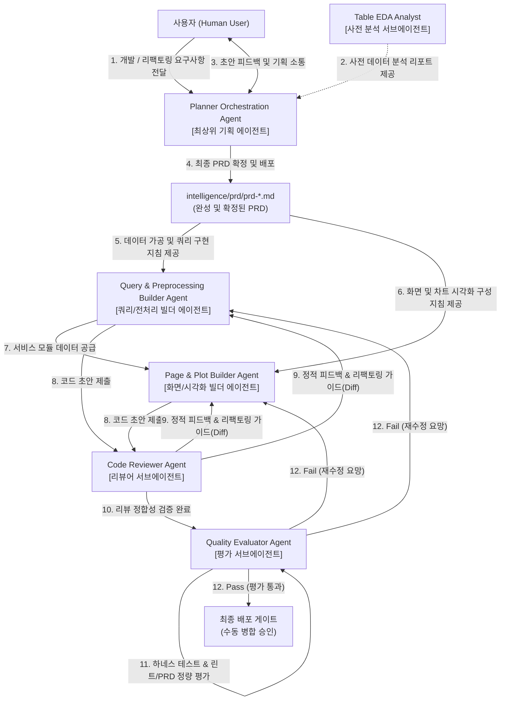

# agent/ 규정

이 문서는 `intelligence/agent/` (지능 및 페르소나 레이어) 고유의 로컬 규칙과 보유 파일 정보를 신속히 인지하기 위한 마이크로 가이드라인입니다.

본 문서는 인텔리전스 개정 표준에 의거하여 기존 `AGENT_MANIFEST.md`를 전격 흡수/통합하였으며, **프로젝트 내 모든 에이전트의 역할 명세 및 오케스트레이션 라우팅 맵의 단일 진실 공급원(SSOT)** 역할을 전담 수행합니다.

---

## 1. 로컬 핵심 제약 (Local Rules)

* **순수 지능 격리 원칙 (No-Code Modification)**: 
  * 본 폴더에는 어떠한 파이썬 스크립트 등 **실행 가능한 소스 코드**를 둘 수 없습니다. (실행 가능한 도구 및 스크립트는 `skill/` 로 격리되어야 함)
  * 모든 파일은 에이전트의 정체성, 프롬프트, 위계 구성을 나타내는 마크다운(`.md`) 또는 JSON 포맷만 허용됩니다.
* **자동 동기화 프로토콜 준수**: 
  * 에이전트들의 역할 변경이나 메타데이터 변경 시, 반드시 `agents_registry.json`을 수정하고 `python intelligence/skill/skill_sync_agents.py` 스크립트를 실행하여 본 문서 내의 에이전트 정보 표 및 다이어그램을 일괄 자동 동기화해야 합니다. 본 파일의 렌더링 영역을 수동 수정하지 마십시오.

---

## 2. 활성 파일 목록 인덱스 (Active Files)

| 파일명 | 파일의 본질적 역할 및 책임 (1줄 요약) |
| :--- | :--- |
| `agents_registry.json` | 에이전트 명세의 단일 진실 공급원 (JSON) |
| `planner-orchestrator.md` | 최상위 기획 및 PRD 설계를 지휘하는 에이전트 상세 가이드 |
| `query-preprocessor.md` | SQL 설계 및 Pandas 데이터프레임 전처리를 수행하는 에이전트 가이드 |
| `page-plot-builder.md` | Streamlit 화면 구성 및 Plotly 시각화를 조립하는 에이전트 가이드 |
| `table-eda.md` | 신규 테이블 등록 시 사전 정량/정성 브리핑을 지원하는 분석가 가이드 |
| `metadata-dictionary.md` | 코드 명명 및 스키마-코드 1:1 컬럼 정합성을 검역하는 분석가 가이드 |
| `code-reviewer.md` | 파이썬 소스 코드 정적 정합성 및 Diff 개선안을 제공하는 리뷰어 가이드 |
| `quality-evaluator.md` | 하네스 테스트 및 PRD 정량 평가를 전담하는 최종 평가자 가이드 |
| `ui-styler-polisher.md` | UI/차트 디자인 일관성과 미학적 리터칭을 수행하는 스타일러 가이드 |

---

## 3. 에이전트 라우팅 및 표준 매니페스트 (Central Routing Table)

현재 프로젝트는 **최상위 기획 및 조율 전담 에이전트(Planner Agent)**, **실제 구현을 수행하는 빌더 에이전트(Builder Agent)**, 그리고 개발 무결성과 품질 정량화를 교차 지원하는 **서브에이전트(Sub-Agent)** 체계로 위계를 명확히 구분하여 운영됩니다.

<!-- START_AGENT_TABLE -->
| Trigger | Agent | Required Context | Allowed Actions | Forbidden Actions | Verification | Output |
| :--- | :--- | :--- | :--- | :--- | :--- | :--- |
| **사용자 요구사항 수집 및 PRD 설계 및 관리 [기획 에이전트]** | `planner-orchestrator` *(Planner Agent)* | `L2-architecture.md` `prd-template.md` | - 신규 페이지 요구사항 분석 및 PRD 초안 작성 - 사용자와 피드백 루프를 통한 PRD 완성 - 기존 페이지 리팩토링 시 기존 PRD 조회 및 업데이트/신규 생성 - 빌더 에이전트들이 참조할 수 있도록 `intelligence/prd/`에 배포 | - 프로덕션 소스 코드(`.py`) 직접 개발 및 수정 금지 (No-Code Modification Policy) - DB 쿼리 실행 또는 비즈니스 로직 작성 금지 | - `prd-template.md` 포맷 정합성 준수 검증 - 빌더들이 참조 가능한 3-Layer 매핑 설계 완성 여부 확인 | `intelligence/prd/prd-*.md` |
| **SQL 쿼리 설계 및 데이터 전처리 개발 [빌더 에이전트]** | `query-preprocessor` *(Builder Agent)* | `L2-architecture.md` `prd-*.md` | - `app/queries/` 내에 쿼리 함수 생성 및 수정 - `app/service/` 내에 데이터 전처리, 정제 및 `@st.cache_data` 부착 개발 | - `app/pages/` 내의 UI 파일이나 시각화(`_plots.py`) 직접 수정 금지 - 화면 컨트롤러 설계 개입 금지 | - `make verify` 구문/린트 검사 - Pandas 예외처리 및 방어 연산 검증 | `app/queries/*_query.py` `app/service/*_df.py` |
| **Streamlit 화면 빌딩 및 Plotly 시각화 [빌더 에이전트]** | `page-plot-builder` *(Builder Agent)* | `L2-architecture.md` `prd-*.md` | - `app/pages/` 내에 Streamlit 레이아웃 구성 및 세션 상태 관리 - `app/pages/` 내에 프리미엄 Plotly Figure(`*_plots.py`) 설계 및 화면 배치 - `app/core/page/config_pages.py`에 네비게이션 매핑 및 자동 등록 | - `app/queries/` 및 `app/service/` 모듈 직접 수정 금지 - UI 레이어 내에서 직접 DB 쿼리 실행 또는 대규모 원천 가공 연산 수행 금지 - UI 페이지, 탭, 텍스트, 버튼, 토스트, 주석 등 모든 소스 영역에서 일반 유니코드 이모지(Emoji)의 직접 사용 엄격 금지 (필요시 오직 Streamlit 기본 Google Material 아이콘 ':material/icon_name:'만 사용 가능) | - 3-Layer 정합성 대조 - 차트 렌더링 검사 - 네비게이션 정상 등록 확인 | `app/pages/*_page.py` `app/pages/*_plots.py` `app/core/page/config_pages.py` |
| **신규 테이블 등록 시 사전 브리핑 및 EDA [분석가 서브에이전트]** | `table-eda` *(Sub-Agent)* | `L2-architecture.md` | - 본격 개발 착수 전, 사용자 및 개발 에이전트를 위한 충분하고 정교한 테이블 사전 브리핑 지원 - 데이터베이스의 Read-Only 메타데이터 및 통계 정보 수집 - `intelligence/domain/` 내에 테이블의 비즈니스 현실 및 수치 특성을 융합한 EDA 가이드북 생성 및 영속 보존 | - **프로덕션 개발 코드(`.py`) 직접 작성 및 수정 금지** (No-Mutation Policy 준수) - `INSERT`, `UPDATE`, `DELETE`, `DROP` 등 데이터 변조/변경 및 파괴적 쿼리 실행 금지 - 대용량 풀 스캔 쿼리 전송 금지 | - DDL/DML 쿼리 유무 검사 (Read-Only 여부) - 보고서 산출물 내 결측치, 비즈니스 맥락 분석 유효성 대조 | `intelligence/domain/eda-*.md` `tests/eda_test_*.py` |
| **코드 명명 정합성 검사 및 스키마-코드 사전 관리 [사전/사후 검역 서브에이전트]** | `metadata-dictionary` *(Sub-Agent)* | `L2-naming-convention.md` `L2-business-constants.md` | - 파일, 함수, 변수가 3-Layer 명명 규정을 지키는지 검증 - 데이터베이스 컬럼(`UPPER_SNAKE`)과 소스 변수(`snake`) 매핑 사전 구축 - 비즈니스 상수 정렬 검증 - query_database.py 에 테이블 상수가 신규 추가 및 변경될 시, 해당 스키마를 즉시 감지하여 `query_tables_metadata.json` 내의 한국어 요약, Alias 추천, 비즈니스 상수 매핑 데이터를 동적으로 연동 및 업데이트 | - **프로덕션 소스 코드(`.py`) 직접 생성 및 임의 변경 엄격 금지** (No-Mutation Policy) - DB 파괴적 명령 실행 금지 | - 명명 규정 위반 탐지 리포트 무결성 - 스키마-코드 1:1 컬럼 정합성 대조 | `intelligence/infra/metadata-dictionary-*.md` `app/core/query/query_tables_metadata.json` |
| **아키텍처 및 3-Layer 정적 코드 리뷰 수행 [리뷰어 서브에이전트]** | `code-reviewer` *(Sub-Agent)* | `code-reviewer.md` `L2-architecture.md` `L2-naming-convention.md` `checklist/checklist-release.md` `checklist/checklist-security.md` `checklist/checklist-architecture.md` `checklist/checklist-coding-standard.md` `checklist/checklist-git.md` | - 빌더가 완성한 파이썬 소스 코드 정적 정합성 및 잠재 버그 분석 - 아키텍처 규칙 위반 탐지 시 리팩토링 개선 가이드(Diff) 제안 생성 | - **프로덕션 소스 코드(`.py`) 직접 수정 및 임의 변경 금지** - 최종 Pass/Fail 합격 여부 독단 결정 금지 (의견 기술만 허용) | - 리뷰 리포트 규격 가독성 검토 - 제시한 리팩토링 가이드(Diff) 무결성 대조 | `intelligence/verification/review-report-*.md` |
| **하네스 테스트 구동 및 품질 평점 채점 관리 [평가 서브에이전트]** | `quality-evaluator` *(Sub-Agent)* | `quality-evaluator.md` `L2-architecture.md` `prd-*.md` | - `tests/` 하위 테스트 케이스 자율 구동 및 감시 - `make verify` 구문/린트 스코어 산출 및 요구사항 충족도 매핑 채점 - 게이트 합격/불합격(Pass/Fail) 판단 수립 | - **프로덕션 소스 코드 및 테스트 코드 직접 수정 금지** (Audit-Only) - 오류 발생 시 리팩토링 코드 직접 작성 금지 (리뷰어에게 에스컬레이션) | - 테스트 구동 성공 신뢰도 검증 - 채점 매트릭 기반 정량 스코어 계산 무결성 | `intelligence/evals/evaluation-scorecard-*.md` |
<!-- END_AGENT_TABLE -->

---

## 4. 예외 에스컬레이션 계약 (Escalation Protocol)

모든 에이전트는 다음 예외 조항 발생 시 즉시 자율 동작을 멈추고 사람(수동 관리자)에게 통제권을 인계해야 합니다.

1. **품질 검증 실패 (`quality-evaluator` 판정 Fail)**: 평가 에이전트의 품질 스코어가 90점 미만이거나 하네스 테스트 실패 시, 개발 빌더 및 리뷰어에게 회부하여 결함을 패치하도록 자동 에스컬레이션하고 최종 병합은 사람의 승인 하에 전면 대기합니다.
2. **보안 가이드라인 침해**: 코드 내 환경변수(DB 접속 정보, 비밀 토큰 등)가 하드코딩되거나 로그에 노출될 위험 감지 시 가차없이 실행을 중단합니다.
3. **리스크 위험도 최고 등급 (Risk Level: High)**: DB 마이그레이션이 수반되거나 권한 체계가 변동되는 패치는 절대 수동 검토 전 자동 승인 처리를 금지합니다.

---

## 5. 에이전트 협업 및 체이닝 (Agent Chaining Diagram)

<!-- START_AGENT_CHAINING -->

<!-- END_AGENT_CHAINING -->

---

## 6. 변경 이력 (Changelog)

* **2026-06-14**:
  * [REFACTOR] `agents_registry.json`에서 존재하지 않는 레거시 `agent-common.md` 파일 참조를 일괄 소거하고 컨텍스트 맵핑 최적화.
  * [REFACTOR] `AGENT_MANIFEST.md`를 전격 영구 폐지하고, 해당 파일이 하던 에이전트 정보 표 및 체이닝 협업 관계를 본 `agent/GEMINI.md` 로 전격 흡수/통합 완료 (문서 중복 제어 및 정비 최적화).
  * [Feat] 에이전트와 스킬의 완전한 역할 분리 원칙에 의거하여, `sync_agents.py` 실행형 스크립트를 `skill/skill_sync_agents.py`로 물리적 이관 완료.
  * [Refactor] `analyst-table-eda.md` 내 수동 쿼리/집계 가이드를 `skill/` 하위 스킬을 호출하도록 정향 리팩토링 완료.
  * [Feat] 에이전트 폴더 전용 `GEMINI.md` 마이크로 가이드라인 최초 수립 및 비치.
