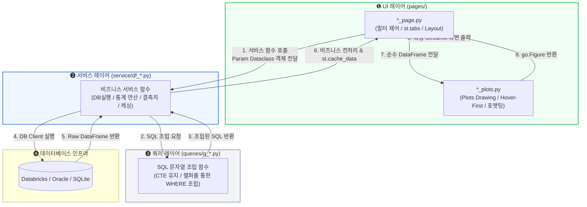

# [PROCESS] 3레이어 준수 개발 및 리팩토링 표준 절차서
> **Standard Development Process for 3-Layer Architecture Integration & Page Refactoring**

이 문서는 대대적인 신규 페이지 생성 및 기존 화면 전체 리팩토링을 안전하고 체계적으로 전개하기 위한 **3-레이어 아키텍처 개발 프로세스 표준 절차서(Standard Operating Procedure)**입니다. 

코드의 가독성, 단위 테스트 가능성, 그리고 인프라 비용 최적화를 위해 모든 에이전트와 엔지니어는 이 절차를 무조건적으로 준수해야 합니다.

---

## 1. 3레이어 데이터 흐름도 (Data Flow Architecture)

모든 데이터는 아래 흐름도와 같이 단방향으로 흐르며, 상위 레이어는 하위 레이어의 상세 구현(SQL 쿼리 조립 및 커넥션 풀 등)을 직접 간섭하거나 알 필요가 없습니다.



---

## 2. 단계별 표준 개발 및 리팩토링 가이드 (4-Step Flow)

새 페이지를 생성하거나 기존 페이지를 대대적으로 리팩토링할 때는 반드시 **아래의 순서(하향식 설계 및 상향식 구현)를 유지**합니다.

```
[Phase 1] 파라미터 정의 -> [Phase 2] 쿼리 설계 -> [Phase 3] 서비스 가공 -> [Phase 4] UI & Plots 구현
```

---

### [Phase 1] 요구사항 분석 및 파라미터 데이터클래스 매핑
가장 먼저 사용자의 화면 요구사항(필터 종류, 검색 범위, 비즈니스 영역)을 파악하고 필터 입력 데이터를 캡슐화합니다.

1. **파라미터 정의 위치**: `core/params/parameters.py`
2. **개발 수칙**:
   - 필터 값을 개별 변수나 낱개 리스트로 흩뿌려 넘기지 마십시오.
   - 기존의 파라미터 클래스(`BaseFilterParams`, `DateFilterParams` 등)를 상속하여 신규 화면 전용 데이터클래스를 조립하십시오.
   - 예: `class NewFeatureParams(BaseFilterParams, DateFilterParams):`

---

### [Phase 2] SQL 쿼리 설계 및 쿼리 레이어 구현
데이터베이스로부터 수집할 원시 데이터 조건과 결합 로직을 설계합니다.

1. **파일 생성/수정 위치**: `queries/q_<도메인>.py` 또는 `queries/*_query.py`
2. **개발 수칙 (5대 SQL 불변 규칙 엄수)**:
   - **No-Separation**: CTE(`WITH ... AS`) 구문을 파이썬 함수로 조각내지 말고, 메인 쿼리문 안에 명시적으로 포함하여 완전한(Full) 온전형 쿼리로 보관하십시오.
   - **Helper Binding**: `QueryFilter`와 `SQLConverter`를 사용하여 Dynamic WHERE 절 및 `IN` 조건 변환, `DECODE` 처리를 수행하십시오. 공백 에러나 Syntax 오류를 방지하기 위해 문자열을 수동으로 결합하지 마십시오.
   - **Table Abstraction**: Databricks 테이블 경로는 `core/query/query_database.py`의 상수를 사용해 바인딩하십시오.

---

### [Phase 3] 비즈니스 서비스 로직 및 캐싱 구현
데이터베이스 클라이언트를 사용해 쿼리를 실행하고, 비즈니스 통계 수치 및 결측치 처리를 수행합니다.

1. **파일 생성/수정 위치**: `service/df_<도메인>.py`
2. **개발 수칙**:
   - **No DB Execution in UI**: `get_client()` 및 데이터베이스 실행 구문은 반드시 이 서비스 레이어 내에서만 존재해야 합니다.
   - **Method Chaining**: Pandas 데이터프레임 가공 시 `SettingWithCopyWarning`을 방지하고 불변성을 유지하기 위해 `.assign()`, `.pipe()`, `.groupby()` 등 메서드 체이닝 방식을 우선 활용하십시오.
   - **Pure Data Only**: 서비스 함수는 오직 **순수 정형 데이터프레임(`pd.DataFrame`)**만 반환해야 하며, Plotly나 Streamlit 종속적인 컴포넌트 객체를 포함해서는 안 됩니다.
   - **Caching**: 비용이 큰 클라우드(Databricks) 쿼리가 빈번히 유발되지 않도록 반드시 `@st.cache_data(ttl=3600)`(일반 배치 데이터 1시간) 데코레이터를 바인딩하십시오.

---

### [Phase 4] UI 화면 빌딩 및 시각화(Plots) 구현
정제된 데이터를 화면에 예쁘게 배치하고, 사용자 인터랙션이 극대화된 차트를 드로잉합니다.

1. **파일 생성/수정 위치**: `pages/` 카테고리 서브디렉터리 내부
   - 예: `pages/_10_dashboard/new_feature_page.py` (화면 메인)
   - 예: `pages/_10_dashboard/new_feature_plots.py` (플롯 전용)
2. **개발 수칙**:
   - **UI 메인 (`*_page.py`)**: 
     - 상위 단계에서 정의된 파라미터 클래스를 조립하여 서비스 함수를 호출하고, 레이아웃(`st.columns`, `st.tabs`)에 맞춰 시각화 모듈을 호출합니다.
     - `st.markdown("<style> ...")`를 사용한 인라인 스타일 조작은 강력히 배제하며, `core/ui/components.py` 및 `styles.py`에서 제공하는 공통 카드 및 헤더 패널을 호출하여 통일성을 지킵니다.
   - **시각화 모듈 (`*_plots.py`)**:
     - `viz_plotly_design`의 `get_default_trace_config` 및 `get_default_layout_config`를 `**kwargs`로 인젝트하여 일관성 있는 Grid, Title, Margin, Font-Family를 적용하십시오.
     - **Hover-First Design**: 사용자가 차트에 마우스를 올렸을 때 직관적으로 정보를 탐색할 수 있도록 굵은 글씨(`<b>`), 줄바꿈(`<br>`), 부가 메타데이터가 완벽하게 포맷팅된 유저 친화적인 `hovertemplate`을 무조건 설계하여 반영하십시오.
     - **Matplotlib 제거**: 정적인 Matplotlib 차트의 사용을 원천 배제하고 Plotly 컴포넌트로 일원화하십시오.
3. **최종 등록 및 보안 격리 (Initial Sandbox)**:
   - 페이지 개발 완료 후 `core/page/config_pages.py`의 `PAGE_CONFIGS`에 신규 화면 정보를 신규 등록합니다.
   - **Admin 단독 권한 지정**: 최초 등록 시에는 **반드시 접근 권한을 `roles: ["Admin"]`으로만 제한적으로 바인딩**하여 등록하십시오. 검증되지 않은 미완성 화면이 일반 사용자(`Viewer`, `Contributor`)에게 노출되는 것을 방지하는 핵심 샌드박스 보안 규정입니다.
   - **배포 승인 후 권한 확장**: 화면 검증 및 유저 최종 승인이 명시적으로 완료된 시점에 비로소 타겟 역할(`["Viewer", "Contributor", "Admin"]`)로 점진적으로 확장 및 배포 처리합니다.

---

## 3레이어 준수 품질 검증 자율 체크리스트 (Self-Checklist)

개발자 및 코드 리뷰어는 대대적인 신규 페이지 배포 및 리팩토링 완료 전, 아래 5가지 체크리스트의 만족 여부를 반드시 서명 및 통과해야 합니다.

* [ ] **C1. UI 메인 파일(`*_page.py`)이나 플롯 파일(`*_plots.py`) 내에 `get_client()`나 데이터베이스 실행 코드가 1줄이라도 유입되었는가?** (통과 기준: **No**)
* [ ] **C2. 비즈니스 통계 알고리즘 공식이나 원시 데이터 필터 조건이 플롯 파일(`*_plots.py`) 내부에 직접 하드코딩되었는가?** (통과 기준: **No**, 모두 서비스 레이어에서 전처리되어야 함)
* [ ] **C3. 시각화 그래프에 임의의 헥사 코드 색상이 포함되었으며, `viz_plotly_design` 공통 레이아웃/트레이스 설정을 상속하지 않고 수동 빌딩했는가?** (통과 기준: **No**, 반드시 colors 및 공통 디자인 시스템 바인딩 완료)
* [ ] **C4. 차트에 마우스를 올렸을 때 단순 기본 데이터 외에, 비즈니스 단위 및 설명이 포함된 친절한 Hover HTML 템플릿을 정밀하게 설계했는가?** (통과 기준: **Yes**, Hover-First 설계 완료)
* [ ] **C5. 새로 개발된 서비스 레이어 데이터 조회 기능에 `@st.cache_data` 캐싱이 안전하게 장착되어 불필요한 반복 조회를 원천 차단하고 있는가?** (통과 기준: **Yes**)
