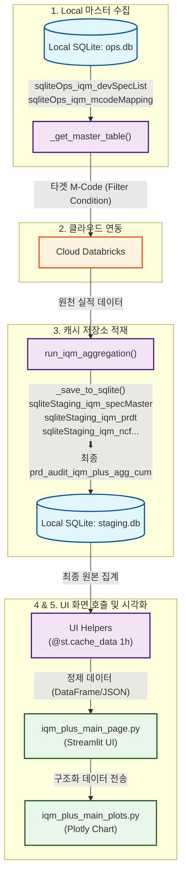

# [임시] IQM Plus 데이터 적재 및 로드 구조 가이드 (최신 변수명 기준)

> [!WARNING]
> **이 문서는 임시 참조용(Temporary) 가이드 문서입니다.**
> 추후 아키텍처나 비즈니스 가이드라인이 최종 갱신되면 본 문서의 명칭 및 내용이 정식 문서로 대체되거나 통합될 수 있습니다.

이 문서는 제품 완성도 관리(IQM Plus) 시스템의 최종 데이터 로드 구조 및 데이터베이스 연동 라이프사이클을 정의합니다. 수립된 **L2 네이밍 컨벤션**(`sqliteOps_...`, `sqliteStaging_...`)을 전면 반영하여 작성되었습니다.

---

## 1. 데이터 흐름 아키텍처 (Architecture Diagram)

### 📊 시각화 Mermaid 아키텍처 다이어그램



### 📋 텍스트 기반 구조도 (ASCII Flowchart)
```text
[원천 데이터 수집 및 적재 라이프사이클]

1단계: Local SQLite (ops.db) 기준 정보 로드
    - 소스코드: app/service/iqm_df.py ➔ _get_master_table()
    - 연동변수:
      * sqliteOps_iqm_devSpecList  (물리명: product_audit_regular_development)
      * sqliteOps_iqm_mcodeMapping (물리명: product_audit_mcode_master)
    - 결과물: 타겟 M-Code 리스트 동적 조립

2단계: 원격 Cloud Databricks 질의 (On-Demand / Batch Query)
    - 소스코드: app/service/iqm_df.py ➔ get_prdt_by_unit_period(), get_ncf_by_unit_period()...
    - 동작: 1단계의 M-Code 필터 조건을 원격 데이터 테이블(Databricks)로 보내 적격 품질 데이터 수집

3단계: 로컬 SQLite (staging.db) 중간 및 최종 병합 적재
    - 소스코드: app/service/iqm_df.py ➔ run_iqm_aggregation() ➔ _save_to_sqlite()
    - 중간 캐시 테이블:
      * sqliteStaging_iqm_specMaster, sqliteStaging_iqm_prdt, sqliteStaging_iqm_ncf, 
        sqliteStaging_iqm_gtWt, sqliteStaging_iqm_uf, sqliteStaging_iqm_rr, sqliteStaging_iqm_ctl
    - 최종 집계 테이블:
      * product_audit_iqm_plus_agg_cum (품질 지표 연산 및 지수화(QI) 완료본)

─────────────────────────────────────────────────────────────────────────────

[Streamlit 대시보드 화면 표출 라이프사이클]

4단계: UI 전처리 헬퍼 서비스 호출 및 캐싱 (Fast Load)
    - 소스코드: app/service/iqm_df.py ➔ get_spec_release_status_data(), get_launch_distribution_data()...
    - 동작: staging.db of 최종 통합 테이블을 읽어 화면 컴포넌트별로 최적화 가공 (@st.cache_data 1시간 캐시 적용)

5단계: 컨트롤러를 통한 화면 시각화 및 Plotly 차트 표출
    - 화면 파일: app/pages/_10_dashboard/iqm_plus_main_page.py
    - 시각화 파일: app/pages/_10_dashboard/iqm_plus_main_plots.py
    - 동작: 전처리 데이터를 인수받아 Plotly 그래프 렌더링 및 Streamlit 위젯 배치
```

---

## 2. 최 밑단 데이터 매핑 카탈로그 (Database to Code Mapping)

| 소스 DB 파일 | 물리 테이블명 (SQLite/Databricks) | SQLiteTables 클래스 내 파이썬 변수명 | 실질 데이터 수집 및 연산 소스코드 함수 |
| :--- | :--- | :--- | :--- |
| **`ops.db`** | `product_audit_regular_development` | **`sqliteOps_iqm_devSpecList`** | `iqm_df.py` ➔ `_get_master_table()` |
| **`ops.db`** | `product_audit_mcode_master` | **`sqliteOps_iqm_mcodeMapping`** | `iqm_df.py` ➔ `_get_master_table()` |
| **`Cloud MES`** | `hkt_dw.production.product_master` 등 | (DatabricksTables 매핑) | `q_iqm_plus.py` 내 Databricks SQL 쿼리들 |
| **`staging.db`** | `product_audit_spec_master` | **`sqliteStaging_iqm_specMaster`** | `iqm_df.py` ➔ `_aggregate_spec_master()` |
| **`staging.db`** | `product_audit_pdrt` | **`sqliteStaging_iqm_prdt`** | `iqm_df.py` ➔ `get_prdt_by_unit_period()` |
| **`staging.db`** | `product_audit_ncf` | **`sqliteStaging_iqm_ncf`** | `iqm_df.py` ➔ `get_ncf_by_unit_period()` |
| **`staging.db`** | `product_audit_gt_wt` | **`sqliteStaging_iqm_gtWt`** | `iqm_df.py` ➔ `get_gt_wt_by_unit_period()` |
| **`staging.db`** | `product_audit_uf` | **`sqliteStaging_iqm_uf`** | `iqm_df.py` ➔ `get_uniformity_by_unit_period()` |
| **`staging.db`** | `product_audit_rr` | **`sqliteStaging_iqm_rr`** | `iqm_df.py` ➔ `refactoring_get_rr_by_unit_period()` |
| **`staging.db`** | `product_audit_ctl` | **`sqliteStaging_iqm_ctl`** | `iqm_df.py` ➔ `get_ctl_by_unit_period()` |
| **`staging.db`** | `product_audit_iqm_plus_agg_cum` | `prd_audit_iqm_plus_agg_cum` | `iqm_df.py` ➔ `run_iqm_aggregation()` 내 Merge 적재 |

---

## 3. 핵심 단계별 소스코드 구현 예시

### [1단계] 로컬 마스터 데이터 셋업 (`_get_master_table`)
`ops.db`에서 기준 마스터 정보를 안전하게 로드하고 머지하여 필터링된 타겟 MCODE 목록을 도출합니다.
```python
# app/service/iqm_df.py
def _get_master_table():
    sqliteOps_iqm_devSpecList = (
        get_client("sqlite", sqlite_db_path="ops")
        .execute(q_sqlite.get_sqlite_RegularDevelopment_iqm_rawdata()) # sqliteOps_iqm_devSpecList 바인딩
        .dropna(subset=["MP Gate Act. End"])
        .reset_index(drop=True)
    )
    sqliteOps_iqm_mcodeMapping = get_client("sqlite", sqlite_db_path="ops").execute(
        q_sqlite.get_sqlite_McodeMappingMgt_iqm_rawdata() # sqliteOps_iqm_mcodeMapping 바인딩
    )
    
    master_table = (
        sqliteOps_iqm_devSpecList.merge(sqliteOps_iqm_mcodeMapping, on="MCODE", how="left")
        .query("DELETE_MCODE != 1")
    )
    return master_table
```

### [2~3단계] Databricks 연동 및 중간 캐시/최종 병합 세이브
```python
# app/service/iqm_df.py
def run_iqm_aggregation() -> dict:
    master_table, mfg_mcode_list_for_query = _get_master_table()
    
    # 2단계 & 3단계: 개별 원천 실적 병렬 수집 및 로컬 staging.db 중간 테이블 적재
    df_spec_master = _aggregate_spec_master(master_table, mfg_mcode_list_for_query)
    _save_to_sqlite(df_spec_master, SQLiteTables.sqliteStaging_iqm_specMaster)

    df_prdt = get_prdt_by_unit_period(mfg_mcode_list_for_query)
    _save_to_sqlite(df_prdt, SQLiteTables.sqliteStaging_iqm_prdt)

    df_ncf = get_ncf_by_unit_period(mfg_mcode_list_for_query)
    _save_to_sqlite(df_ncf, SQLiteTables.sqliteStaging_iqm_ncf)
    
    # ... GT_WT, UF, RR, CTL 수집 및 적재 ...

    # 최종 병합(Merge) 및 지수화 연산 후 통합 테이블 저장
    df_iqm_agg_cum = (
        df_spec_master.merge(df_prdt, on=["MFG_MCODE"], how="left")
        .merge(df_ncf, on=["MFG_MCODE", "PERIOD_NAME"], how="left")
        ...
    )
    _save_to_sqlite(df_iqm_agg_cum, SQLiteTables.prd_audit_iqm_plus_agg_cum)
    return results
```

---

## 4. 3-Layer 아키텍처 규칙 및 유지보수 수칙

1. **DB 클라이언트 격리**:
   * 대시보드 화면 컨트롤러(`iqm_plus_main_page.py`) 내에서 `get_client("sqlite")`나 SQL 직접 `execute()`를 수행하는 것은 아키텍처 격벽을 붕괴시키는 위반 행위입니다.
   * 무조건 `app/service/iqm_df.py` 서비스 모듈을 통해 전처리된 데이터를 제공받아야 합니다.
2. **명명 규칙 수호**:
   * SQLite 데이터프레임 조작 시, 물리 소스 DB의 성격에 맞춰 상수를 반드시 준수하십시오.
     * **`sqliteOps_`**: 마스터/기준 데이터베이스 (`ops.db`)
     * **`sqliteStaging_`**: 원격 연동 캐시 및 집계 데이터베이스 (`staging.db`)
3. **Streamlit 캐싱 준수**:
   * 데이터 조회 비용을 줄이고 UI 렌더링 성능을 극대화하기 위해, 서비스 레이어 헬퍼 함수 상단에 `@st.cache_data(ttl="1h")` 캐싱 데코레이터를 적용하십시오.
