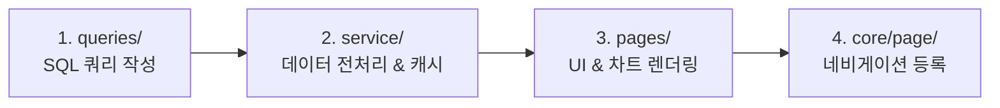
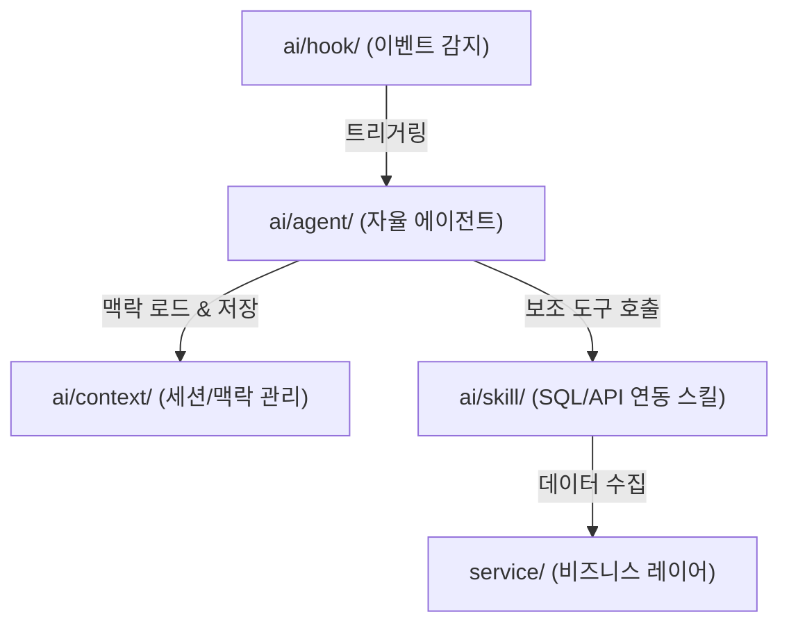

# current-workflow.md (현재 개발 흐름 및 AI 확장 가이드라인)

이 문서는 이 프로젝트의 현재 개발 방식, 아키텍처 흐름 및 이번에 새롭게 설계된 **AI 인텔리전스 확장 레이어(`ai/`)**의 개발 워크플로우를 기술합니다.

---

## 1. 3-레이어 애플리케이션 개발 흐름 (Core App Development)

새로운 분석 피처나 화면을 추가하는 표준 워크플로우는 **역방향(Data-to-UI)**으로 개발을 진행하는 3-레이어 파이프라인을 따릅니다.



### [Step 1] SQL 쿼리 빌더 설계 (`queries/`)
- 데이터베이스(Databricks, Oracle, SQLite)에서 원하는 원시 데이터를 수집할 쿼리 문자열 조립 함수를 작성합니다.
- `core/query/query_helper.py`의 `QueryFilter`와 `SQLConverter`를 사용하여 파라미터 기반으로 WHERE 절을 동적 결합합니다.
- *예시: `queries/cqms_query.py`*

### [Step 2] 데이터 가공 및 서비스 전처리 (`service/`)
- `queries/` 레이어의 함수를 임포트하여 SQL을 확보합니다.
- `core.operate.db_client`에서 알맞은 커넥터(`get_client`)를 얻어 `.execute(query)`를 실행해 Pandas DataFrame을 가져옵니다.
- 가공 및 정밀 전처리(인덱싱, 타입 매핑, 누락값 정제, 중복 제거 등)를 수행하고 결과를 리턴하는 함수를 작성합니다.
- 반드시 `@st.cache_data(ttl=3600)` 같은 Streamlit 캐싱 어노테이션을 부착하여 성능과 비용을 최적화합니다.
- *예시: `service/cqms_df.py`*

### [Step 3] UI 제어 및 시각화 구현 (`pages/`)
- 해당 페이지 디렉터리에 `*_page.py` (Streamlit 입력 컨트롤러, 세션 필터 등)와 `*_plots.py` (Plotly 등 시각화 함수)를 생성합니다.
- `*_page.py`에서 `service/`의 가공 함수를 호출하여 캐싱된 DataFrame을 가져온 후, `*_plots.py`로 전달하여 화면에 시각화합니다.
- *예시: `pages/_20_analysis/qi_trend_page.py` & `pages/_20_analysis/qi_trend_plots.py`*

### [Step 4] 네비게이션 허브 등록 (`core/page/config_pages.py`)
- 마지막으로 새롭게 만든 `*_page.py`를 `core/page/config_pages.py`의 `PAGE_CONFIGS` 사전 객체에 등록해야 Streamlit 사이드바(네비게이션)에 해당 메뉴가 노출되고 권한별(Viewer, Contributor, Admin) 접근 제어가 이루어집니다.

---

## 2. 테스트 및 하네스 검증 흐름 (Testing & Verification)

기존 기능의 안정성을 검증하기 위해 로컬 환경에서 단독 테스트 하네스를 활용해 검증 주기를 단축합니다.

- **독립 테스트 하네스 (`tests/`)**:
  - `tests/sql_query_test.py` 와 같이 기존 코드의 수정 없이 인메모리 테스트 기법만 활용해 서비스 레이어와 DB 클라이언트를 격리 검증합니다.
- **실행 원칙 (Python Path)**:
  - 모듈의 상대 경로 및 루트 패키지 임포트가 정상 동작하도록 실행 시에는 항상 `PYTHONPATH`를 루트 경로(`workstation/`)로 선언하고 실행해야 합니다.
  ```bash
  PYTHONPATH=/home/jumasi/workstation /home/jumasi/miniconda3/envs/goeq/bin/python tests/sql_query_test.py
  ```

---

## 3. AI 확장 레이어 워크플로우 (AI Agent Workflow)

새롭게 추가된 **`ai/` 디렉터리**는 본 시스템의 데이터 분석 결과를 지능화하고 자율적인 품질 의사결정을 자동화하기 위한 공간입니다.



### 1) AI Skill 개발 흐름 (`ai/skill/`)
- 에이전트가 원천 DB(Databricks 등) 혹은 로컬 SQLite 데이터에 자율적으로 접근할 수 있는 **도구(Tools/Skills)**를 설계합니다.
- `service/` 레이어 및 `core/` 모듈의 함수를 매핑하여 필요한 데이터를 수집 및 필터링할 수 있는 함수형 API 혹은 쿼리 익스큐터를 설계합니다.
- 각 스킬은 타입 힌트와 상세한 Docstring을 작성해야 에이전트가 자율적으로 도구 사용법을 이해할 수 있습니다.

### 2) AI Context 관리 흐름 (`ai/context/`)
- 사용자 세션, 에이전트가 탐색 중인 특정 품질 이슈 이력, 과거 챗봇 대화 등의 메모리 혹은 가공 맥락을 추적합니다.
- 이를 SQLite(`ops.db` 또는 전용 `ai_memory.db`) 혹은 로컬 파일 저장소에 효율적으로 영속화하여, 에이전트 호출 간의 일관성을 제공합니다.

### 3) AI Hook 바인딩 흐름 (`ai/hook/`)
- 비즈니스 상 특정 이벤트가 발생할 때 AI를 자동으로 동작시키는 감지기입니다.
- Streamlit 페이지 진입, 특정 공장의 대량 불량 건수 데이터 수집(GMES), 주기적 백그라운드 갱신 작업(`automation/`) 완료 시점 등에 훅을 결합하여, 실시간 지능형 진단 보고서를 띄우는 이벤트를 트리거합니다.

### 4) AI Agent 핵심 구현 (`ai/agent/`)
- 위 3가지 요소(Skill, Context, Hook)를 통합 활용하여 실제 품질 분석, 의사 결정, 품질 경보 메커니즘을 구동하는 지능형 에이전트 로직을 코딩합니다.
- 프롬프트 템플릿, 에이전트 실행 루프, 추론 과정 분석(Chain of Thought) 결과를 제어하는 메인 엔진 클래스가 이곳에 위치하게 됩니다.

---

## 개발 준수 사항 및 규칙

* **기존 코드 보호 규칙(GEMINI.md Safety Lock)**:
  AI 확장 레이어(`ai/`)나 독립 테스트(`tests/`)에서 코드를 추가 및 호출하는 것은 완전히 허용되나, 이 과정에서 `core/`, `service/`, `queries/`, `pages/` 등의 기존 소스 코드를 동의 없이 변경하는 것은 엄격히 제한됩니다.
* **Streamlit 캐시 친화적 설계**:
  에이전트가 도출하는 원형 데이터도 시스템에 부하가 걸리지 않도록 최대한 캐시된 서비스 레이어 API를 경유하여 취득하도록 설계해야 합니다.
