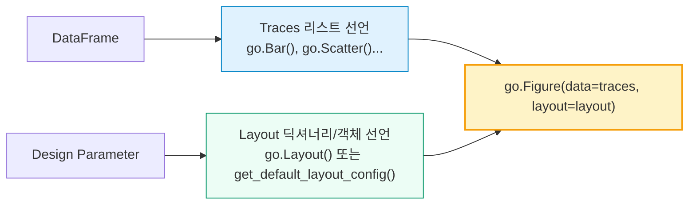

# Plotly 시각화 코드 작성 표준 가이드라인
> **Plotly Styling & Structure Standardization Manual (Trace/Layout 조립 방식 표준화)**

프로젝트 내 시각화(Plots) 코드가 개발자마다 각기 다른 기법으로 작성되어 코드 리뷰, 공통 스타일 유지보수 및 테마 스위칭 시 많은 공수가 발생하고 있습니다. 본 표준 가이드라인은 코드 검토 효율성을 높이고 시각화 완성도를 상향 평준화하기 위한 **엄격한 스타일 통일 규칙**을 규정합니다.

---

## 1. 현재 코드 검토 결과 및 파편화 현황 분석 (Anti-patterns)

현재 `pages/` 내부의 plots 스크립트를 검토한 결과, 다음과 같은 **3대 비일관성 문제(Anti-patterns)**가 발견되었습니다.

### 1.1. 피겨 빌딩 라이프사이클(Lifecycle)의 혼용
* **현황**: `go.Figure(data=[trace], layout=layout)`의 정적 조립 방식과 `fig = go.Figure()` 선언 후 `fig.add_trace()` 및 `fig.update_layout()`을 병행 호출하는 단계식 빌딩이 혼재하고 있습니다.
* **영향**: 차트에 추가 트레이스(예: 추세선, 목표선 등)를 동적으로 추가하거나 다중 축을 제어할 때 코드 결합도가 높아져 유지보수가 곤란합니다.

### 1.2. 인라인 폰트 및 스타일 수치 하드코딩
* **현황**: 특정 플롯에서 디자인 토큰을 무시하고 `color="black"`, `size=16`, `family="Inter"` 등 원시 문자열/정수값을 직접 레이아웃에 주입하고 있습니다.
  > **안티패턴 예시 ([data_analysis_plots.py:L98-101](file:///home/jumasi/workstation/pages/_20_analysis/data_analysis_plots.py#L98-101))**
  > ```python
  > layout = go.Layout(
  >     title=dict(text="Product History", font=dict(color="black", size=16)),
  >     yaxis=dict(
  >         title=dict(text="Category", font=dict(color="black", size=16)),
  >         tickfont=dict(color="black", size=20),
  >     )
  > )
  > ```
* **영향**: 다크 모드(Dark Mode) 지원 시, 위와 같이 하드코딩된 블랙/화이트 색상이 레이아웃에 남게 되어 차트 텍스트가 묻히거나 보이지 않는 치명적인 비주얼 결함이 유발됩니다.

### 1.3. 렌더링과 데이터 가공의 강한 결합 (Tight Coupling)
* **현황**: 그리기 함수 내부에서 Pandas Query를 실행하고 결측값을 복잡하게 채우는 등의 비즈니스 로직(Data Preprocessing)과 순수 시각화 빌딩 코드가 뒤섞여 있어 가독성이 떨어집니다.

---

## 2. 시각화 코드 개발 4대 표준 원칙 (The 4 Rules)

앞으로 작성되는 모든 `*_plots.py` 내의 Plotly 생성 함수는 아래의 4가지 원칙을 예외 없이 강제 준수해야 합니다.

```
┌──────────────────────────────────────────────────────────────┐
│  Rule 1. 정적 조립(Declarative Assembler) 표준 채택           │
│  Rule 2. 인라인 레이아웃 딕셔너리 하드코딩 전면 금지          │
│  Rule 3. 데이터 가공과 피겨 렌더링의 엄격한 역할 분리         │
│  Rule 4. 호버 템플릿(Hover Template) 단일 창구 등록 사용     │
└──────────────────────────────────────────────────────────────┘
```

### Rule 1. 정적 조립(Declarative Assembler) 방식 채택 (★선호 방식 적용)
Trace와 Layout 객체를 개별 변수로 완벽히 정의하여 독립적으로 가공한 후, 마지막에 `go.Figure(data=traces, layout=layout)`에 한꺼번에 주입하여 조립하는 방식을 공식 표준으로 규정합니다.



#### 이 방식의 아키텍처적 이점:
* **완벽한 관심사 분리(Decoupling)**: 데이터 트레이스 파트와 비주얼 테마/레이아웃 파트가 물리적으로 완전히 단절되어 검토 가독성이 극대화됩니다.
* **단위 테스트의 용이성(Testability)**: 무거운 `go.Figure` 인스턴스 전체를 생성하지 않고도, 반환할 `traces` 리스트와 `layout` 딕셔너리 정보 자체만 단독으로 가로채어 검증/테스트하기 매우 유리합니다.
* **직렬화 우수성(Serialization)**: 레이아웃과 데이터가 별도 변수로 깔끔하게 추출되므로 향후 JSON 직렬화 및 클라이언트 연동에 탁월한 확장성을 가집니다.

---

### Rule 2. 디자인 제어 단일 통로화 (Strict Token Connection)
임의의 딕셔너리 스타일 선언을 불허하며, 반드시 디자인 유틸을 통해서만 스타일을 제어합니다.
* **색상**: `from core.common_design_parameter import colors` 내 정의된 토큰만 사용 (`colors.iqm_primary_500`, `colors.gray` 등)
* **폰트**: `create_plotly_font_dict("title")` 또는 `create_plotly_font_dict("axis_label")` 활용
* **공통 레이아웃**: `get_default_layout_config()`을 사용해 기본 베이스 레이아웃 딕셔너리를 취득하고, 변경이 필요한 사항만 덮어씌웁니다.

---

### Rule 3. 데이터 가공 로직 격리 (Data Clean Room)
`draw_*` 함수 내부에는 이미 완전히 전처리가 완료된 정제 DataFrame만 전달되어야 합니다. 함수 시작 지점에 결측 검증용 `validate_chart_data(df, columns)`를 제외한 복잡한 가공 로직 배치를 불허합니다.

---

### Rule 4. 가독성을 위한 호버 인라인 직접 정의 (Inline Hover Customization)
시각화 차트의 직관성과 가독성을 극대화하기 위해, 마우스 호버(Tooltip) 텍스트 포맷 및 HTML 템플릿은 외부 모듈에 분리하여 관리하지 않고 시각화 함수(`draw_*`) 내부에서 f-string 및 HTML 태그를 결합하여 직접 정의하고 하드코딩하여 사용합니다.

---

## 3. 표준 코드 템플릿 (Before vs After)

### Bad (규제되지 않은 파편화된 코드 스타일)
```python
import plotly.graph_objects as go

def draw_bad_chart(df):
    # 데이터 가공 및 필터링이 시각화 함수 내에 깊이 포개짐 (가독성 저하)
    df_filtered = df[df["VAL"] > 10]
    df_filtered["ratio"] = df_filtered["VAL"] / df_filtered["TOTAL"]
    
    # 폰트/사이즈/컬러 하드코딩 및 스타일 유틸 무시
    trace = go.Bar(
        x=df_filtered["NAME"],
        y=df_filtered["VAL"],
        marker=dict(color="#f97316"),
        hovertemplate="<b>Name:</b> %{x}<br><b>Val:</b> %{y} EA<extra></extra>" # 인라인 하드코딩
    )
    
    layout = go.Layout(
        title=dict(text="Bad Chart Case", font=dict(color="black", size=16)),
        xaxis=dict(tickfont=dict(color="#333333", size=11)),
        yaxis=dict(showgrid=True, gridcolor="#eeeeee"),
        paper_bgcolor="white"
    )
    
    fig = go.Figure(data=[trace], layout=layout)
    return fig
```

### Good (선호 방식: Trace와 Layout을 각각 독립 선언 후 최종 조립)
```python
import plotly.graph_objects as go
from core.common_design_parameter import colors, font_sizes, create_plotly_font_dict
from core.plot.viz_plotly_design import get_default_trace_config, get_default_layout_config
from core.plot.viz_helper import validate_chart_data, create_empty_chart

def draw_good_chart(df: pd.DataFrame) -> go.Figure:
    # 1. 진입 단계: 차트 메타데이터 검증 및 조기 반환 (Validate & Early Exit)
    if not validate_chart_data(df, ["NAME", "VAL"]):
        return create_empty_chart(title="Good Chart Case", height=300)
        
    # 2. 빌딩 1단계: 트레이스 명세 선언 (Trace Specifications)
    # 가독성을 극대화하기 위해 호버 텍스트는 시각화 함수 내에 f-string 및 HTML로 직접 하드코딩합니다.
    trace_config = get_default_trace_config("bar")
    df_plot = df.copy()
    df_plot["hover_text"] = df_plot.apply(
        lambda r: f"<b>이름</b>: {r['NAME']}<br><b>수량</b>: {r['VAL']:,} EA", axis=1
    )
    
    trace = go.Bar(
        x=df_plot["NAME"],
        y=df_plot["VAL"],
        text=df_plot["hover_text"],
        hovertemplate="%{text}<extra></extra>", # 인라인 직접 정의 적용
        marker=dict(color=colors.iqm_primary_500), # 브랜드 전용 테마 컬러 지정
        **trace_config
    )
    
    # 3. 빌딩 2단계: 레이아웃 테마 선언 (Layout Customization)
    # get_default_layout_config()를 통해 공통 스타일(배경, 마진, 폰트)이 1차 적용된 베이스를 취득합니다.
    layout_config = get_default_layout_config(
        chart_type="bar",
        title="Good Chart Case",
        height=300,
        showlegend=False,
        # 미세 튜닝이 필요한 폰트/그리드 축 설정만 중앙 토큰을 활용해 전달합니다.
        xaxis_tickfont=create_plotly_font_dict("axis_label"),
        yaxis_showgrid=True,
        yaxis_gridcolor=colors.slate_200
    )
    
    # 4. 빌딩 3단계: 최종 Figure 정적 조립 및 반환 (Declarative Injection)
    # traces와 layout이 분리되어 있어 검사자가 이 함수 구조를 한눈에 읽어내기 극히 수월합니다.
    fig = go.Figure(data=[trace], layout=layout_config)
    
    return fig
```

---

## 4. 규제 프로세스 구축 가이드 (팀 협업용)

코드의 자유도를 강제로 규제하고 점진적으로 통합하기 위해, 다음 단계의 프로세스를 적용할 것을 제안합니다.

1. **규격 문서 공유**: 본 [PLOTLY_STYLE_GUIDE.md](file:///home/jumasi/workstation/PLOTLY_STYLE_GUIDE.md) 가이드를 프로젝트 협업 채널(혹은 깃허브 PR 가이드)에 등재하고 팀원들에게 규칙을 안내합니다.
2. **코드 리뷰 체크리스트 도입**: 모든 Pull Request 검토 시 아래 **시각화 3대 금지 체크리스트**를 충족하는지 검사합니다.
   * `get_default_layout_config`을 사용하지 않고 처음부터 독단적인 `go.Layout()` 딕셔너리를 구축했는가? (불허)
   * 컬러 헥사 코드나 `'black'`, `'white'` 같은 인라인 문자열이 들어있는가? (불허)
   * 렌더링 함수 내부에 `groupby`나 `merge` 같은 고가공 판다스 쿼리가 녹아있는가? (불허)
3. **규제 자동화 (Linter 설정)**: `flake8`이나 `ruff` 설정 시 차트 파일에 한해 `F` (하드코딩 컬러 감지 커스텀 룰) 또는 `T` (임시 주석) 경고를 추가하여 빌드 타임에 검증되도록 점진적 통합을 진행합니다.
