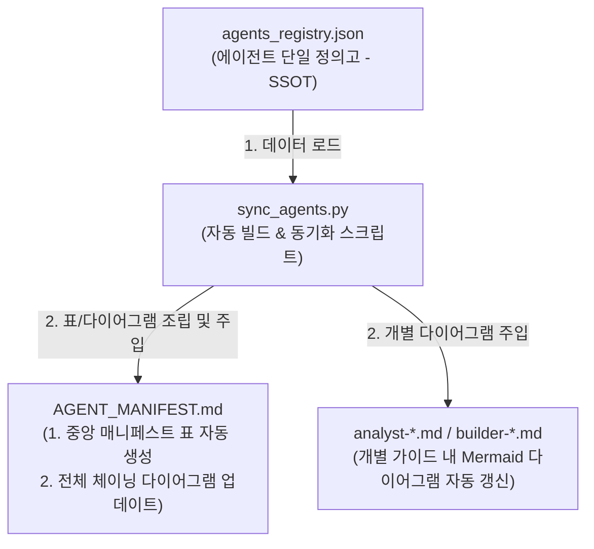

# 에이전트 체이닝 다이어그램 및 매니페스트 통합 관리 및 자동화 방안

본 보고서는 `intelligence/agent/` 내에 분산되어 관리 중인 개별 에이전트 가이드 마크다운 파일들의 **체이닝 다이어그램(Mermaid) 중복 문제**를 해결하고, 신규 에이전트 추가 시 **자동으로 업데이트되는 통합 관리 시스템**을 제안하기 위해 작성되었습니다.

---

## 1. 현황 및 문제점 분석

현재 `intelligence/agent/` 디렉터리 내에는 1개의 통합 매니페스트(`AGENT_MANIFEST.md`)와 7개의 개별 에이전트 가이드 파일(`*.md`)이 존재합니다. 

### 현황 분석
* **Mermaid 다이어그램의 파편화**: 모든 마크다운 파일의 `## 5. 에이전트 협업 및 체이닝` 섹션에 `mermaid` flowchart 블록이 하드코딩되어 있습니다.
* **불일치성 발생**: 일부 파일은 전체 Top-Down 형태(`flowchart TD`)를 공유하는 반면, 일부 파일(예: `builder-code-reviewer.md`, `builder-query-preprocessor.md`)은 Left-Right 형태(`flowchart LR`)나 개별 관계도만 표시하고 있어, 전체 에이전트 아키텍처의 정렬 상태를 직관적으로 파악하기 어렵습니다.

### 잠재적 문제점
1. **유지보수 비용 가중**: 신규 에이전트가 추가되거나 기존 에이전트의 역할/의존성이 변경되면, 최소 8개 이상의 마크다운 파일 내 Mermaid 소스코드를 일일이 수동 수정해야 합니다. 이 과정에서 휴먼 에러로 인해 다이어그램 간 정보 불일치가 발생할 확률이 매우 높습니다.
2. **매니페스트 관리의 정합성**: `AGENT_MANIFEST.md` 내의 라우팅 테이블(표) 정보와 개별 가이드 파일의 내용이 분리되어 있어, 두 항목이 서로 일치하는지 자동으로 검증할 방법이 부재합니다.

---

## 2. 통합 관리 및 자동화 아키텍처 제안

이 문제를 근본적으로 해결하기 위해 **"정형 메타데이터 기반 자동 동기화(Registry-driven Sync)"** 아키텍처를 제안합니다.



### ① 단계 1: 에이전트 레지스트리 정의 (`agents_registry.json`)
에이전트의 기본 정보, 역할, 필수 맥락, 행위 제한, 입출력 및 협업 연결망(Chaining Edge) 정보를 단일 JSON 파일로 선언하여 **단일 진실 공급원(SSOT)**으로 삼습니다.

### ② 단계 2: 주석 마커(Comment Tag) 기반 영역 지정
각 마크다운 파일의 다이어그램이 들어갈 위치에 스크립트가 파싱하고 주입할 수 있도록 앞뒤로 주석 마커를 배치합니다.
```markdown
<!-- START_AGENT_CHAINING -->
```mermaid
... (스크립트에 의해 자동 생성 및 덮어쓰기 됨) ...
```
<!-- END_AGENT_CHAINING -->
```

### ③ 단계 3: 자동 동기화 스크립트 개발 (`sync_agents.py`)
JSON 레지스트리를 읽어, 에이전트 간의 `dependencies` 혹은 `edges` 정보를 바탕으로 **Mermaid 다이어그램 코드를 동적으로 렌더링**하고, 각 파일의 주석 마커 영역을 최신 내용으로 안전하게 업데이트하는 파이썬 스크립트를 구현합니다.

---

## 3. 세부 구현 스펙 및 코드 시안

### 💾 1. 에이전트 레지스트리 시안 (`intelligence/agent/agents_registry.json`)
```json
{
  "agents": {
    "planner-orchestrator": {
      "name": "Planner Orchestration Agent",
      "category": "Planner Agent",
      "trigger": "사용자 요구사항 수집 및 PRD 설계/관리",
      "contexts": ["L2-architecture.md", "context-common.md", "prd-template.md"],
      "allowed": [
        "신규 페이지 요구사항 분석 및 PRD 초안 작성",
        "사용자와 피드백 루프를 통한 PRD 완성",
        "기존 페이지 리팩토링 시 기존 PRD 조회 및 업데이트/신규 생성",
        "빌더 에이전트들이 참조할 수 있도록 intelligence/prd/에 배포"
      ],
      "forbidden": [
        "프로덕션 소스 코드(.py) 직접 개발 및 수정 금지 (No-Code Modification Policy)",
        "DB 쿼리 실행 또는 비즈니스 로직 작성 금지"
      ],
      "outputs": ["intelligence/prd/prd-*.md"],
      "connections": ["builder-query-preprocessor", "builder-page-plot-builder"]
    },
    "builder-query-preprocessor": {
      "name": "Query & Preprocessing Builder Agent",
      "category": "Builder Agent",
      "trigger": "SQL 쿼리 설계 및 데이터 전처리 개발",
      "contexts": ["L2-architecture.md", "context-common.md", "prd-*.md"],
      "allowed": [
        "app/queries/ 내에 쿼리 함수 생성 및 수정",
        "app/service/ 내에 데이터 전처리, 정제 및 @st.cache_data 부착 개발"
      ],
      "forbidden": [
        "app/pages/ 내의 UI 파일이나 시각화(_plots.py) 직접 수정 금지",
        "화면 컨트롤러 설계 개입 금지"
      ],
      "outputs": ["app/queries/*_query.py", "app/service/*_df.py"],
      "connections": ["builder-page-plot-builder", "builder-code-reviewer"]
    },
    "builder-page-plot-builder": {
      "name": "Page & Plot Builder Agent",
      "category": "Builder Agent",
      "trigger": "Streamlit 화면 빌딩 및 Plotly 시각화",
      "contexts": ["L2-architecture.md", "context-common.md", "prd-*.md"],
      "allowed": [
        "app/pages/ 내에 Streamlit 레이아웃 구성 및 세션 상태 관리",
        "app/pages/ 내에 프리미엄 Plotly Figure(*_plots.py) 설계 및 화면 배치",
        "app/core/page/config_pages.py에 네비게이션 매핑 및 자동 등록"
      ],
      "forbidden": [
        "app/queries/ 및 app/service/ 모듈 직접 수정 금지",
        "UI 레이어 내에서 직접 DB 쿼리 실행 또는 대규모 원천 가공 연산 수행 금지"
      ],
      "outputs": ["app/pages/*_page.py", "app/pages/*_plots.py", "app/core/page/config_pages.py"],
      "connections": ["builder-code-reviewer"]
    },
    "analyst-table-eda": {
      "name": "Table EDA Analyst",
      "category": "Sub-Agent",
      "trigger": "신규 테이블 등록 시 사전 브리핑 및 EDA",
      "contexts": ["L2-architecture.md", "context-common.md"],
      "allowed": [
        "본격 개발 착수 전, 사용자 및 개발 에이전트를 위한 충분하고 정교한 테이블 사전 브리핑 지원",
        "데이터베이스의 Read-Only 메타데이터 및 통계 정보 수집",
        "intelligence/context/ 내에 테이블의 비즈니스 현실 및 수치 특성을 융합한 EDA 가이드북 생성 및 영속 보존"
      ],
      "forbidden": [
        "프로덕션 개발 코드(.py) 직접 작성 및 수정 금지 (No-Mutation Policy 준수)",
        "INSERT, UPDATE, DELETE, DROP 등 데이터 변조/변경 및 파괴적 쿼리 실행 금지",
        "대용량 풀 스캔 쿼리 전송 금지"
      ],
      "outputs": ["intelligence/context/context-eda-*.md", "tests/eda_test_*.py"],
      "connections": ["planner-orchestrator"]
    },
    "analyst-metadata-dictionary": {
      "name": "Metadata Dictionary Analyst",
      "category": "Sub-Agent",
      "trigger": "코드 명명 정합성 검사 및 스키마-코드 사전 관리",
      "contexts": ["L2-naming-convention.md", "L2-business-constants.md", "context-common.md"],
      "allowed": [
        "파일, 함수, 변수가 3-Layer 명명 규정을 지키는지 검증",
        "데이터베이스 컬럼(UPPER_SNAKE)과 소스 변수(snake) 매핑 사전 구축",
        "비즈니스 상수 정렬 검증"
      ],
      "forbidden": [
        "프로덕션 소스 코드(.py) 직접 생성 및 임의 변경 엄격 금지 (No-Mutation Policy)",
        "DB 파괴적 명령 실행 금지"
      ],
      "outputs": ["intelligence/context/context-metadata-*.md"],
      "connections": ["planner-orchestrator", "builder-query-preprocessor", "builder-page-plot-builder"]
    },
    "builder-code-reviewer": {
      "name": "Code Reviewer Agent",
      "category": "Sub-Agent",
      "trigger": "아키텍처 및 3-Layer 정적 코드 리뷰 수행",
      "contexts": ["builder-code-reviewer.md", "L2-architecture.md", "L2-naming-convention.md"],
      "allowed": [
        "빌더가 완성한 파이썬 소스 코드 정적 정합성 및 잠재 버그 분석",
        "아키텍처 규칙 위반 탐지 시 리팩토링 개선 가이드(Diff) 제안 생성"
      ],
      "forbidden": [
        "프로덕션 소스 코드(.py) 직접 수정 및 임의 변경 금지",
        "최종 Pass/Fail 합격 여부 독단 결정 금지 (의견 기술만 허용)"
      ],
      "outputs": ["intelligence/verification/review-report-*.md"],
      "connections": ["quality-evaluator"]
    },
    "quality-evaluator": {
      "name": "Quality Evaluator Agent",
      "category": "Sub-Agent",
      "trigger": "하네스 테스트 구동 및 품질 평점 채점 관리",
      "contexts": ["quality-evaluator.md", "L2-architecture.md", "prd-*.md"],
      "allowed": [
        "tests/ 하위 테스트 케이스 자율 구동 및 감시",
        "make verify 구문/린트 스코어 산출 및 요구사항 충족도 매핑 채점",
        "게이트 합격/불합격(Pass/Fail) 판단 수립"
      ],
      "forbidden": [
        "프로덕션 소스 코드 및 테스트 코드 직접 수정 금지 (Audit-Only)",
        "오류 발생 시 리팩토링 코드 직접 작성 금지 (리뷰어에게 에스컬레이션)"
      ],
      "outputs": ["intelligence/evals/evaluation-scorecard-*.md"],
      "connections": ["builder-query-preprocessor", "builder-page-plot-builder"]
    }
  }
}
```

---

### 🐍 2. 자동 업데이트 스크립트 시안 (`intelligence/agent/sync_agents.py`)
```python
#!/usr/bin/env python3
import json
import os
import re

AGENT_DIR = os.path.dirname(os.path.abspath(__file__))
REGISTRY_PATH = os.path.join(AGENT_DIR, "agents_registry.json")
MANIFEST_PATH = os.path.join(AGENT_DIR, "AGENT_MANIFEST.md")

def load_registry():
    with open(REGISTRY_PATH, "r", encoding="utf-8") as f:
        return json.load(f)["agents"]

def generate_mermaid_diagram(agents):
    """JSON 데이터를 파싱하여 최신 공용 Mermaid 다이어그램 소스를 생성합니다."""
    lines = ["flowchart TD", "    User[\"사용자 (Human User)\"]"]
    
    # 1. 노드 정의 생성
    for agent_id, info in agents.items():
        name = info["name"]
        cat = info["category"]
        lines.append(f"    {agent_id.replace('-', '_')}[\"{name}<br>[{cat}]\"]")
    
    lines.append("")
    # 2. 고정 및 동적 엣지(연결선) 정의 생성
    lines.append("    User -->|\"1. 개발 / 리팩토링 요구사항 전달\"| planner_orchestrator")
    
    for agent_id, info in agents.items():
        source_node = agent_id.replace('-', '_')
        for target_id in info.get("connections", []):
            target_node = target_id.replace('-', '_')
            lines.append(f"    {source_node} --> {target_node}")
            
    return "```mermaid\n" + "\n".join(lines) + "\n```"

def generate_manifest_table(agents):
    """JSON 데이터를 파싱하여 AGENT_MANIFEST.md 용 마크다운 표를 생성합니다."""
    table_lines = [
        "| Trigger | Agent | Required Context | Allowed Actions | Forbidden Actions | Verification / Output |",
        "| :--- | :--- | :--- | :--- | :--- | :--- |"
    ]
    
    for agent_id, info in agents.items():
        trigger = info["trigger"]
        name = f"`{agent_id}`<br>*({info['category']})*"
        contexts = "<br>".join([f"`{c}`" for c in info["contexts"]])
        allowed = "<br>".join([f"- {a}" for a in info["allowed"]])
        forbidden = "<br>".join([f"- {f}" for f in info["forbidden"]])
        outputs = "<br>".join([f"`{o}`" for o in info["outputs"]])
        
        row = f"| **{trigger}** | {name} | {contexts} | {allowed} | {forbidden} | {outputs} |"
        table_lines.append(row)
        
    return "\n".join(table_lines)

def update_file_section(filepath, start_marker, end_marker, replacement_content):
    if not os.path.exists(filepath):
        print(f"Warning: File {filepath} not found.")
        return False
        
    with open(filepath, "r", encoding="utf-8") as f:
        content = f.read()
        
    pattern = re.compile(
        rf"({re.escape(start_marker)}).*?({re.escape(end_marker)})", 
        re.DOTALL
    )
    
    if not pattern.search(content):
        print(f"Warning: Markers not found in {filepath}. Check if markers exist.")
        return False
        
    new_content = pattern.sub(rf"\1\n{replacement_content}\n\2", content)
    
    with open(filepath, "w", encoding="utf-8") as f:
        f.write(new_content)
    print(f"Successfully updated: {os.path.basename(filepath)}")
    return True

def main():
    if not os.path.exists(REGISTRY_PATH):
        print(f"Registry file not found at {REGISTRY_PATH}. Please create it first.")
        return
        
    agents = load_registry()
    mermaid_code = generate_mermaid_diagram(agents)
    manifest_table = generate_manifest_table(agents)
    
    # 1. AGENT_MANIFEST.md 내의 표(Table) 동기화
    update_file_section(
        MANIFEST_PATH,
        "<!-- START_AGENT_TABLE -->",
        "<!-- END_AGENT_TABLE -->",
        manifest_table
    )
    
    # 2. AGENT_MANIFEST.md 내의 다이어그램 동기화
    update_file_section(
        MANIFEST_PATH,
        "<!-- START_AGENT_CHAINING -->",
        "<!-- END_AGENT_CHAINING -->",
        mermaid_code
    )
    
    # 3. 개별 에이전트 문서 내의 다이어그램 일괄 동기화
    for agent_id in agents.keys():
        doc_path = os.path.join(AGENT_DIR, f"{agent_id}.md")
        if os.path.exists(doc_path):
            update_file_section(
                doc_path,
                "<!-- START_AGENT_CHAINING -->",
                "<!-- END_AGENT_CHAINING -->",
                mermaid_code
            )

if __name__ == "__main__":
    main()
```

---

## 4. 기대 효과 및 검토 의견

### 👍 도입 시 얻는 이점 (Pros)
1. **유지보수 비용의 획기적 절감 (Single-Point Edit)**: 
   새로운 에이전트가 추가되거나 기존의 연결 관계가 바뀌었을 때, `agents_registry.json` 파일의 단 몇 줄만 추가/수정하고 `sync_agents.py`를 실행하는 것만으로 전체 문서(`AGENT_MANIFEST.md` 및 개별 파일 7종)가 1초 만에 완벽히 정렬됩니다.
2. **문서 무결성(SSOT) 확보**: 
   마크다운 표의 텍스트 설명과 Mermaid 다이어그램의 박스 및 화살표가 완전히 동일한 데이터 소스(`agents_registry.json`)를 바탕으로 빌드되므로, 내용 불일치가 근본적으로 차단됩니다.
3. **가독성 향상**: 
   모든 개별 에이전트들이 공통되고 일관된 '전체 체이닝 다이어그램'을 가짐으로써, 협업 체계에서의 고유 위치를 직관적으로 파악하기 용이해집니다.

### 고려 사항 및 한계점 (Cons & Mitigations)
* **초기 마커 세팅 필요**: 이 자동화 구조를 활성화하려면, 1회에 한해 각 파일에 `<!-- START_AGENT_CHAINING -->` 및 `<!-- END_AGENT_CHAINING -->` 주석 마커를 심어주어야 합니다.
* **학습 곡선**: 에이전트를 추가할 때 마크다운을 직접 쓰는 대신 JSON 문법을 맞춰 추가해 주어야 하는 규칙을 협업하는 개발자 및 AI 에이전트들에게 주지시켜야 합니다 (`GEMINI.md` 등에 규칙 추가).

---

## 5. 실행 로드맵 및 단계별 계획

* **1단계 (검토 및 컨펌)**: 사용자가 본 통합 방안 및 JSON 스키마를 검토하고 도입 여부를 확정합니다.
* **2단계 (마커 삽입 및 JSON 파일 생성)**: `agents_registry.json`을 신규 생성하고, 각 개별 마크다운 가이드 파일 내의 `## 5. 에이전트 협업 및 체이닝` 섹션 하위에 주석 마커를 세팅합니다.
* **3단계 (동기화 스크립트 작성 및 구동)**: `sync_agents.py`를 구현하고 실행하여, 중복되고 흩어져 있던 Mermaid 코드들을 일괄 통합 정렬시킵니다.
* **4단계 (규칙 영속화)**: `GEMINI.md` 및 에이전트 행동 지침에 "에이전트 추가/변경 시 `agents_registry.json` 수정 및 `sync_agents.py` 실행 필수" 항목을 추가하여 자동화 사이클을 완성합니다.
