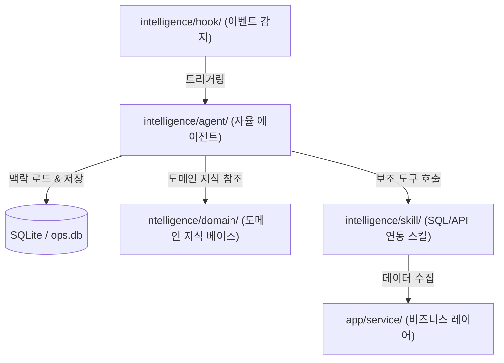

# current-workflow.md (현재 개발 흐름 및 AI 확장 가이드라인)

이 문서는 이 프로젝트의 현재 개발 방식, 아키텍처 흐름 및 이번에 새롭게 설계된 **AI 인텔리전스 확장 레이어(`intelligence/`)**의 개발 워크플로우를 기술합니다.

---

## 1. 3-레이어 애플리케이션 개발 표준 흐름 및 보안 격리
> [!IMPORTANT]
> 본 프로젝트의 UI, 서비스, 쿼리를 물리적으로 격리하는 3-레이어 개발 표준 파이프라인 및 신규 페이지 배포 시 최초 접근 권한을 Admin으로만 격리하는 핵심 보안 규정(Initial Sandbox)은 단일 진실 공급원(SSOT)인 **[3layer-development-process.md](file:///home/jumasi/workstation/intelligence/guide/3layer-development-process.md)**의 절차를 완벽히 준수합니다.

---

## 2. 테스트 및 하네스 검증 흐름 (Testing & Verification)

기존 기능의 안정성을 검증하기 위해 로컬 환경에서 단독 테스트 하네스를 활용해 검증 주기를 단축합니다.

- **독립 테스트 하네스 (`tests/`)**:
  - `tests/sql_query_test.py` 와 같이 기존 코드의 수정 없이 인메모리 테스트 기법만 활용해 서비스 레이어와 DB 클라이언트를 격리 검증합니다.
  - 상세 테스트 격리 원칙 및 `verify_code.py` 구문 문법 정적 검증은 [testing-verification.md](file:///home/jumasi/workstation/intelligence/guide/testing-verification.md) 문서를 참조합니다.
- **실행 원칙 (Python Path)**:
  - 모듈의 상대 경로 및 루트 패키지 임포트가 정상 동작하도록 실행 시에는 항상 `PYTHONPATH`를 루트 경로(`workstation/`)로 선언하고 실행해야 합니다.
  ```bash
  PYTHONPATH=/home/jumasi/workstation /home/jumasi/miniconda3/envs/goeq/bin/python tests/sql_query_test.py
  ```

---

## 3. AI 확장 레이어 워크플로우 (AI Agent Workflow)

새롭게 추가된 **`intelligence/` 디렉터리**는 본 시스템의 데이터 분석 결과를 지능화하고 자율적인 품질 의사결정을 자동화하기 위한 공간입니다.



### 1) AI Skill 개발 흐름 (`intelligence/skill/`)
- 에이전트가 원천 DB(Databricks 등) 혹은 로컬 SQLite 데이터에 자율적으로 접근할 수 있는 **도구(Tools/Skills)**를 설계합니다.
- `app/service/` 레이어 및 `app/core/` 모듈의 함수를 매핑하여 필요한 데이터를 수집 및 필터링할 수 있는 함수형 API 혹은 쿼리 익스큐터를 설계합니다.
- 각 스킬은 타입 힌트와 상세한 Docstring을 작성해야 에이전트가 자율적으로 도구 사용법을 이해할 수 있습니다.

### 2) AI 도메인 지식 및 맥락 관리 흐름 (`intelligence/domain/` 등)
- 에이전트가 자율 업무 수행 시 준수해야 하는 공장 품질 가이드, CQMS/GMES 품질 지표 연산 사전 등 도메인 고유 지식 베이스는 **`intelligence/domain/`** 내 표준 마크다운 문서를 탐색하여 참조합니다.
- 사용자 세션, 에이전트 품질 이슈 이력, 과거 챗봇 대화 등의 메모리 혹은 영속성 맥락은 SQLite(`ops.db` 또는 전용 `ai_memory.db`) 데이터베이스 테이블을 통해 안전하게 관리합니다.

### 3) AI Hook 바인딩 흐름 (`intelligence/hook/`)
- 비즈니스 상 특정 이벤트가 발생할 때 AI를 자동으로 동작시키는 감지기입니다.
- 상세 품질 게이트 및 훅 아키텍처 사양은 [hooks-specification.md](file:///home/jumasi/workstation/intelligence/hook/hooks-specification.md) 문서를 전적으로 준수합니다.
- Streamlit 페이지 진입, 특정 공장의 대량 불량 건수 데이터 수집(GMES), 주기적 백그라운드 갱신 작업(`automation/`) 완료 시점 등에 훅을 결합하여, 실시간 지능형 진단 보고서를 띄우는 이벤트를 트리거합니다.

### 4) AI Agent 핵심 구현 (`intelligence/agent/`)
- 위 요소들(Skill, Domain, Hook)을 통합 활용하여 실제 품질 분석, 의사 결정, 품질 경보 메커니즘을 구동하는 지능형 에이전트 로직을 코딩합니다.
- 프롬프트 템플릿, 에이전트 실행 루프, 추론 과정 분석(Chain of Thought) 결과를 제어하는 메인 엔진 클래스가 이곳에 위치하게 됩니다.

---

## 개발 준수 사항 및 규칙

* **기존 코드 보호 규칙(GEMINI.md Safety Lock)**:
  AI 확장 레이어(`intelligence/`)나 독립 테스트(`tests/`)에서 코드를 추가 및 호출하는 것은 완전히 허용되나, 이 과정에서 `app/core/`, `app/service/`, `app/queries/`, `app/pages/` 등의 기존 소스 코드를 동의 없이 변경하는 것은 엄격히 제한됩니다.
* **Streamlit 캐시 친화적 설계**:
  에이전트가 도출하는 원형 데이터도 시스템에 부하가 걸리지 않도록 최대한 캐시된 서비스 레이어 API를 경유하여 취득하도록 설계해야 합니다.
