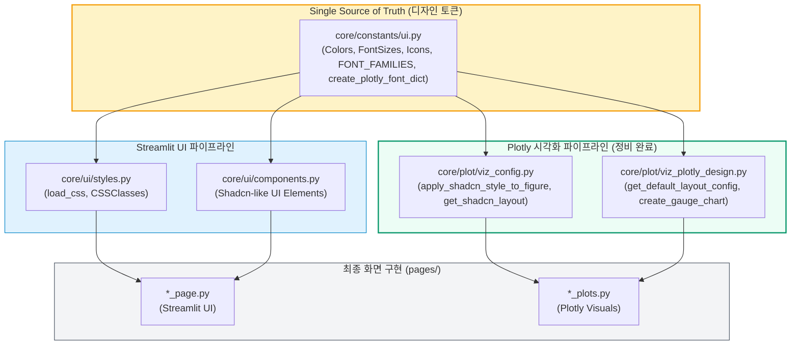

# IQM+ (Interactive Quality Management Plus) 통합 디자인 시스템 가이드
> **Streamlit UI & Plotly Visualization 중앙화 명세서 (최신 정비 적용 완료)**

이 가이드는 IQM+ 프로젝트 내의 모든 화면(Pages)과 시각화 차트(Plotly Charts)에서 일관된 사용자 경험(UX)과 고품질의 비주얼 정체성을 유지하고, 색상 및 폰트 설정을 단일 소스(Single Source of Truth)로 중앙 관리하기 위한 개발 지침서입니다.

최근 **차트 시각화 공통 모듈(`core/plot/`) 내에 잔존해 있던 하드코딩 폰트 패밀리 및 크기 지수들을 중앙 토큰 참조 방식으로 완전히 리팩토링 정비 완료**하였습니다.

---

## 1. 중앙화 디자인 파이프라인 아키텍처
IQM+는 3-Layer 아키텍처와 통합되어 UI 테마와 시각화 테마가 하나의 통합 디자인 토큰을 참조하도록 설계되었습니다.



---

## 2. 디자인 토큰 레퍼런스 (Design Token Reference)

### 2.1. Color Tokens (`core/constants/ui.py` - `Colors` 클래스)
모든 UI 요소와 차트 트레이스(Trace)는 아래 지정된 헥사코드 상수를 호출하여 사용하며, **하드코딩을 절대 금지**합니다.

| 구분 | 변수명 | 헥사코드 | 설명 / 용도 |
| :--- | :--- | :--- | :--- |
| **기본 (Shadcn)** | `colors.primary` | `#0f172a` | Slate-900 (기본 브랜드 강조색, 진한 회색) |
| | `colors.secondary` | `#64748b` | Slate-500 (보조 텍스트, 설명글 등 중간 회색) |
| | `colors.muted` | `#94a3b8` | Slate-400 (비활성화 상태, 연한 회색) |
| | `colors.light` | `#e2e8f0` | Slate-200 (테두리선, 아주 연한 회색) |
| | `colors.white` | `#ffffff` | 전역 기본 배경색 및 컴포넌트 내부 배경 |
| **상품 완성도 특화 (IQM)** | `colors.iqm_primary_500` | `#F28C28` | IQM 브랜드 메인 KPI, 핵심 수치 강조색 (오렌지) |
| | `colors.iqm_primary_700` | `#C96A14` | Hover, Pressed, 혹은 매우 강력한 시각적 강조 |
| | `colors.iqm_primary_300` | `#F7B267` | 보조 포인트, 서브 하이라이팅 영역 |
| | `colors.iqm_primary_100` | `#FDE7CC` | 강조 카드 배경색, 배지, 칩용 |
| **대비선 및 참조선** | `colors.iqm_pre_color` | `#4A6FA5` | 변경 전(PRE) 대비 데이터용 색상 |
| | `colors.iqm_post_color` | `#2FA4A9` | 변경 후(POST) 대비 데이터용 색상 |
| | `colors.iqm_spec_red` | `#D64545` | 스펙 리밋(Spec Limit), 불량 임계값 라인 |
| | `colors.iqm_mean_gray` | `#374151` | 통계적 평균선, 중앙값선 (Mean/Median Line) |
| | `colors.iqm_analysis_purple`| `#7C6EE6` | 데이터 분석용 회귀선, 추세선 (Trend Line) |
| **상태 알림** | `colors.success` / `positive`| `#22c55e` | 정상 상태, 향상, 긍정 데이터 알림 |
| | `colors.error` / `negative`| `#ef4444` | 이상 감지, 품질 이슈, 스펙 아웃(Spec-Out) 알림 |
| | `colors.warning` | `#f59e0b` | 경고 상태, 주의가 필요한 영역 알림 |
| | `colors.info` | `#3b82f6` | 시스템 상태 및 단순 공지 정보 알림 |

> [!TIP]
> **다중 카테고리 차트**에서는 `colors.multi_color_1`부터 `colors.multi_color_20`까지 제공되며, 순서대로 자동 적용하고 싶을 때는 `core.constants.ui.multi_colors_list`를 활용해 슬라이싱해 쓸 수 있습니다.

---

## 3. Typography Tokens (`core/constants/ui.py` - `FontSizes` 및 `FONT_FAMILIES`)

### 3.1. 폰트 패밀리 (Font Family)
- **전역 UI (Streamlit & CSS)**: `"Geist"`, `"Noto Sans KR"`, `-apple-system`, `sans-serif` (전역 주입을 통해 강제 제어)
- **시각화 (Plotly)**: `Inter`, `Source Sans Pro`, `system-ui`, `sans-serif` (차트 내부 해상도 가독성을 극대화하기 위해 별도로 제공)
  > 차트 폰트 적용 시에는 `get_font_family("chart")` 또는 `get_font_family("display")` 함수를 활용해 동적으로 연결합니다.

### 3.2. 폰트 크기 체계 (Font Size Table)
Streamlit UI(Rem 단위)와 Plotly 시각화(Px 단위)는 항상 상응하도록 일대일 상수로 매핑되어 관리됩니다.

| Rem 토큰명 | 값 (rem) | Px 토큰명 | 값 (px) | 대표 권장 용도 |
| :--- | :--- | :--- | :--- | :--- |
| `font_sizes.xs` | `0.75rem` | `font_sizes.xs_px` | `12` | 타임스탬프, 메타데이터, 범례(Legend), 뱃지 내부 텍스트 |
| `font_sizes.small` | `0.875rem` | `font_sizes.small_px` | `14` | 일반 본문 텍스트, 축 레이블(Axis Label), 주석(Annotation) |
| `font_sizes.base` | `1.0rem` | `font_sizes.base_px` | `16` | 표준 텍스트 기본값, 테이블 데이터 셀 |
| `font_sizes.medium` | `1.125rem` | `font_sizes.medium_px` | `18` | 카드 컴포넌트 내 값 설명, 소제목, 강조글 |
| `font_sizes.large` | `1.25rem` | `font_sizes.large_px` | `20` | 섹션 제목, 중요 지표, 차트 축 타이틀 |
| `font_sizes.xl` | `1.5rem` | `font_sizes.xl_px` | `24` | 탭 헤더 타이틀, 기본 페이지 타이틀, 차트 타이틀 |
| `font_sizes.xxl` | `1.75rem` | `font_sizes.xxl_px` | `28` | 대형 타이틀, 핵심 모니터링 경보용 디스플레이 |
| `font_sizes.xxxl` | `2.0rem` | `font_sizes.xxxl_px` | `32` | 메인 대시보드 KPI 빅넘버(Big Number) |

---

## 4. 공통 모듈 완전 중앙화 정비 내역 (리팩토링 세부사항)
이번 정비를 통해 공통 플롯 라이브러리(`core/plot/`) 내부의 하드코딩 요소가 디자인 토큰 참조 체계로 완전히 흡수되었습니다.

### 4.1. `core/plot/viz_plotly_design.py` 수정 완료
- **폰트 패밀리 중앙화**:
  - `TraceConfig`의 `default_font_family`를 기존 하드코딩 `"Inter, -apple-system, ..."`에서 `get_font_family("chart")`로 대체.
  - `LayoutConfig`의 `default_font_family`를 기존 하드코딩 `"Noto Sans KR, ..."`에서 `get_font_family("primary")`로 대체.
  - 게이지 차트 생성부(`create_gauge_chart`) 내 축/주석 폰트 패밀리를 `get_font_family("chart")`로 일괄 대체.
- **폰트 크기 및 게이지 상태색 매핑 정비**:
  - 인디케이터/게이지 내 하드코딩 수치 폰트 크기(`36`)를 중앙 토큰 `font_sizes.xxxl_px` (32)로 통합 조율.
  - 게이지 스텝 컬러 하드코딩 값들을 중앙 `colors.orange_50`, `colors.orange_200`, `colors.green_100`으로 안전하게 싱크 완료.

### 4.2. `core/plot/viz_config.py` 수정 완료
- **Shadcn 공통 레이아웃 폰트/사이즈 중앙화**:
  - `get_shadcn_layout` 함수 내부의 제목 폰트 패밀리를 `get_font_family("display")`, 크기를 `font_sizes.medium_px`로 정밀 연계.
  - 본문 폰트 패밀리를 `get_font_family("chart")`, 크기를 `font_sizes.small_px`로 연계.
  - `FONT_STYLES` 내에 존재하던 하드코딩된 `"Inter, sans-serif"` 문자열들을 `get_font_family("display")` 및 `get_font_family("chart")` 호출로 완벽 전환.

---

## 5. 코드 적용 규칙 및 마이그레이션 예시 (Before vs After)

### 5.1. Streamlit UI 코드 가이드

#### Before (안티패턴: 인라인 인스타일 및 색상 하드코딩)
```python
# 색상과 폰트 크기가 직접 기재되어 있어, 테마 스위칭이나 디자인 일괄 수정이 불가능함
st.markdown(
    "<span style='color: #F28C28; font-size: 24px; font-weight: bold;'>생산 현황</span>",
    unsafe_allow_html=True
)
st.markdown(
    "<div style='background-color: #f3f4f6; padding: 10px; border-radius: 5px;'>기본 정보</div>",
    unsafe_allow_html=True
)
```

#### After (디자인 시스템 적용: 중앙화 토큰 활용 및 공통 CSS 클래스 활용)
```python
from core.constants.ui import colors, font_sizes
from core.ui.styles import CSSClasses

# 1. 디자인 시스템 토큰 직접 호출 사용
st.markdown(
    f"<span style='color: {colors.iqm_primary_500}; font-size: {font_sizes.xl}; font-weight: 700;'>생산 현황</span>",
    unsafe_allow_html=True
)

# 2. core/ui/styles.py의 CSS 클래스 또는 UI 컴포넌트 활용 (더욱 강력히 권장)
from core.ui.components import render_info_panel

# custom 컴포넌트를 사용하면 내부 마진, 폰트, 배경 등이 자동으로 통합 제어됩니다.
render_info_panel(
    title="기본 정보",
    content="공장 설비 운영 현황",
    icon="info"
)
```

---

### 5.2. Plotly 시각화 코드 가이드

#### Before (안티패턴: 개별 플롯마다 폰트 및 고정 크기/색상 직접 생성)
```python
import plotly.graph_objects as go

# 개별 플롯 파일에서 'black' 색상 및 12, 20 등 숫자를 하드코딩함
fig = go.Figure()
fig.add_trace(go.Scatter(x=x, y=y, marker=dict(color="#f97316")))
fig.update_layout(
    title=dict(text="생산성 트렌드", font=dict(color="black", size=16)),
    xaxis=dict(tickfont=dict(color="black", size=12)),
    yaxis=dict(tickfont=dict(color="black", size=12)),
    paper_bgcolor="white"
)
```

#### After (디자인 시스템 적용: 차트 템플릿 및 통합 폰트 제어 유틸 활용)
```python
from core.constants.ui import colors, font_sizes, create_plotly_font_dict
from core.plot.viz_config import apply_shadcn_style_to_figure

fig = go.Figure()
# 1. 개별 트레이스 색상 및 마커는 중앙화된 colors 토큰 및 폰트 유틸 사용
fig.add_trace(go.Scatter(
    x=x, 
    y=y, 
    marker=dict(color=colors.iqm_primary_500)
))

# 2. 폰트 구조화 유틸리티 함수 'create_plotly_font_dict'를 활용해 일괄 제어
fig.update_layout(
    title=dict(
        text="생산성 트렌드", 
        font=create_plotly_font_dict("title") # 알아서 display 폰트 및 20px, gray_900 세팅됨
    ),
    xaxis=dict(
        tickfont=create_plotly_font_dict("axis_label") # 알아서 chart 폰트 및 12px, gray_500 세팅됨
    ),
    yaxis=dict(
        tickfont=create_plotly_font_dict("axis_label")
    )
)

# 3. 혹은 전반적인 공통 테마 레이아웃 주입 유틸리티 활용 (엄격 권장)
# 배경색, 마진, 축 그리드 스타일 등을 일관성 있게 일괄 정렬해 줍니다.
fig = apply_shadcn_style_to_figure(fig, title="생산성 트렌드", height=400)
```

---

## 6. 유지보수 및 자가 검증 프로토콜

화면을 추가 개발하거나 수정 시 다음 자가 검사(Self-Check) 체크리스트를 준수해 주세요.

1. [ ] **Hex-Code 하드코딩 여부**: `"#F28C28"`, `"#FFFFFF"`, `"black"`, `"white"`, `"red"` 등의 하드코딩된 스타일 문자열이 없는가?
2. [ ] **Font Family 하드코딩 여부**: 코드 내에 `"Inter"`, `"Malgun Gothic"`, `"Nanum Barun Gothic"` 등 특정 폰트명이 인라인으로 박혀있지 않은가? (전부 `get_font_family()`를 통해 제어)
3. [ ] **Font Size 정수형 하드코딩 여부**: `size=16`, `size=22`, `size=11` 등 임의의 숫자를 폰트 크기 속성에 직접 인라인 대입하지 않았는가? (`font_sizes.base_px` 혹은 `create_plotly_font_dict` 활용 확인)
4. [ ] **CSS 주입 규칙**: 커스텀 CSS를 화면에 주입하기 전, `core/ui/styles.py`의 `load_css()`가 정상 실행되었고 필요한 경우 `CSSClasses`의 클래스 상수를 명시적으로 상속해 사용했는가?

---

> **Note**: 본 가이드의 single source of truth인 `core/constants/ui.py`를 정기적으로 검토하여 공장 공통 테마 및 클라이언트 품질 등급 컬러의 업데이트 여부를 싱크해야 합니다.

---

## 7. 폰트 시스템 표준화 및 일관성 개선 계획 (Font System Standardization & Alignment Plan)

> [!NOTE]
> 본 섹션은 OEquality BI 프로젝트 전반에 걸쳐 제각각 파편화되어 정의 및 하드코딩되어 있는 폰트 시스템(Font Family, Weights, Sizes)을 근본적으로 정비하고, `app/core/constants/ui.py`를 단일 진실 공급원(SSOT)으로 삼아 완벽히 일관성을 수호하기 위한 구조화된 개선 계획을 명시합니다.

### 7.1. 현황 및 파편화 문제점 분석 (As-Is Assessment)
1. **디자인 시스템(SSOT)의 구조적 모순**: 
   - `app/core/constants/ui.py`의 `Icons` 클래스(아이콘 전용 명세) 안에 `font_family` 문자열 속성이 기형적으로 삽입되어, 이로 인해 `styles.py` 등에서 `icons.font_family`를 기형적으로 상속해 사용하는 기형적 참조 패턴이 유지되어 왔습니다.
2. **개별 페이지 및 컴포넌트 내 폰트 하드코딩**:
   - `iqm_plus_main_page.py` 에서 `'Inter'`, `'Outfit'` 폰트를 수동 하드코딩 적용.
   - `metadata_manager_page.py` 에서 `'Pretendard'`, `'Inter'` 폰트를 하드코딩하여 사용.
   - `app/core/ui/components.py` 내부에 `font_family="Inter, -apple-system, ..."`를 직접 문자열 하드코딩 적용.
3. **글로벌 CSS (`styles.py`) 내 폰트 정의 혼선**:
   - `sans-serif !important`, `"Geist", "Geist Fallback", sans-serif !important` 등 단일화되지 못한 다중 스택이 산발적으로 산재하여 화면 영역별로 렌더링 자형이 엇갈리는 현상 발생.

### 7.2. 개선 아키텍처 디자인 (Target Architecture)
- 물리 폰트 선언 및 가독성 폰트 스택 정의를 `ui.py` 내의 신설 `Fonts` 데이터클래스로 완전 통합하고, `Icons` 내부의 `font_family` 변수는 제거합니다.
- 영문/숫자 가독성은 `Inter` 및 `Geist` 조합, 한국어 가독성은 한국어 표준 `Pretendard` 조합, 그리고 타이틀 강조 디자인은 프리미엄 `Outfit` 조합으로 각각 시맨틱 폰트 스택을 고도화하여 통제합니다.

### 7.3. 단계별 마이그레이션 로드맵 (Action Roadmap)
- **Phase 1: ui.py 내 통합 Fonts 토큰 시스템 정의**
  - `Fonts` 데이터클래스를 신설하고 글로벌 `fonts` 인스턴스를 공유하며, 레거시 크래시 방지용 과도기적 별칭(Alias) 지정.
- **Phase 2: 공통 UI CSS 및 스타일 모듈 개편**
  - `styles.py` 및 `components.py` 내의 `icons.font_family`를 `fonts.primary` 등으로 전량 전환 및 중복 CSS 삭제.
- **Phase 3: 개별 대시보드 내 인라인 폰트 스타일 제거**
  - `app/pages/` 하위에서 개별 수동 적용된 `font-family` 인라인 마크다운 스타일 구문을 전량 삭제하고 `fonts` 토큰 또는 글로벌 공통 클래스로 대체 적용.
