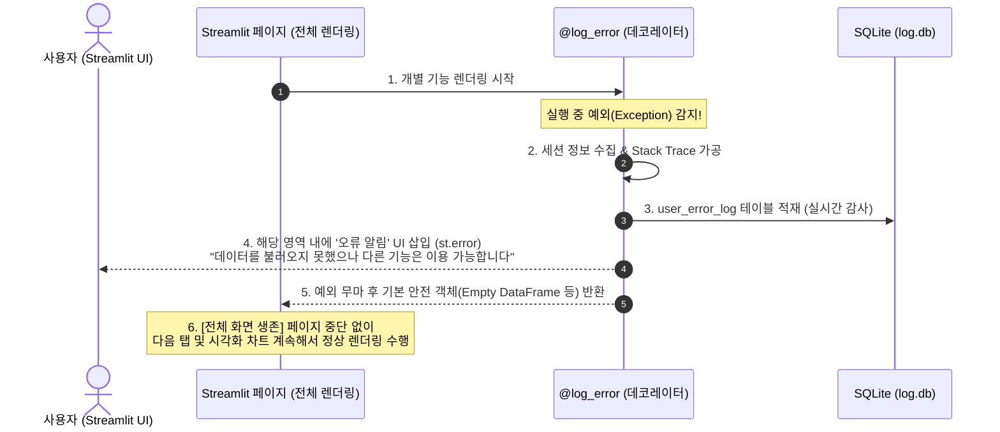

# 애플리케이션 에러 로그 집계 및 분석 구축 설계서 (2단계 로그 정책)

이 문서는 3대 로그 관리 정책 중 **2단계인 "애플리케이션 에러 로그 집계 및 분석"**에 대한 기술 사양 및 구축 방안을 정의합니다. 

특히 사용자가 특정 기능에서 에러를 경험했을 때, **해당 기능 구역에서만 에러가 발생했음을 친근하게 고지하고 전체 페이지가 중단(Crash)되지 않으며, 다른 기능 및 컴포넌트들은 계속해서 정상적으로 렌더링 및 작동되도록 보장하는 "에러 격리(Error Boundary)" 메커니즘**을 설계에 추가로 반영하여 기술 신뢰성을 극대화합니다.

---

## 1. 아키텍처 흐름도 (Mermaid)

특정 기능 영역에서 예외가 발생하더라도, 이를 안전하게 차단(Sandbox)하여 개별 영역에만 에러 표시를 하고 전체 Streamlit 페이지의 다른 기능들은 차례대로 렌더링되는 흐름입니다.



---

## 2. 데이터베이스 설계 (Schema)

1단계 로그인 로그 시스템의 `log.db`를 그대로 활용하며, 에러 기록을 보관할 `user_error_log` 테이블을 정의합니다.

### 테이블명: `user_error_log`

| 컬럼명 | 데이터 타입 | 제약 조건 | 설명 |
| :--- | :--- | :--- | :--- |
| `error_id` | `INTEGER` | `PRIMARY KEY AUTOINCREMENT` | 에러 로그 고유 식별자 |
| `error_time` | `TEXT` | `DEFAULT (datetime('now', 'localtime'))` | 에러 발생 시각 (KST 로컬 타임) |
| `employee_id` | `INTEGER` | `FOREIGN KEY` | 에러가 발생한 사용자의 사번 |
| `error_feature` | `TEXT` | `NOT NULL` | 에러가 발생한 기능명 혹은 파일 경로 |
| `error_message` | `TEXT` | `NOT NULL` | 에러 메시지 요약 (`str(exception)`) |
| `stack_trace` | `TEXT` | `NOT NULL` | 개발자 디버깅용 전체 Stack Trace |
| `client_ip` | `TEXT` | `DEFAULT 'UNKNOWN'` | 사용자의 IP 주소 |
| `user_agent` | `TEXT` | `DEFAULT 'UNKNOWN'` | 사용자의 브라우저/OS 정보 |

---

## 3. 에러 격리(Error Boundary) 및 수집 메커니즘 설계

Streamlit은 싱글 스크립트 실행 환경이므로, 처리 중 오류가 발생하여 예외가 그대로 상위로 올라갈 경우 **페이지 전체가 렌더링을 멈추고 빈 화면(Crash)으로 바뀌는 치명적인 약점**이 있습니다.

이를 해결하기 위해, 새로 설계할 데코레이터에 **"에러 격리 및 기본 반환값(`default_return`)"** 설정을 추가하여, 에러가 발생한 기능의 영역은 안전하게 `st.error()`로 마킹하고, 다른 화면들은 방해받지 않고 매끄럽게 그려지도록 보장합니다.

### 데코레이터 구현 사양 (`app/core/ui/error_handler.py` 신설)

```python
import functools
import logging
import traceback
import streamlit as st
from app.core.db.sqlite_utils import SQLiteDML

logger = logging.getLogger(__name__)

def log_error(feature_name: str, default_return=None):
    """
    Streamlit 페이지 기능이나 서비스 모듈의 에러를 감지하여
    SQLite의 'user_error_log' 테이블에 자동 기록하고, 
    에러가 전체 페이지로 전파되어 화면 렌더링이 깨지는 현상을 방지(Error Boundary)하는 데코레이터입니다.
    
    Args:
        feature_name (str): 에러가 발생한 기능 또는 페이지의 직관적인 이름
        default_return (any): 에러 발생 시 전체 렌더링 유지를 위해 반환할 기본값 (예: pd.DataFrame(), None, [] 등)
    """
    def decorator(func):
        @functools.wraps(func)
        def wrapper(*args, **kwargs):
            try:
                # 원본 함수 실행
                return func(*args, **kwargs)
            except Exception as e:
                # 1. 세션 및 컨텍스트 정보 추출
                employee_id = st.session_state.get("employee_id", None)
                client_ip = st.session_state.get("client_ip", "UNKNOWN")
                user_agent = st.session_state.get("user_agent", "UNKNOWN")
                
                # 2. 에러 및 Stack Trace 상세 가공
                error_msg = str(e)
                stack_trace = traceback.format_exc()
                
                # 3. SQLite DML을 활용하여 'log' DB에 즉시 적재
                try:
                    dml = SQLiteDML("log")
                    dml.insert_row(
                        table="user_error_log",
                        columns=[
                            "employee_id", 
                            "error_feature", 
                            "error_message", 
                            "stack_trace", 
                            "client_ip", 
                            "user_agent"
                        ],
                        values=(employee_id, feature_name, error_msg, stack_trace, client_ip, user_agent)
                    )
                    logger.info(f"[Error Logged] Feature: {feature_name} saved to DB.")
                except Exception as db_err:
                    logger.critical(f"CRITICAL: Failed to write error log to SQLite! Error: {db_err}")
                
                # 4. 사용자에게 해당 구역에서만 에러가 발생했음을 안전하게 고지 (에러 UI 영역 한정)
                st.error(
                    f"⚠️ **'{feature_name}' 기능 로딩 중 일시적인 오류가 발생했습니다.**\n\n"
                    f"일부 데이터를 표시할 수 없으나, 다른 기능 및 차트는 계속해서 이용이 가능합니다.\n"
                    f"*(상세 원인: {error_msg})*"
                )
                
                # 5. 핵심: 원본 에러를 raise하지 않고, 지정된 안전 기본 객체(Container)를 반환하여
                # 이후 실행될 다른 UI 컴포넌트나 연동 렌더링 프로세스가 정상 수행되도록 에러를 철저히 '격리'합니다.
                return default_return
        return wrapper
    return decorator
```

### 페이지별 실무 적용 예시 (`app/pages/`)

아래 예시처럼 데이터 전처리 및 시각화용 데이터프레임을 생성할 때 에러가 나더라도, **빈 데이터프레임(`pd.DataFrame()`)**을 반환받아 차트 렌더링에 필요한 속성이 유지되므로 전체 화면이 깨지지 않고 자연스럽게 지속됩니다.

```python
import pandas as pd
import streamlit as st
from app.core.ui.error_handler import log_error

# 에러가 발생해도 전체 화면이 안 깨지도록 빈 DataFrame을 기본 반환값으로 명시
@log_error("CQMS 원시 데이터 수집 및 전처리", default_return=pd.DataFrame())
def load_and_preprocess_cqms_data(params):
    # 만약 원시 데이터 쿼리 중 DB 오프라인이나 일시적인 Timeout이 발생할 경우
    # 1. DB 에러 로깅 수행
    # 2. st.error() 알림 표출
    # 3. 안전하게 빈 DataFrame() 반환
    df = db_client.execute(query_string)
    return df

# 페이지 렌더링 제어부
def run_cqms_page():
    st.title("CQMS 품질 모니터링")
    
    # 에러 발생 시 빈 데이터프레임이 리턴되어 하단 차트나 테이블은 빈 상태로 안전하게 렌더링 유지됨
    df_data = load_and_preprocess_cqms_data(st.session_state.params)
    
    st.subheader("실시간 품질 트렌드 차트")
    if not df_data.empty:
        st.plotly_chart(create_trend_plot(df_data))
    else:
        st.info("⚠️ 표시할 품질 데이터가 존재하지 않습니다. 상단의 에러 알림을 검토해주십시오.")
        
    st.subheader("기타 분석 지원 및 매뉴얼 가이드")
    st.write("이 영역은 상단 데이터 조회 오류 여부와 상관없이 끊김 없이 정상적으로 로드됩니다.")
```

---

## 4. UI 및 시각화 모니터링 방안 (관리자 페이지 연동)

수집된 격리 에러 내역은 **`assess_log_temp_page.py` 관리자 화면**에 **"Error Audit Dashboard"** 탭을 추가하여 다음과 같이 직관적인 관리 경험을 제공합니다.

### 1) 신규 핵심 지표 (Metrics) 대시보드 배치
- **Total Error Count**: 분석 기간 내 수집된 에러 로그 총합
- **Impacted Users**: 에러를 겪었지만 화면 이탈 없이 격리 치료된 고유 사용자 수
- **Crash Defense Ratio**: 데코레이터를 통해 전체 화면 붕괴(Crash)를 방지해 낸 방어 성공률 (격리 적용된 호출 수)

### 2) 분석용 시각화 차트 구성 (Plotly 연동)
- **Error Time-series Trend**: 일단위/시간별 에러 발생 건수 추이 -> 배포 전후 에러 이상 징후 분석
- **Error Category by Feature**: 기능별 에러 비중 (도넛 차트) -> 사용자 경험(UX)을 가장 크게 저해하는 취약 기능 선별

### 3) 실시간 에러 분석 Raw 테이블 및 Stack Trace 뷰어 (Dialog 연동)
- 에러 기록을 표로 노출하고, 상세 디버깅을 위해 테이블의 특정 로그를 클릭하면 `st.dialog` 모달 창에 **형형색색의 깔끔하게 포맷팅된 Python Traceback 코드**를 노출하여 개발 및 운영진의 즉각적인 트러블슈팅을 보장합니다.

---

## 5. 향후 확장 및 3단계 추진 로드맵 제언

| 단계 | 정책명 | 핵심 내용 | 현재 상태 |
| :--- | :--- | :--- | :--- |
| **1단계** | **로그인 및 세션 로그 수집** | 로그인 성공/실패, IP, User-Agent, 평균 체류 시간, 사용자 권한 통계 | **완료 (100%)** |
| **2단계** | **애플리케이션 에러 로그 수집** | 에러 자동 로깅, **에러 격리(Error Boundary) 기술을 통한 화면 생존력 보장**, Stack Trace 분석 | **본 설계서 (보완 완료)** |
| **3단계** | **기능별 성능 및 쿼리 Audit** | 특정 기능의 쿼리 속도 모니터링, 3초 이상 병목 쿼리 추적, 인프라 부하 감시 | **대기 중** |

---
*본 격리 아키텍처는 에러 상황에서도 사용자 이탈 및 전체 시스템 불통을 야기하지 않는 현대적인 대시보드 엔지니어링 표준(Fault Isolation)을 적용하여 정교하게 최적화되었습니다.*
