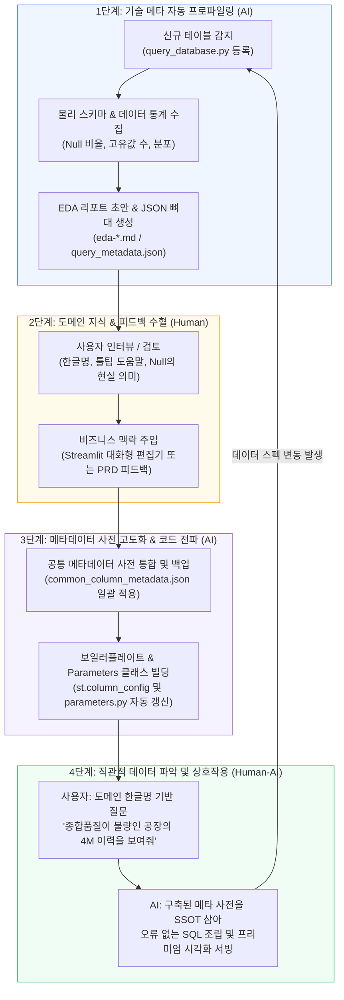

# 메타데이터 에이전트의 사용자-AI 협업 프레임워크 및 워크플로우 설계서
(Metadata Agent Collaboration & Chaining Framework)

이 문서는 사용자와 AI가 상호작용하면서, AI가 원천 데이터의 비즈니스 현실을 완벽하게 이해하고 사용자는 AI를 통해 데이터를 쉽고 강력하게 파악할 수 있도록 돕는 **'상호 지식 순환형 메타데이터 에이전트(Interactive Metadata Agent)'**의 역할 구분 및 워크플로우 설계 제안서입니다.

본 설계는 프로젝트의 기존 기술 명세([common-column-metadata-design.md](file:///home/jumasi/workstation/intelligence/guide/common-column-metadata-design.md), [metadata-editor-design.md](file:///home/jumasi/workstation/intelligence/guide/metadata-editor-design.md))를 인간-AI 협업 관점의 고차원 프로세스로 바인딩하고 승화시킵니다.

---

## 1. 철학 및 핵심 개념: 데이터의 이중성 (Duality of Data)

데이터는 단순히 데이터베이스에 적재된 물리적 테이블과 타입의 집합이 아닙니다. 데이터는 **'기술적 사양(Technical Spec)'**과 **'비즈니스 현실(Business Context)'**이 결합될 때 비로소 가치를 지니는 이중적 실체입니다.

```
┌────────────────────────────────────────────────────────────────────────┐
│                        데이터의 완전한 이해 (SSOT)                       │
└───────────────────────────────────┬────────────────────────────────────┘
                                    │
         ┌──────────────────────────┴──────────────────────────┐
         ▼                                                     ▼
┌─────────────────────────────────┐                 ┌──────────────────────────────────┐
│   기술적 사양 (Technical Spec)  │                 │   비즈니스 현실 (Business Context)│
│  - DB 스키마, 타입, 제약조건    │                 │  - 현업 용어, 가이드라인, 배경   │
│  - 데이터 통계, 카디널리티      │                 │  - 예외 상황 및 데이터 노이즈의 의미│
│  - 물리 컬럼명 (UPPER_SNAKE)    │                 │  - 품질 수식 및 도메인 로직      │
├─────────────────────────────────┤                 ├──────────────────────────────────┤
│        [ AI 전담 정리 영역 ]     │                 │       [ 사용자 전담 수혈 영역 ]   │
└─────────────────────────────────┘                 └──────────────────────────────────┘
```

- **AI(에이전트)의 강점**: 무수히 많은 테이블 스펙을 정밀하게 탐색하고, 통계값을 연산하며, 명명 규칙의 정합성을 검증하는 '기계적·구문론적 분석'에 탁월합니다.
- **인간(사용자)의 강점**: 데이터가 수집된 실제 가동 배경, 시스템 이관 과정의 노이즈, 현업에서 부르는 용어 등 데이터 이면에 숨겨진 '의미론적·맥락적 지식'을 완벽하게 통제합니다.

> [!IMPORTANT]
> **상호 지식 순환 루프(Co-learning Loop)의 가치**
> 메타데이터 에이전트는 사용자와 대화하며 **사용자로부터 비즈니스 맥락을 "수혈"받고(Context Infusion)**, 이를 고도로 정형화하여 **사용자에게 직관적이고 쉬운 데이터 파악 경험을 "서빙"하는(Semantic Serving)** 지식 미디에이터(Mediator) 역할을 수행합니다.

---

## 2. 명확한 역할 구분 (Role Separation)

AI와 사용자가 각각 정리하고 책임져야 할 영역을 명확히 규정하여 상호 혼선을 예방합니다.

### ① AI(에이전트)가 전담하여 정리·도출할 영역
AI는 수작업으로 파악하기 힘든 기계적 특성과 명명 표준을 검사하여 구조화합니다.

| 분류 | 정리 대상 및 세부 업무 | 산출 및 연계 코드 |
| :--- | :--- | :--- |
| **물리 스키마 자동 프로파일링** | - 테이블의 물리적 경로, 데이터 타입, 제약조건, 컬럼 크기 파악.<br>- **데이터 프로파일링**: Null 비율, 고유값 수(Cardinality), 수치형 컬럼의 기초 통계(Min/Max/Mean) 및 샘플 데이터 5선 자동 추출. | `intelligence/domain/eda-[table].md` 초안 생성 |
| **코드-DB 명명 정합성 검역** | - DB 컬럼명(`UPPER_SNAKE`)에 매핑되는 파이썬 `snake_case` 변수 제안.<br>- 3-Layer 폴더/파일/함수 구조 및 `parameters.py` 데이터클래스 접미사(`*Params`) 명명 정합성 감사. | `intelligence/verification/review-report-*.md` |
| **UI 동적 바인딩 코드 조립** | - UI 단에서 한글 라벨링, 포맷, 툴팁을 동적으로 제어할 수 있도록 `get_dynamic_column_configs`용 JSON 스키마 뼈대 자동 조립.<br>- Streamlit `st.column_config` 보일러플레이트 자동 빌딩. | `app/core/query/query_tables_metadata.json` 뼈대 및 보일러플레이트 코드 생성 |

### ② 사용자(인간)가 전담하여 정의·수혈할 영역
사용자는 AI가 소스 코드나 스키마만으로는 절대 유추할 수 없는 비즈니스 세계의 숨겨진 지식을 제공합니다.

| 분류 | 정의 대상 및 세부 업무 | 사용자가 전달해야 할 세부 맥락 예시 |
| :--- | :--- | :--- |
| **비즈니스 용어 & 라벨화** | - 실제 현업에서 통용되는 정식 한글 명칭 정의.<br>- UI 표 헤더 및 차트 축에 노출되어야 하는 한국어 Alias 설정. | `"PLANT_CD는 UI에서 '생산공장'으로 표시하고, MC_CD는 '설비코드'로 표현해줘."` |
| **현업 가이드 & 도움말** | - 데이터 조회 시 해당 지표가 의미하는 정교한 설명 정의.<br>- 사용자들이 데이터 왜곡을 예방할 수 있는 툴팁 내용 기술. | `"OEQI_VAL은 종합품질지수로, 공장의 핵심 관리 지표야. 80 미만은 불량 경고 상태를 뜻해."` |
| **수집 누락 및 현실 예외** | - 데이터의 누락(Null)이나 특정 코드값의 업무적 가동 현실 서술.<br>- 역사적 사건에 의한 데이터 파편화 현상 제보. | `"STATUS가 Null인 것은 시스템 오류가 아니라, 아직 결재 품의가 대기 상태인 것을 의미해. 전처리 시 '대기'로 디코딩해야 해."` |
| **필터링 & 업무 제약조건** | - 현업 사용자가 분석 시 반드시 걸어야 하는 필수 조건 전달.<br>- 분석의 유효성을 담보하기 위한 데이터 필터 최소 범위. | `"이 테이블은 과거 2026년 3월 이전 데이터가 마이그레이션 중 깨졌으니, 조회 시 REG_DATE를 최근 1년으로 강제 제한해줘."` |

---

## 3. 4단계 상호작용 워크플로우 설계 (4-Stage Chaining Workflow)

사용자와 AI의 유기적인 메타데이터 관리 루프를 4단계로 구조화합니다.



### 1단계: AI의 기술 메타 자동 프로파일링 (Sensory Stage)
- **동작**: 개발자가 `query_database.py`에 새로운 테이블을 정의하거나 사용자가 신규 데이터를 등록하면, AI 메타데이터 에이전트가 데이터베이스를 정밀 스캔합니다.
- **AI Action**:
  1. 실제 물리 테이블 스펙(타입, 크기)을 감지하고, 상위 5행의 샘플 데이터를 조회합니다.
  2. 수치형/문자형 컬럼별 Null 비율과 카디널리티를 분석하여, 데이터가 비어있거나 편향된 위험 영역을 식별합니다.
  3. 테이블 탐색 보고서(`intelligence/domain/eda-[table].md`)와 JSON 사전 뼈대를 동적으로 자동 발행합니다.

### 2단계: 사용자의 비즈니스 지식 수혈 (Context Infusion Stage)
- **동작**: 사용자는 AI가 생성한 사전 리포트를 바탕으로, 실제 업무 현실의 옷을 입힙니다.
- **인간-AI 상호작용**:
  1. 사용자는 스트림릿 상의 **'대화형 메타데이터 편집기(Metadata Interactive Editor)'**를 기동합니다.
  2. AI가 도출한 기술 스펙 옆에 한글 Alias(생산공장, 종합품질지수 등), 용어 도움말(툴팁), 그리고 Null 값의 가동적 해석을 편집하고 저장합니다.
  3. AI는 애매한 데이터 영역(예: "이 컬럼은 '01', '02', '03' 코드값이 존재하는데 의미가 무엇인가요?")을 능동적으로 감지하여 인터랙티브 질문 카드를 띄우고, 사용자는 이를 명쾌하게 답변해 줍니다.

### 3단계: 메타데이터 사전 고도화 및 정적 코드 전파 (Consolidation Stage)
- **동작**: 사용자가 제공한 비즈니스 지식을 기계 판독이 가능한 완전한 메타데이터 사전에 반영하고, 개발 생산성을 돕는 코드를 생성합니다.
- **AI Action**:
  1. `query_metadata.json`에 사용자의 한글 Alias, 디코드 설정, 툴팁을 온전히 업데이트합니다.
  2. 글로벌 공통 컬럼 사전(`common_column_metadata.json`)과 동기화 연산을 실행하여, 다른 테이블에 존재하는 동일 컬럼들의 한글 설정을 일괄 정합합니다 (Fill Blank Only 모드 가동).
  3. 업데이트된 메타데이터를 기반으로 UI 레이어에서 복사해 쓸 수 있는 `st.column_config` 보일러플레이트 코드를 화면에 빌드하고, 서비스 함수에 쓰일 `parameters.py` 클래스를 자율 설계합니다.

### 4단계: 직관적 데이터 파악 및 상호작용 (Utilization Stage)
- **동작**: 정립된 완전무결한 메타 사전을 기반으로, 사용자는 더 이상 복잡한 영어 컬럼명이나 SQL 조인을 걱정하지 않고 데이터를 쉽게 파악합니다.
- **사용자-AI 상호작용**:
  1. 사용자는 한글화된 직관적인 명칭과 사전 도움말을 보며 화면 상에서 필터와 데이터를 한눈에 분석합니다.
  2. 사용자가 자연어로 데이터를 질문하면, AI는 `query_tables_metadata.json`을 단일 진실 공급원(SSOT) 삼아 정확히 매핑되는 SQL을 결합해 내고, UI에서 하드코딩 없이 한글 표 헤더와 도움말을 동적으로 렌더링(`get_dynamic_column_configs` 연동)하여 완벽한 시각화를 제공합니다.

---

## 4. 시나리오 예시: 인간과 AI의 실제 대화 흐름

다음은 신규 테이블인 `cqms_quality_issue`가 등록되었을 때, 사용자와 AI 메타데이터 에이전트가 지식을 주고받는 생생한 시나리오입니다.

```
🤖 AI 메타데이터 에이전트:
"사용자님, query_database.py에 신규 테이블 hkt_system_dw.eqms.cqms_quality_issue가 추가된 것을 감지했습니다!
해당 테이블의 기술적 스펙과 통계를 1차 분석한 결과를 보고해 드립니다.

[1차 기술 프로파일링 보고]
- 총 컬럼 수: 28개
- 샘플 레코드 수: 1,240,510개 (대형 테이블)
- 핵심 특이사항 관찰:
  1. 'OEQI_VAL' 컬럼은 수치형 데이터인데, 약 12%의 행에서 'Null'이 발견되었습니다. 
     이 수치에 대해 결측치를 0으로 처리해야 할까요, 아니면 평균값으로 메워야 할까요?
  2. 'PLANT' 컬럼의 고유값은 ['P1', 'P2', 'P3'] 세 가지입니다. 
     이것이 각각 어떤 공장을 의미하는지 알려주시면 UI 한글화 사전에 반영하겠습니다.
  3. 'STATUS' 컬럼의 값 분포는 ['OG', 'AP', 'RE'] 입니다. 각각의 현업 용어를 알려주세요."

──────────────────────────────────────────────────────────────────────────

👤 사용자 (Human):
"좋은 분석이야! 질문에 대해 피드백 줄게.
1. 'OEQI_VAL'은 '종합 품질 지수'야. Null이 발견된 것은 수집 누락이 아니라 해당 이슈가 '작성 중'이어서 지수가 아직 산출되지 않은 상태를 뜻해. 전처리 시 Null은 그냥 비워두거나(None) '산출 대기'로 표시해줘.
2. 'PLANT'는 '생산공장'을 뜻하고, P1은 '한국 대전공장', P2는 '한국 금산공장', P3는 '미국 아크론공장'이야. L2 비즈니스 상수의 공장 코드 매핑 규칙을 준수해줘.
3. 'STATUS'는 '결함 상태'를 뜻하고, 'OG'는 '작성중(Ongoing)', 'AP'는 '승인(Approved)', 'RE'는 '반려(Rejected)'야."

──────────────────────────────────────────────────────────────────────────

🤖 AI 메타데이터 에이전트:
"명쾌한 피드백 감사드립니다! 주입해주신 비즈니스 컨텍스트를 메타 사전에 전격 반영하였습니다.

[메타데이터 통합 및 전파 완료 결과]
1. 'query_metadata.json'의 'cqms_quality_main' 항목에 한글 Alias와 비즈니스 툴팁, 상태 코드 디코드 정의를 저장 완료했습니다.
2. 글로벌 공통 사전 'common_column_metadata.json'과 동기화를 진행하여, 다른 모든 테이블의 'PLANT' 컬럼 설명도 일괄적으로 대전/금산/아크론 매핑 규칙으로 통합 채우기(Fill Blank)를 적용했습니다.
3. UI 개발 시 즉시 복사해 쓸 수 있는 'st.column_config' 보일러플레이트 코드를 생성했습니다.
4. 이제 자연어로 '대전공장의 작성중 상태인 품질 이슈 목록을 보여줘'라고 입력하시면, 정합된 규칙에 따라 안전하게 필터링된 고품격 시각화와 표를 즉시 서빙해 드리겠습니다!"
```

---

## 5. 결론 및 향후 실천 과제 (Action Plan)

본 협업 프레임워크를 기반으로, 인간의 도메인 지식과 AI의 자동화 능력이 결합되면 복잡한 엔터프라이즈 BI 시스템의 개발 및 유지보수 비용을 획기적으로 낮출 수 있습니다.

사용자님, 본 설계 제안서의 방향성에 대해 검토해보시고 의견을 남겨주세요:

1. **[구현 및 테스트 프레임 구축]** 본 워크플로우에 따라 DB의 메타데이터를 정밀 프로파일링하고, 인간의 피드백을 받아 JSON 사전을 갱신하는 기본 서비스 함수(`app/service/metadata_df.py`)의 구현에 돌입한다.
2. **[설계 일부 조정]** 역할의 구분 경계(AI가 해야할 일과 인간이 해야할 일)나 4단계 흐름을 조금 더 보완하고 리팩토링한다.
