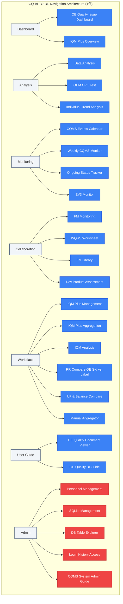

# CQ-BI 상단 네비게이션 카테고리 & 페이지 맵핑 분석 및 개선 제안

본 제안서는 현재 CQ-BI 웹 애플리케이션에 활성화되어 있는 페이지들과 상단 네비게이션 카테고리 간의 매핑 구조를 정밀 분석하고, 사용자 경험(UX) 극대화 및 시스템 정합성 향상을 위한 최적의 카테고리 재구성 방안을 제시합니다.

---

## 1. 현재 네비게이션 매핑 구조 분석 (AS-IS)

현재 시스템은 총 **9개의 카테고리**와 **21개의 활성 페이지**로 구성되어 있습니다. (`app/core/page/config_pages.py` 기준)

### 카테고리별 페이지 현황

| 카테고리 (Category) | 페이지 이름 (Page Name) | 물리 파일 경로 (File Path) | 허용 역할 (Roles) |
| :--- | :--- | :--- | :--- |
| **Dashboard** | OE Quality Issue Dashboard | `app/pages/_10_dashboard/oe_quality_issue_dashboard_page.py` | Viewer, Contributor, Admin |
| | IQM Plus | `app/pages/_10_dashboard/iqm_plus_main_page.py` | Viewer, Contributor, Admin |
| **Analysis** | Data Analysis | `app/pages/_20_analysis/data_analysis_page.py` | Viewer, Contributor, Admin |
| | OEM CPK Test | `app/pages/_20_analysis/oem_cpk_test_page.py` | Viewer, Contributor, Admin |
| **Monitoring** | CQMS Events Calendar | `app/pages/_30_monitoring/calendar_page.py` | Viewer, Contributor, Admin |
| | Weekly CQMS Monitor | `app/pages/_30_monitoring/weekly_cqms_monitor_page.py` | Viewer, Contributor, Admin |
| | Ongoing Status Tracker | `app/pages/_30_monitoring/ongoing_status_tracker_page.py` | Viewer, Contributor, Admin |
| | EV3 | `app/pages/_30_monitoring/ev3_page.py` | Viewer, Contributor, Admin |
| **Collaboration** | FM Monitoring | `app/pages/_40_collaboration/fm_monitoring_page.py` | Viewer, Contributor, Admin |
| | WQRS Worksheet Monitoring | `app/pages/_40_collaboration/qrs_worksheet_monitoring_page.py` | Viewer, Contributor, Admin |
| | FM Library | `app/pages/_40_collaboration/fm_library_page.py` | Contributor, Admin |
| | Dev Product Assessment[Draft] | `app/pages/_40_collaboration/dev_product_assessment_page.py` | Viewer, Contributor, Admin |
| | [TEMP]UF & Balance Compare | `app/pages/_60_workplace/uf_balance_compare_page.py` | Viewer, Contributor, Admin |
| **User Guide** | OE Quality Document Viewer | `app/pages/_50_user_guide/test_manual_page.py` | Viewer, Contributor, Admin |
| | OE Quality BI User Guide | `app/pages/_50_user_guide/oequality_bi_guide_page.py` | Viewer, Contributor, Admin |
| | CQMS User Guide | `app/pages/_50_user_guide/cqms_userguide_page.py` | Admin |
| **Workplace** | IQM Plus Management | `app/pages/_60_workplace/iqm_plus_management_page.py` | Contributor, Admin |
| | IQM Plus Aggregation | `app/pages/_60_workplace/iqm_plus_agg_page.py` | Contributor, Admin |
| | IQM Analysis | `app/pages/_60_workplace/iqm_analysis_page.py` | Contributor, Admin |
| | RR Compare OE Std vs. RR Label | `app/pages/_60_workplace/rr_compare_oe_std_label_page.py` | Contributor, Admin |
| **Settings** | Manual Aggregator | `app/pages/_70_settings/manual_aggregator_page.py` | Contributor, Admin |
| **Admin** | Personnel Management | `app/pages/_80_admin/personnel_management_page.py` | Admin |
| | SQLite Management | `app/pages/_80_admin/sqlite_management_page.py` | Admin |
| | DB Table Explorer | `app/pages/_80_admin/db_table_explorer_page.py` | Admin |
| | Login History Access | `app/pages/_80_admin/assess_log_temp_page.py` | Admin |
| | Temp_Analysis | `app/pages/_80_admin/analysis_individual_page.py` | Contributor, Admin |
| **System** | Navigation | `app/pages/_90_system/navigation_page.py` | Viewer, Contributor, Admin |

---

## 2. 현 구조의 주요 문제점 및 개선 포인트 (AS-IS Pain Points)

> [!WARNING]
> 현재 매핑 구조에는 시스템의 직관성, 정합성, 그리고 사용자 편의성을 저해하는 몇 가지 구조적 결함이 존재합니다.

1. **디렉터리-메뉴 매핑의 불일치 (Structural Mismatch)**
   - `[TEMP]UF & Balance Compare` 페이지는 물리적으로 `_60_workplace` 디렉터리에 있지만, 설정상 `Collaboration` 카테고리에 매핑되어 있습니다. 개발자가 코드를 관리할 때 혼선을 줄 수 있으므로 물리 경로와 카테고리를 일치시켜야 합니다.

2. **임시 명칭의 노출 (Noise in UI Labels)**
   - `[TEMP]UF & Balance Compare`, `Dev Product Assessment[Draft]`, `Temp_Analysis` 등 개발 단계에서 사용되던 접두사(`[TEMP]`, `Temp_`) 및 접미사(`[Draft]`)가 UI 메뉴명에 그대로 표시되고 있어, 프로덕션 애플리케이션으로서의 완성도를 떨어뜨립니다.

3. **불필요한 카테고리 파편화 (Category Fragmentation)**
   - **`Settings` 카테고리**는 오직 단 1개의 페이지(`Manual Aggregator`)만을 포함하고 있어, 상단 네비게이션 공간을 불필요하게 많이 점유합니다.
   - 단일 페이지를 위해 독립 카테고리를 유지하기보다는, 비즈니스 성격이 통하는 `Workplace`나 `Admin` 등의 하위 페이지로 통합하는 것이 효율적입니다.

4. **비즈니스 도메인의 파편화 (Domain Fragmentation)**
   - **IQM** 관련 기능들이 `Dashboard`(`IQM Plus`)와 `Workplace`(`IQM Plus Management`, `IQM Plus Aggregation`, `IQM Analysis`)에 나뉘어 있어 사용자가 IQM 업무를 수행할 때 상단 메뉴를 빈번하게 이동해야 합니다.

5. **성격에 맞지 않는 카테고리 배치 (Misplacement of Features)**
   - `Temp_Analysis`는 개별 분석 도구(Analysis)의 성격을 지님에도 불구하고 `Admin` 카테고리에 배치되어 있습니다. 또한, `CQMS User Guide`는 오직 Admin 역할만 조회 가능하게 막혀 있어, `User Guide` 탭의 원래 취지(전체 유저 대상 가이드)와 일치하지 않습니다.

---

## 3. 개선 네비게이션 매핑 제안 (TO-BE Proposal)

업무 편의성과 메뉴 단순화를 극대화할 수 있는 **2가지 설계 대안**을 제시합니다.

### [제안 1안] 업무 도메인 및 라이프사이클 중심 통합 (적극 추천)
* 카테고리를 **9개에서 7개로 슬림화**하고, 업무 성격이 유사한 탭을 병합합니다.
* 임시성 레이블을 정제하고, 물리 구조와 메뉴 카테고리를 1:1로 정확히 동기화합니다.



#### 1안의 주요 변경 사항 및 효과

1. **`Settings` 카테고리 제거 & `Workplace`로 통합**
   - 단일 페이지였던 `Manual Aggregator`를 `Workplace`로 이동하여 상단 메뉴 탭의 복잡성을 낮춤.
2. **`[TEMP]UF & Balance Compare` 최적화**
   - 페이지명을 `UF & Balance Compare`로 정제하고, 물리적 디렉터리(`_60_workplace`)에 알맞게 `Workplace` 카테고리로 변경하여 일관성 확보.
3. **`Temp_Analysis` 개편**
   - 페이지명을 `Individual Trend Analysis` (개별 트렌드 분석)로 정식 명칭화하고, 성격에 맞게 `Analysis` 카테고리로 이동시킴.
4. **`CQMS User Guide` 재배치**
   - Admin 전용 매뉴얼이므로 `User Guide` 탭에서 분리하여 `Admin` 카테고리의 `CQMS System Admin Guide`로 이동하거나 모든 유저용으로 권한을 개방.
5. **어색한 접미사/접두사 제거**
   - `Dev Product Assessment[Draft]` -> `Dev Product Assessment`로 명칭 변경.

---

### [제안 2안] 역할(Role) 및 접근 제어 기준 최적화 (대안)
* 사용자의 권한 등급(Viewer, Contributor, Admin)에 따라 탭 자체의 노출을 지엽화하여 협업 공간을 고립시키는 구조입니다.
* 일반 뷰어(Viewer)에게는 `Dashboard`, `Analysis`, `Monitoring`, `User Guide`만 노출하고, `Workplace`와 `Collaboration`을 `Work & Collaboration`으로 단일 병합합니다.

---

## 4. 세부 맵핑 비교표 (AS-IS vs. TO-BE 1안)

> [!TIP]
> 1안을 적용할 때의 세부 설정 변화는 다음과 같으며, 이를 통해 직관적인 UX를 즉시 완성할 수 있습니다.

| 변경전 페이지명 | 변경전 Category | **제안 페이지명** | **제안 Category** | **제안 Icon** | **제안 대상 권한** | **변경 사유 및 기대효과** |
| :--- | :--- | :--- | :--- | :--- | :--- | :--- |
| OE Quality Issue Dashboard | Dashboard | **OE Quality Dashboard** | **Dashboard** | `:material/dashboard:` | Viewer, Contributor, Admin | 직관적 축약명 적용 |
| IQM Plus | Dashboard | **IQM Plus Overview** | **Dashboard** | `:material/science:` | Viewer, Contributor, Admin | 분석/관리 기능과의 혼선 예방 |
| Data Analysis | Analysis | **Data Analysis** | **Analysis** | `:material/view_object_track:` | Viewer, Contributor, Admin | 유지 |
| OEM CPK Test | Analysis | **OEM CPK Test** | **Analysis** | `:material/analytics:` | Viewer, Contributor, Admin | 분석 아이콘 적용으로 전문성 강화 |
| Temp_Analysis | Admin | **Individual Trend Analysis** | **Analysis** | `:material/query_stats:` | **Contributor, Admin** | 실제 기능(분석)에 부합하는 카테고리 재배치 |
| CQMS Events Calendar | Monitoring | **CQMS Events Calendar** | **Monitoring** | `:material/calendar_month:` | Viewer, Contributor, Admin | 더 직관적인 달력 아이콘 적용 |
| Weekly CQMS Monitor | Monitoring | **Weekly CQMS Monitor** | **Monitoring** | `:material/assignment_late:` | Viewer, Contributor, Admin | 주의/감시 성격에 부합하는 아이콘 |
| Ongoing Status Tracker | Monitoring | **Ongoing Status Tracker** | **Monitoring** | `:material/pending_actions:` | Viewer, Contributor, Admin | 상태 추적 전용 아이콘 적용 |
| EV3 | Monitoring | **EV3 Monitor** | **Monitoring** | `:material/screenshot_monitor:` | Viewer, Contributor, Admin | 모니터링 명확화 |
| FM Monitoring | Collaboration | **FM Monitoring** | **Collaboration** | `:material/texture:` | Viewer, Contributor, Admin | 유지 |
| WQRS Worksheet Monitoring| Collaboration | **WQRS Worksheet Monitor** | **Collaboration** | `:material/article:` | Viewer, Contributor, Admin | 워크시트 양식에 맞춤 |
| FM Library | Collaboration | **FM Library** | **Collaboration** | `:material/local_library:` | Contributor, Admin | 라이브러리 메타포 강화 |
| Dev Product Assessment[Draft] | Collaboration | **Dev Product Assessment** | **Collaboration** | `:material/rule_folder:` | Viewer, Contributor, Admin | `[Draft]` 꼬리표 제거, 평가에 맞는 아이콘 |
| [TEMP]UF & Balance Compare | Collaboration | **UF & Balance Compare** | **Workplace** | `:material/balance:` | Viewer, Contributor, Admin | 물리 디렉터리(`_60_workplace`)와 카테고리 일치화, `[TEMP]` 노이즈 제거 |
| OE Quality Document Viewer| User Guide | **Quality Document Viewer** | **User Guide** | `:material/quick_reference:` | Viewer, Contributor, Admin | 명칭 간소화 |
| OE Quality BI User Guide | User Guide | **CQ-BI User Guide** | **User Guide** | `:material/menu_book:` | Viewer, Contributor, Admin | 앱 명칭(CQ-BI)과 가이드 통일 |
| CQMS User Guide | User Guide | **CQMS System Admin Guide** | **Admin** | `:material/admin_panel_settings:`| **Admin** | Admin만 조회 가능한 성격을 고려하여 Admin 카테고리로 이관 |
| IQM Plus Management | Workplace | **IQM Plus Management** | **Workplace** | `:material/edit_document:` | Contributor, Admin | 입력/편집 메타포 강화 |
| IQM Plus Aggregation | Workplace | **IQM Plus Aggregation** | **Workplace** | `:material/hub:` | Contributor, Admin | 집계에 부합하는 허브 아이콘 적용 |
| IQM Analysis | Workplace | **IQM Trend Analysis** | **Workplace** | `:material/trending_up:` | Contributor, Admin | 트렌드 지표 시각화 지향 |
| RR Compare OE Std vs. RR Label| Workplace | **RR OE Std vs. Label Compare**| **Workplace** | `:material/compare:` | Contributor, Admin | 비교 직관성 향상 및 아이콘 변경 |
| Manual Aggregator | Settings | **Manual Aggregator** | **Workplace** | `:material/mediation:` | Contributor, Admin | **`Settings` 카테고리 폐쇄** 및 업무 영역 통합 |

---

## 5. 향후 반영을 위한 예상 코드 수정안 (Draft)

사용자 동의가 완료되면, `app/core/page/config_pages.py` 파일 내 `VALID_CATEGORIES` 상수와 `PAGE_CONFIGS` 구성을 다음과 같이 안전하게 수정할 수 있습니다.

### `app/core/page/config_pages.py` 수정 예시 (Diff)

```diff
 VALID_CATEGORIES = [
     "Dashboard",
     "Analysis",
     "Monitoring",
     "Collaboration",
     "User Guide",
     "Workplace",
-    "Settings",
     "Admin",
     "System",
 ]
```

```diff
 PAGE_CONFIGS = {
     # Dashboard
-    "OE Quality Issue Dashboard": {
+    "OE Quality Dashboard": {
         "filename": "app/pages/_10_dashboard/oe_quality_issue_dashboard_page.py",
         "icon": ":material/dashboard:",
         "category": "Dashboard",
         "roles": ["Viewer", "Contributor", "Admin"],
     },
-    "IQM Plus": {
+    "IQM Plus Overview": {
         "filename": "app/pages/_10_dashboard/iqm_plus_main_page.py",
-        "icon": ":material/science:",
+        "icon": ":material/science:",
         "category": "Dashboard",
         "roles": ["Viewer", "Contributor", "Admin"],
     },
     # Analysis
     "Data Analysis": {
         "filename": "app/pages/_20_analysis/data_analysis_page.py",
         "icon": ":material/view_object_track:",
         "category": "Analysis",
         "roles": ["Viewer", "Contributor", "Admin"],
     },
     "OEM CPK Test": {
         "filename": "app/pages/_20_analysis/oem_cpk_test_page.py",
-        "icon": ":material/science:",
+        "icon": ":material/analytics:",
         "category": "Analysis",
         "roles": ["Viewer", "Contributor", "Admin"],
     },
+    "Individual Trend Analysis": {
+        "filename": "app/pages/_80_admin/analysis_individual_page.py",
+        "icon": ":material/query_stats:",
+        "category": "Analysis",
+        "roles": ["Contributor", "Admin"],
+    },
     # Monitoring
     "CQMS Events Calendar": {
         "filename": "app/pages/_30_monitoring/calendar_page.py",
-        "icon": ":material/event_repeat:",
+        "icon": ":material/calendar_month:",
         "category": "Monitoring",
         "roles": ["Viewer", "Contributor", "Admin"],
     },
     "Weekly CQMS Monitor": {
         "filename": "app/pages/_30_monitoring/weekly_cqms_monitor_page.py",
-        "icon": ":material/event_repeat:",
+        "icon": ":material/assignment_late:",
         "category": "Monitoring",
         "roles": ["Viewer", "Contributor", "Admin"],
     },
     "Ongoing Status Tracker": {
         "filename": "app/pages/_30_monitoring/ongoing_status_tracker_page.py",
-        "icon": ":material/pending:",
+        "icon": ":material/pending_actions:",
         "category": "Monitoring",
         "roles": ["Viewer", "Contributor", "Admin"],
     },
-    "EV3": {
+    "EV3 Monitor": {
         "filename": "app/pages/_30_monitoring/ev3_page.py",
-        "icon": ":material/event_repeat:",
+        "icon": ":material/screenshot_monitor:",
         "category": "Monitoring",
         "roles": ["Viewer", "Contributor", "Admin"],
     },
     # Collaboration
     "FM Monitoring": {
         "filename": "app/pages/_40_collaboration/fm_monitoring_page.py",
         "icon": ":material/texture:",
         "category": "Collaboration",
         "roles": ["Viewer", "Contributor", "Admin"],
     },
-    "WQRS Worksheet Monitoring": {
+    "WQRS Worksheet Monitor": {
         "filename": "app/pages/_40_collaboration/qrs_worksheet_monitoring_page.py",
-        "icon": ":material/event_repeat:",
+        "icon": ":material/article:",
         "category": "Collaboration",
         "roles": ["Viewer", "Contributor", "Admin"],
     },
     "FM Library": {
         "filename": "app/pages/_40_collaboration/fm_library_page.py",
-        "icon": ":material/bug_report:",
+        "icon": ":material/local_library:",
         "category": "Collaboration",
         "roles": ["Contributor", "Admin"],
     },
-    "Dev Product Assessment[Draft]": {
+    "Dev Product Assessment": {
         "filename": "app/pages/_40_collaboration/dev_product_assessment_page.py",
-        "icon": ":material/science:",
+        "icon": ":material/rule_folder:",
         "category": "Collaboration",
         "roles": ["Viewer", "Contributor", "Admin"],
     },
-    "[TEMP]UF & Balance Compare": {
-        "filename": "app/pages/_60_workplace/uf_balance_compare_page.py",
-        "icon": ":material/balance:",
-        "category": "Collaboration",
-        "roles": ["Viewer", "Contributor", "Admin"],
-    },
     # User Guide
-    "OE Quality Document Viewer": {
+    "Quality Document Viewer": {
         "filename": "app/pages/_50_user_guide/test_manual_page.py",
         "icon": ":material/quick_reference:",
         "category": "User Guide",
         "roles": ["Viewer", "Contributor", "Admin"],
     },
-    "OE Quality BI User Guide": {
+    "CQ-BI User Guide": {
         "filename": "app/pages/_50_user_guide/oequality_bi_guide_page.py",
-        "icon": ":material/quick_reference:",
+        "icon": ":material/menu_book:",
         "category": "User Guide",
         "roles": ["Viewer", "Contributor", "Admin"],
     },
-    "CQMS User Guide": {
-        "filename": "app/pages/_50_user_guide/cqms_userguide_page.py",
-        "icon": ":material/menu_book:",
-        "category": "User Guide",
-        "roles": ["Admin"],
-    },
     # Workplace
     "IQM Plus Management": {
         "filename": "app/pages/_60_workplace/iqm_plus_management_page.py",
-        "icon": ":material/input:",
+        "icon": ":material/edit_document:",
         "category": "Workplace",
         "roles": ["Contributor", "Admin"],
     },
     "IQM Plus Aggregation": {
         "filename": "app/pages/_60_workplace/iqm_plus_agg_page.py",
-        "icon": ":material/science:",
+        "icon": ":material/hub:",
         "category": "Workplace",
         "roles": ["Contributor", "Admin"],
     },
-    "IQM Analysis": {
+    "IQM Trend Analysis": {
         "filename": "app/pages/_60_workplace/iqm_analysis_page.py",
-        "icon": ":material/science:",
+        "icon": ":material/trending_up:",
         "category": "Workplace",
         "roles": ["Contributor", "Admin"],
     },
-    "RR Compare OE Std vs. RR Label": {
+    "RR OE Std vs. Label Compare": {
         "filename": "app/pages/_60_workplace/rr_compare_oe_std_label_page.py",
-        "icon": ":material/label_important:",
+        "icon": ":material/compare:",
         "category": "Workplace",
         "roles": ["Contributor", "Admin"],
     },
+    "UF & Balance Compare": {
+        "filename": "app/pages/_60_workplace/uf_balance_compare_page.py",
+        "icon": ":material/balance:",
+        "category": "Workplace",
+        "roles": ["Viewer", "Contributor", "Admin"],
+    },
+    "Manual Aggregator": {
+        "filename": "app/pages/_70_settings/manual_aggregator_page.py",
+        "icon": ":material/mediation:",
+        "category": "Workplace",
+        "roles": ["Contributor", "Admin"],
+    },
     # Settings
-    "Manual Aggregator": {
-        "filename": "app/pages/_70_settings/manual_aggregator_page.py",
-        "icon": ":material/mediation:",
-        "category": "Settings",
-        "roles": ["Contributor", "Admin"],
-    },
     # Admin
     "Personnel Management": {
         "filename": "app/pages/_80_admin/personnel_management_page.py",
         "icon": ":material/badge:",
         "category": "Admin",
         "roles": ["Admin"],
     },
     "SQLite Management": {
         "filename": "app/pages/_80_admin/sqlite_management_page.py",
         "icon": ":material/database:",
         "category": "Admin",
         "roles": ["Admin"],
     },
     "DB Table Explorer": {
         "filename": "app/pages/_80_admin/db_table_explorer_page.py",
         "icon": ":material/table_chart:",
         "category": "Admin",
         "roles": ["Admin"],
     },
     "Login History Access": {
         "filename": "app/pages/_80_admin/assess_log_temp_page.py",
         "icon": ":material/key:",
         "category": "Admin",
         "roles": ["Admin"],
     },
-    "Temp_Analysis": {
-        "filename": "app/pages/_80_admin/analysis_individual_page.py",
-        "icon": ":material/science:",
-        "category": "Admin",
-        "roles": ["Contributor", "Admin"],
-    },
+    "CQMS System Admin Guide": {
+        "filename": "app/pages/_50_user_guide/cqms_userguide_page.py",
+        "icon": ":material/admin_panel_settings:",
+        "category": "Admin",
+        "roles": ["Admin"],
+    },
     # System
     "Navigation": {
         "filename": "app/pages/_90_system/navigation_page.py",
         "icon": ":material/apps:",
         "category": "System",
         "roles": ["Viewer", "Contributor", "Admin"],
     },
 }
```

---

## 6. 결론 및 다음 단계 제안

본 매핑 개선안을 적용함으로써 다음과 같은 즉각적인 이점을 얻을 수 있습니다.
* **사용자 편의성 향상**: 상단 탭이 9개에서 7개로 압축되어 필요한 기능에 더 신속히 접근할 수 있습니다.
* **브랜드 가치 제고**: `[TEMP]`, `[Draft]`, `Temp_` 등 지저분한 명칭이 정리되어 프로덕션 비즈니스 시스템다운 깔끔한 완성도를 확보합니다.
* **코드베이스 정합성 강화**: 물리적인 파일 위치(`_60_workplace`)와 메뉴 매핑(`Workplace`)이 정확히 1:1 대응되어 향후 개발자가 직관적으로 디렉터리를 탐색할 수 있습니다.

> [!IMPORTANT]
> **사용자 승인 요청**:
> 본 제안서의 **[제안 1안]**이 적합하다고 판단되시는 경우, **"제안 1안 승인"** 또는 **"코드를 수정해줘"**라고 피드백해 주십시오. 
> 승인해 주시면 즉시 `app/core/page/config_pages.py` 소스 코드를 안전하게 수정하고 반영을 진행하겠습니다.
