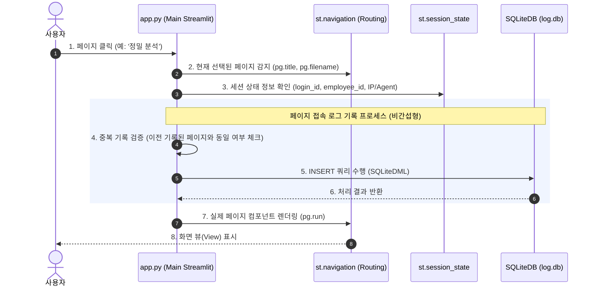

# 사용자 페이지 접속 로그 수집 및 DB 설계안
본 문서는 CQMS(Customer Quality Management System) 웹 애플리케이션에서 사용자가 로그인한 이후 페이지를 선택할 때마다 접속 내역을 실시간으로 감지하고 저장하기 위한 **페이지 접속 로그 수집 시스템 설계 및 DB 구축안**을 정의합니다.

---

## 1. 핵심 설계 컨셉 (Core Concept)

### ① 중앙 집중식 자동화 로깅 (AOP 방식)
* **문제점**: 각 개별 페이지 파일(`dashboard_page.py`, `analysis_page.py` 등)마다 일일이 로그 기록 코드를 삽입하면 유지보수가 매우 어려워지고 누락 위험이 있습니다.
* **해결책**: 애플리케이션의 단일 진입점인 `app.py`에서 `pg = st.navigation(...)`을 생성하고 실행하는 `pg.run()` 직전에 현재 사용자가 접근하려는 페이지 객체의 메타데이터(페이지명, 파일 경로)를 가로채 기록하는 **중앙 집중식 로깅**을 적용합니다. 
* **장점**: 새로운 페이지가 추가되거나 기존 페이지 구조가 변경되어도 코드 수정 없이 100% 자동으로 접속 기록이 추적됩니다.

### ② 로그인 세션 연계 (Clickstream Tracking)
* `st.session_state`에 있는 사용자의 고유 정보(`personnel_id`, `role`)뿐만 아니라, 로그인 성공 시 생성되는 세션 ID인 `login_id`(Foreign Key)를 연동합니다.
* 이를 통해 단순한 '누가 언제 들어왔다'가 아니라, **"특정 사용자(A)가 로그인 세션(B) 내에서 어떤 동선으로 페이지를 탐색했는지(클릭스트림 분석)"**를 완벽하게 추적할 수 있습니다.

### ③ 성능 및 예외 자가치유 (Performance & Resilience)
* 로그 저장은 실제 페이지가 렌더링되는 시점에 동기적으로 일어나므로, DB 쓰기 중 에러가 발생하더라도 메인 화면 렌더링에 영향을 미치지 않도록 `try-except`로 완전히 격리합니다.
* 무분별한 DB 쓰기를 방지하기 위해 사용자가 페이지 내에서 새로고침(F5)을 하거나 동일 페이지를 반복 로드할 때는 중복 로그 생성을 필터링합니다.

---

## 2. 아키텍처 및 데이터 흐름도

사용자가 페이지를 전환하는 시점부터 로그가 SQLite DB에 적재되기까지의 전체적인 제어 흐름입니다.



---

## 3. 데이터베이스(DB) 스키마 설계

기존 `user_login` 및 `user_error_log` 등과 데이터 정합성을 가지며, 로그의 경량성과 쿼리 성능을 동시에 확보하는 SQLite 기반 스키마 설계입니다.

### ① 테이블 구조 (`user_page_access_log`)

* **DB 물리 파일**: `log.db` (SQLite `log` 연결 활용)

| 컬럼명 | 데이터 타입 | 제약 조건 | 설명 | 비고 |
| :--- | :--- | :--- | :--- | :--- |
| **`access_id`** | `INTEGER` | PRIMARY KEY AUTOINCREMENT | 페이지 접속 로그 고유 ID | 자동 증가 |
| **`login_id`** | `INTEGER` | FOREIGN KEY | `user_login(login_id)` 연계 ID | 로그인 세션 식별 |
| **`employee_id`** | `INTEGER` | NOT NULL | 사용자 인사번호 (8자리) | `personnel_id`와 매핑 |
| **`page_name`** | `TEXT` | NOT NULL | 접속한 페이지 이름 (타이틀) | 예: "정밀 분석" |
| **`page_path`** | `TEXT` | NOT NULL | 접속한 페이지 파일 실제 경로 | 예: "app/pages/_20_analysis/..." |
| **`access_time`** | `TEXT` | DEFAULT (KST 기준시) | 페이지에 실제 진입한 일시 | 형식: `YYYY-MM-DD HH:MM:SS` |
| **`client_ip`** | `TEXT` | - | 접속 클라이언트 IP 주소 | Proxy 고려 |
| **`user_agent`** | `TEXT` | - | 브라우저 및 OS 기기 사양 정보 | Client Agent |

> [!NOTE]
> `login_id`를 외래키(Foreign Key)처럼 활용함으로써, 특정 세션 내에서 발생한 이탈률, 평균 페이지 체류 시간 등을 산출하는 고도화된 통계 분석 쿼리가 가능해집니다.

### ② 성능 최적화를 위한 인덱스(Index) 설계
페이지 접속 로그는 시스템 운영 중 가장 빠르게 누적되는 데이터입니다. 주기적인 통계 대시보드나 유저 모니터링 시 테이블 전체 스캔(Full Table Scan)을 방지하기 위해 아래와 같이 인덱스를 사전에 지정합니다.

```sql
-- 빠른 유저별 활동 추적을 위한 인덱스
CREATE INDEX IF NOT EXISTS idx_access_employee ON user_page_access_log(employee_id);

-- 특정 시간 범위(일별/월별) 통계 및 분석을 위한 인덱스
CREATE INDEX IF NOT EXISTS idx_access_time ON user_page_access_log(access_time);

-- 특정 세션 분석을 위한 인덱스
CREATE INDEX IF NOT EXISTS idx_access_login ON user_page_access_log(login_id);
```

---

## 4. 상세 구현 가이드라인

### ① 데이터베이스 테이블 초기화 (DDL)
`app/pages/_90_system/login_page.py`의 `init_login_database` 함수 또는 시스템 부트스트랩 단계에 추가할 DDL 코드 예시입니다.

```python
def init_page_access_log_table() -> None:
    """페이지 접속 로그 테이블과 인덱스를 자동 보완 및 생성합니다."""
    try:
        from app.core.db.sqlite_utils import SQLiteDDL
        ddl = SQLiteDDL("log")
        
        # 테이블 생성
        ddl.create_table(
            "user_page_access_log",
            [
                ("access_id", "INTEGER PRIMARY KEY AUTOINCREMENT"),
                ("login_id", "INTEGER"),
                ("employee_id", "INTEGER NOT NULL"),
                ("page_name", "TEXT NOT NULL"),
                ("page_path", "TEXT NOT NULL"),
                ("access_time", "TEXT NOT NULL"),
                ("client_ip", "TEXT"),
                ("user_agent", "TEXT")
            ]
        )
        
        # 성능 인덱스 적용
        ddl.execute_script(
            """
            CREATE INDEX IF NOT EXISTS idx_access_employee ON user_page_access_log(employee_id);
            CREATE INDEX IF NOT EXISTS idx_access_time ON user_page_access_log(access_time);
            CREATE INDEX IF NOT EXISTS idx_access_login ON user_page_access_log(login_id);
            """
        )
        logger.info("Database Initialized: 'user_page_access_log' table & indexes verified successfully.")
    except Exception as e:
        logger.error("Failed to guarantee user_page_access_log table: %s", str(e))
```

### ② 페이지 접근 로깅 로직 (DML)
`app.py` 내부 또는 별도 모듈에 포함되어 실제 INSERT를 담당할 로직입니다.

```python
def record_page_access(page_name: str, page_path: str) -> None:
    """사용자의 페이지 접속 로그를 영속 저장합니다. (AOP 기반)"""
    try:
        # 1. 로그인되지 않은 상태이거나 로그가 무의미한 기본 시스템 페이지 제외
        if not st.session_state.get("password_verified", False):
            return
            
        employee_id = st.session_state.get("personnel_id")
        if not employee_id:
            return

        # 2. 새로고침 시 무한 저장 방지 (세션 상태를 이용해 직전 페이지와 동일할 경우 패스)
        last_logged_page = st.session_state.get("last_logged_page")
        if last_logged_page == page_path:
            return

        from app.core.db.sqlite_utils import SQLiteDML
        from app.pages._90_system.login_page import get_client_ip_and_agent
        
        login_id = st.session_state.get("login_id")
        ip, user_agent = get_client_ip_and_agent()
        now_str = datetime.now(KST).strftime("%Y-%m-%d %H:%M:%S")

        # 3. 데이터베이스 INSERT 실행
        SQLiteDML("log").execute_insert(
            """
            INSERT INTO user_page_access_log 
            (login_id, employee_id, page_name, page_path, access_time, client_ip, user_agent) 
            VALUES (?, ?, ?, ?, ?, ?, ?)
            """,
            (
                int(login_id) if login_id else None,
                int(employee_id),
                page_name,
                page_path,
                now_str,
                ip,
                user_agent
            )
        )
        
        # 4. 세션 상태 업데이트 (중복 탐지용)
        st.session_state["last_logged_page"] = page_path
        logger.info(f"Page Access Logged: {employee_id} -> {page_name} ({page_path})")
        
    except Exception as e:
        # 메인 애플리케이션의 가용성에 절대 영향을 주지 않도록 완벽히 격리
        logger.error("Failed to record page access log: %s", str(e))
```

### ③ `app.py` 연계 예시 (Hook 적용)
`app.py` 의 실제 내비게이션 구동 영역에 아주 심플하게 적용하는 예시입니다.

```python
# app.py 306라인 부근의 기존 구동 로직
pg = st.navigation(page_groups, position="top")

# ======== [ 페이지 접속 로그 훅 적용 (신규 추가 영역) ] ========
if pg is not None:
    # st.navigation에 의해 선택된 현재 액티브 페이지 정보를 가져옵니다.
    # pg는 Streamlit의 Page 객체이므로 title과 _filename(또는 page.filename) 등을 가지고 있습니다.
    current_page_title = pg.title
    current_page_file = getattr(pg, "_filename", "UNKNOWN_PATH")
    
    # 훅 호출 (성능 격리)
    record_page_access(page_name=current_page_title, page_path=current_page_file)
# =============================================================

# -- 상단 메뉴 렌더링 및 구동
render_top_menu()

if pg is not None:
    pg.run()
```

---

## 5. 설계 도입 효과

1. **사용자 행동 분석의 기반 마련**: 특정 페이지에 대한 집중도, 정체 시간, 유입 경로 패턴을 완벽히 데이터화하여 추후 UX 개선이나 페이지 최적화에 기여합니다.
2. **이상 징후 탐지 및 보안 강화**: 비인가 사용자의 연속적인 페이지 무단 접속, 또는 의심스러운 IP 주소에서의 대량 조회 등의 활동 로그를 추적하여 관제할 수 있습니다.
3. **무결성 및 안정성 유지**: 페이지 렌더링 비간섭 설계 구조(Error Sandbox)를 택해 로그 서버나 로컬 파일 쓰기 장애 시에도 본래 서비스(CQ-BI)는 끊김 없이 안정적으로 동작합니다.
