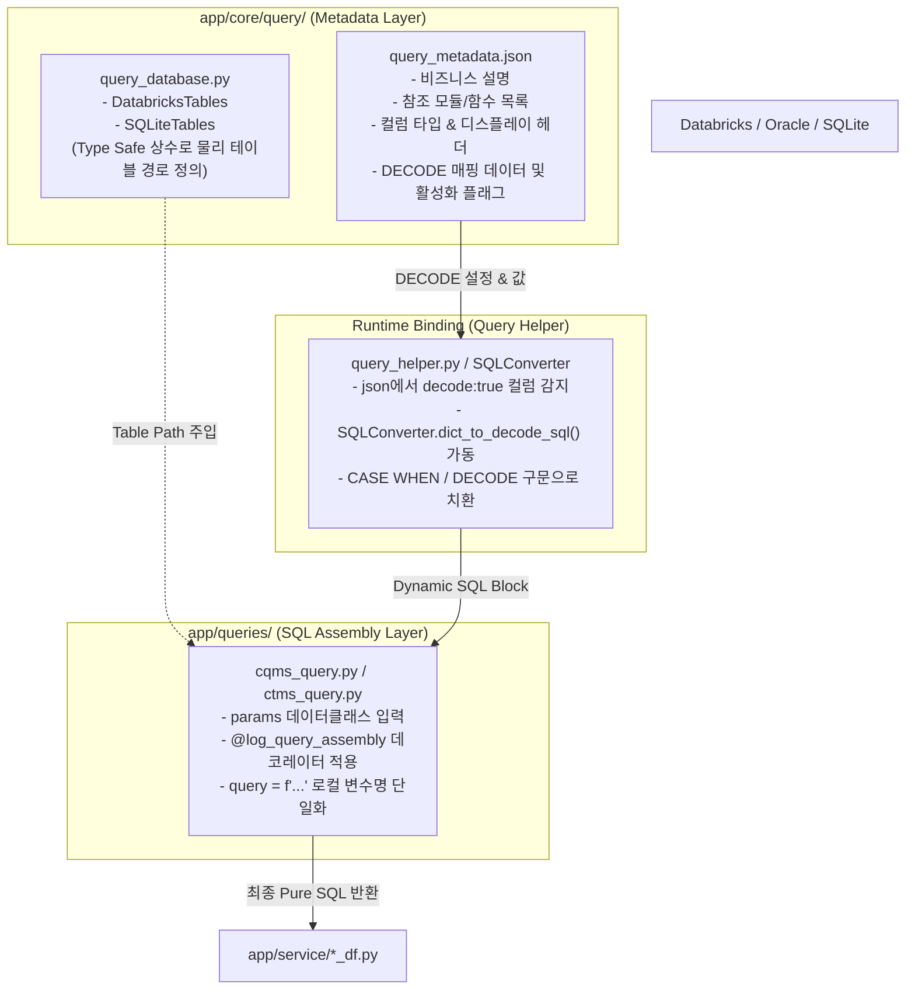

# `app/queries` 대규모 리팩토링 작업 계획서 검토 보고서

본 보고서는 `intelligence/guide/queries-refactoring-plan.md`에 기술된 **app/queries 대규모 리팩토링 작업 계획서(보완본 v2)**를 프로젝트의 최상위 아키텍처 규칙인 `GEMINI.md`, `L2-architecture.md`, `L2-naming-convention.md`, `L3-query.md` 등과 대조하여 다차원적으로 정밀 검토한 결과를 기술합니다.

---

## 1. 종합 평가 요약

> [!NOTE]
> **종합 평가: Excellent (최상급 정합성 및 보완성)**
> 
> 제출된 리팩토링 계획서는 프로젝트가 지향하는 **3-레이어 모듈 격리 원칙** 및 **유지보수 안정성**을 극대화하는 고도로 정밀한 가이드라인입니다. 단순한 리팩토링에 그치지 않고, 정적 타입 안정성(Python)과 동적 메타데이터 관리(JSON)를 유기적으로 결합하는 하이브리드 바인딩 아키텍처를 제시하여 코드 가독성과 디버깅 편의성을 획기적으로 개선했습니다.
> 
> 특히, 복잡한 CTE(Common Table Expression) 구문의 무분별한 쪼개기를 금지한 규칙과 공통 조건/변수명을 엄격히 단일화한 규칙은 SQL 관리의 실질적 고충을 완벽히 해결하는 우수한 통제 방안입니다.

---

## 2. 핵심 영역별 세부 검토 및 분석

### ① `query_database.py` & `query_metadata.json` 이원화(Hybrid) 설계
* **설계 개요**: 테이블의 물리적 경로는 `query_database.py` 내부의 정적 클래스 변수(`DatabricksTables` 등)에서 관리하고, 컬럼 속성 및 DECODE 맵, 참조 관계 등은 `query_metadata.json`에서 유연하게 관리하는 구조입니다.



* **검토 의견 (장점)**:
  - **IDE Intellisense & 타입 안정성 확보**: 물리적 테이블 경로를 파이썬 정적 변수로 제공함으로써 개발자가 타이핑할 때 자동완성이 완벽하게 보장되며, 오탈자로 인한 런타임 SQL 구문 오류가 원천 예방됩니다.
  - **비즈니스 영향도 분석 최적화**: JSON 메타데이터에 `referenced_modules` 및 `referenced_functions`를 명시하도록 설계하여, 특정 DB 스키마가 변경될 때 어떤 파이썬 모듈과 함수를 수정/테스트해야 하는지 **함수 단위까지 추적 및 정밀 임팩트 분석**이 가능해집니다.
  - **결합도 최소화**: 비즈니스 설명이나 디스플레이 헤더, 디코드 값 등의 수정 시 파이썬 프로덕션 코드를 전혀 변경하지 않고 JSON 마스터 파일만 배포하면 되므로, 무결성 유지가 용이합니다.
* **보완 의견 및 제언**:
  - **키 정합성 검증 추가**: `query_database.py`에 선언된 정적 변수명(예: `cqms_quality_main`)과 `query_metadata.json`의 1단계 Key가 정확히 일치해야 런타임 바인딩 에러가 발생하지 않습니다. 따라서 **3단계(또는 테스트 하네스 구축 단계)에 이 두 파일의 키 목록 정합성을 정적으로 크로스 체크(Cross Check)하는 정합성 검증 유닛 테스트 코드를 반드시 추가하도록 액션 플랜을 구체화해야 합니다.**

### ② DECODE 런타임 바인딩 및 표준화
* **설계 개요**: 메타데이터 내에 `"decode": true` 설정 시, `SQLConverter`를 활용하여 파이썬 런타임에 동적으로 `CASE WHEN` 또는 `DECODE` SQL로 조립해 쿼리에 주입하는 구조입니다.
* **검토 의견**:
  - SQL 빌더 함수 내에 어지럽게 산재하던 하드코딩된 `CASE WHEN` 코드 변환 로직이 완벽하게 제거되어, SQL 본연의 가독성이 획기적으로 상승합니다.
  - 디코드 기준값이나 설명 텍스트가 변하더라도 소스 코드를 재배포하거나 리팩토링할 필요가 없어 유지보수 리스크가 차단됩니다.
* **보완 의견 및 제언**:
  - SQL 쿼리 빌더 내에서 `DECODE_PLANT` 등 바인딩될 런타임 로컬 변수의 생성 및 주입 스타일을 가이드라인에 좀 더 명시적으로 정의하는 것이 좋습니다.
  - *예시 제안*:
    ```python
    # 쿼리 빌더 내 표준 바인딩 흐름
    DECODE_PLANT = SQLConverter.dict_to_decode_sql(
        col_name="QI.PLANT", 
        mapping_dict=metadata["cqms_quality_main"]["columns"]["PLANT"]["value"]
    )
    ```

### ③ CTE 함수의 별도 쪼개기 금지 규칙
* **설계 개요**: SQL의 가독성을 높인다는 명목으로 CTE 구문을 여러 함수나 모듈 단위로 쪼개어 동적 조립하는 행위를 일체 금지하고, 단일 함수 내에서 완성된 형태의 대형 문자열로 수집하도록 제약합니다.
* **검토 의견 (★매우 우수)**:
  - **디버깅 편의성 극대화**: SQL 튜닝 및 디버깅 시, 개발자가 해당 파이썬 함수를 한 번 실행해 출력된 완성형 SQL을 DBeaver, Databricks Query Editor 등의 SQL 클라이언트에 복사-붙여넣기만 하면 즉시 실행 계획(`EXPLAIN`)을 확인하고 실행할 수 있습니다. 잘게 쪼개진 쿼리 블록은 이러한 단순 디버깅을 불가능하게 만들어 유지보수성을 극도로 떨어뜨립니다.
  - **아키텍처 부합성**: L3 쿼리 레이어 개발 규칙인 `L3-query.md`의 "Full Query 지향 (CTE 비분리)" 규칙과 완벽하게 일치합니다.

### ④ SQL 3대 표준 작성 스타일 (Style A, B, C)
* **설계 개요**: 복잡도와 조인/CTE 유무에 따라 획일적 포맷을 강제하지 않고, Style A(단순 조회), Style B(동적 조인 및 필터링), Style C(대규모 CTE 구조화)의 3가지 트랙으로 분류해 가이드합니다.
* **검토 의견**:
  - 복잡도가 낮은 마스터 조회 기능에 불필요한 동적 리스트 조립(`conditions`) 오버헤드를 줄이고, 반대로 대규모 정제 및 분석형 쿼리에는 명확히 CTE 구조를 활용하도록 강제하여 유연성과 일관성을 동시에 조화롭게 달성했습니다.
  - 예시로 제공된 코드 역시 `QueryFilter` 헬퍼 사용 표준 및 데이터클래스 파라미터 표준을 아주 잘 반영하고 있습니다.

### ⑤ 네이밍 컨벤션 표준화 및 `L2-naming-convention.md` 크로스 체크

계획서에서 제시한 명명 표준은 우리 단일 진실 공급원(SSOT)인 `L2-naming-convention.md`와 **완벽하게 공명**하고 있습니다.

| 영역 | 계획서 표준안 | L2-naming-convention.md 일치 여부 | 세부 정합성 분석 |
| :--- | :--- | :---: | :--- |
| **테이블 데이터 클래스** | `{시스템명}Tables` (예: `DatabricksTables`) | **일치 (Pass)** | PascalCase 공식 및 데이터베이스 명시 원칙 철저 준수 |
| **테이블 변수명** | `{시스템}_{도메인}_{세부내용}` (예: `cqms_qi_main`) | **일치 (Pass)** | snake_case 및 시스템/도메인/세부내용 정제 순서 일치 |
| **모듈 파일명** | `*_query.py` 또는 `q_*.py` | **일치 (Pass)** | 소문자 스네이크 케이스 및 접두/접미사 규칙 완벽 싱크 |
| **함수 명명 공식** | `get_{system}_{domain}_{조건/설명/general}_{agg/rawdata}` | **일치 (Pass)** | L2/L3의 핵심 표준 공식을 보다 구체적으로 상세화하여 명문화함 |
| **비공개 헬퍼 함수** | 싱글 언더바 `_` 접두사 기입 (예: `_format_mcode_list`) | **일치 (Pass)** | 모듈 외부 노출 격벽을 위한 핵심 룰 반영 |
| **공통 상수명** | `UPPER_SNAKE_CASE` (예: `PLANT_TO_OEQG`) | **일치 (Pass)** | 기존 비즈니스 상수 명명 규칙 수호 |
| **디코드 변수명** | `DECODE_{명칭}` (예: `DECODE_STAGE`) | **일치 (Pass)** | 런타임 바인딩 SQL 문자열 가시성 극대화 |
| **표준 로컬 변수명** | 입력: `params`, 조건: `conditions`, 최종 SQL: `query` | **보완 및 심화 (Pass)** | 개발자 간의 중구난방식 변수 작명을 철저 차단하는 우수한 강제 수칙 |

---

## 3. 테스트 하네스(Sandbox) 구축 검토 및 구체적 제언

계획서 3단계의 **"테이블 및 DECODE 메타데이터의 런타임 바인딩"** 및 2단계 **"테이블/쿼리 테스트 하네스 구축"**은 리팩토링의 안전성을 위해 반드시 필요한 장치입니다. 이를 더욱 완벽하게 만들기 위해 아래와 같은 구체적 검증 알고리즘을 제언합니다.

### 1) SQL 의미론적 동등성(Semantic Equivalence) 검증 알고리즘
단순히 리팩토링 전후의 쿼리 문자열을 `diff` 또는 `==`로 비교하면, 개행이나 공백의 차이, 주석의 변동 등으로 인해 무수한 오탐(False Positive)이 유발됩니다.
따라서, 테스트 하네스(`tests/refactoring_harness_test.py`)에 아래와 같은 **정규화 헬퍼 함수**를 탑재하여 비교할 것을 강력히 권장합니다.

```python
import re

def normalize_sql(sql_str: str) -> str:
    """
    SQL 문자열을 정규화하여 순수 논리적 동등성을 비교하기 쉽도록 변환합니다.
    1. SQL 단일행 주석(--) 및 다중행 주석(/* */) 제거
    2. 모든 공백문자(탭, 개행, 다중 공백)를 단일 공백(' ')으로 치환
    3. 문자열 양끝 공백 제거 및 대소문자 통일 (선택)
    """
    # 1. 다중행 주석 제거
    sql_no_comments = re.sub(r'/\*.*?\*/', '', sql_str, flags=re.DOTALL)
    # 2. 단일행 주석 제거
    sql_no_comments = re.sub(r'--.*?\n', '\n', sql_no_comments)
    # 3. 모든 공백(개행, 탭 포함)을 단일 스페이스로 압축
    normalized = re.sub(r'\s+', ' ', sql_no_comments)
    # 4. 양끝 공백 제거 및 소문자 통일 (비교용)
    return normalized.strip().lower()
```

### 2) 메타데이터-정적상수 상호 교차 체크 테스트(Cross-Check Unit Test)
`query_database.py`의 `DatabricksTables` 속성 목록과 `query_metadata.json`의 Key 목록이 정확히 1:1로 일치하는지 자동 검증하는 테스트 코드를 하네스 파일에 포함시켜야 합니다.

```python
def test_metadata_and_constants_integrity():
    """
    query_database.py 내 DatabricksTables 상수의 속성들과
    query_metadata.json 파일의 최상위 Key들이 완벽하게 일치하는지 검증합니다.
    """
    import json
    from app.core.query.query_database import DatabricksTables
    from dataclasses import fields
    
    # 1. 정적 클래스 변수명 추출
    py_keys = {f.name for f in fields(DatabricksTables)}
    
    # 2. JSON 메타데이터 Key 추출
    with open("app/core/query/query_metadata.json", "r", encoding="utf-8") as f:
        json_meta = json.load(f)
    json_keys = set(json_meta.keys())
    
    # 3. 차집합 검사 (불일치 항목 검출)
    missing_in_json = py_keys - json_keys
    missing_in_py = json_keys - py_keys
    
    assert not missing_in_json, f"JSON 메타데이터에 누락된 테이블 상수가 존재합니다: {missing_in_json}"
    assert not missing_in_py, f"파이썬 테이블 상수에 정의되지 않은 JSON Key가 존재합니다: {missing_in_py}"
```

---

## 4. 안전 가이드라인(Safety Lock) 정합성

제안된 계획서는 `GEMINI.md`의 **"기존 소스 코드 변경 금지 및 승인 프로세스 (Safety Lock)"** 및 **"하네스 엔지니어링 작업 범위 제한"**을 극도로 철저하게 존중하고 있습니다.

1. **무단 수정의 원천 금지**: 사용자의 승인 없이 어떠한 프로덕션 코드도 건드리지 않는다는 명시적 CAUTION을 4단원 안전 수칙 첫 번째 항목으로 격리하여 명시했습니다.
2. **샌드박스 기반 하네스 검증**: 리팩토링 검증을 위해 `tests/` 디렉터리 하위에만 신규 독립 테스트 파일을 작성하고, 실제 데이터베이스 연결 없이 **Pure-String 레벨** 및 **인메모리(In-Memory) 기법**만을 사용하여 안전하게 검증하도록 설계되어 시스템 영향도를 완벽하게 차단했습니다.
3. **이모지 사용 배제 및 한국어 커밋/Dual Push**: 협업 및 형상관리 표준 규정을 완벽하게 반영하여 안정적인 배포 플랜을 수립했습니다.

---

## 5. 검토 결론 및 추천 액션

> [!TIP]
> **검토 결론**: 본 리팩토링 계획서는 **100% 합격(Green-Lit)** 수준이며, 즉시 다음 단계인 **승인 및 실행** 단계로 진행할 것을 적극 추천합니다.
> 
> 단, 더 안전하고 완벽한 리팩토링 이행을 위해 아래 **2가지 권장 보완책**을 계획서에 탑재하여 진행할 것을 제안합니다.

* **권장 보완책 1**: 3단계(JSON 메타데이터 아키텍처 수립 및 런타임 바인딩 구현) 완료 후, `query_database.py`와 `query_metadata.json` 간의 Key 싱크를 맞추는 **상호 교차 체크 테스트 코드(Cross-Check Test)**를 `tests/refactoring_harness_test.py` 하네스 테스트 스위트에 필수로 내장할 것.
* **권장 보완책 2**: 하네스 비교 검증 수행 시, 공백/개행/탭 및 주석 등을 완벽히 배제하고 의미적 동등성만 기계적으로 정밀 대조하는 **SQL 정규화 헬퍼 함수(`normalize_sql`)**를 핵심 비교 엔진으로 채택할 것.

상기 보완책이 반영된다면, 본 대규모 리팩토링은 어떠한 부작용(Side Effect)도 없이 극도의 안전 속에서 성공적으로 완수될 것입니다.
