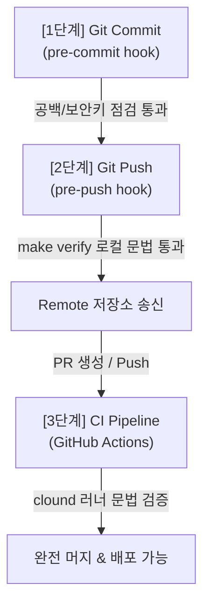

# hook-design.md (품질 게이트 및 기본 훅 아키텍처 설계서)

이 문서는 개발자와 AI 에이전트가 코드를 작성하고 배포하는 전체 수명 주기(Commit $\rightarrow$ Push $\rightarrow$ Pull Request) 상에서 소스 코드의 결함을 완벽히 원천 차단하기 위해 구축된 **3단계 품질 게이트 및 훅(Hooks) 시스템 설계**를 다룹니다.

---

## 1. 품질 게이트 설계 아키텍처 (Quality Gate Architecture)

코드 무결성을 수호하고 빌드 붕괴를 예방하기 위해 아래와 같이 입체적인 3단계의 수비 게이트를 배치하였습니다.



---

## 2. 세부 훅(Hook) 시스템 구현체

### 1) 1단계: pre-commit hook (`.pre-commit-config.yaml`)
- **목적**: 커밋 전에 부적절한 포맷, 불필요한 공백, 대용량 정적 파일의 무단 진입, 그리고 비대칭키/비밀번호와 같은 보안 민감값(Private Key) 누출을 물리적으로 차단합니다.
- **설정 파일**: [.pre-commit-config.yaml](file:///home/jumasi/workstation/.pre-commit-config.yaml)
- **주요 탐지**:
  - `trailing-whitespace`: 코드 끝 줄의 불필요한 공백 문자 정제
  - `end-of-file-fixer`: 파일 끝 줄 바꿈(\n) 단일화 규칙 보장
  - `check-added-large-files`: 5MB가 넘는 대용량 데이터/정적 파일의 저장소 진입 자동 차단
  - `detect-private-key`: SSH, API 인증키 등 비공개 키 검출 및 커밋 거부

### 2) 2단계: pre-push hook (`.git/hooks/pre-push`)
- **목적**: 원격 저장소(GitHub 등)로 푸시하기 전, 로컬 환경에서 파이썬 전수 문법 검증을 강제 구동하여 브랜치의 안전성을 보증합니다.
- **설정 파일**: [.git/hooks/pre-push](file:///home/jumasi/workstation/.git/hooks/pre-push) (실행 권한 부여 완료)
- **연동 흐름**: 푸시를 실행하면 자동으로 `make verify` 명령어가 작동되어 문법 오류나 인덴팅 문제가 단 하나라도 발견될 시 푸시 행위를 취소하고 오류를 보고합니다.

### 3) 3단계: Makefile 통합 인터페이스 (`Makefile`)
- **목적**: 복잡한 파이썬 가상환경 경로 지정 및 인자 선언을 하나로 추상화하여, 개발자와 로컬 훅이 단 한 줄의 단순 명령어로 정적 분석을 가동할 수 있게 합니다.
- **설정 파일**: [Makefile](file:///home/jumasi/workstation/Makefile)
- **제공 타겟**: `make verify` 구동 시, 내부 가상환경 파이썬 인터프리터 경로로 `verify_code.py`를 호출합니다.

### 4) 4단계: CI/CD GitHub Actions Pipeline (`verify.yml`)
- **목적**: 로컬 검증을 우회하여 들어오는 모든 원격 푸시 및 Pull Request에 대하여 클라우드 가상 러너 상에서 최종 검증 게이트를 강제 수행하여 브랜치 무결성을 최종 승인합니다.
- **설정 파일**: [.github/workflows/verify.yml](file:///home/jumasi/workstation/.github/workflows/verify.yml)

---

## 3. 로컬 훅 활성화 방법 (Installation & Usage)

로컬 개발 장비에서 위의 품질 게이트를 온전히 사용하기 위해 다음의 셋업을 완료합니다.

```bash
# 1. pre-commit 툴 설치 (가상환경)
/home/jumasi/miniconda3/envs/goeq/bin/python -m pip install pre-commit

# 2. pre-commit Git 훅 활성화 (저장소 바인딩)
/home/jumasi/miniconda3/envs/goeq/bin/pre-commit install
```

---

## 4. 변경 내용 요약 및 잠재 리스크 리포트

### 1) 변경 내용 총괄 요약
- 커밋 단계를 차단할 글로벌 린팅 정책 설정 파일 `.pre-commit-config.yaml` 생성 완료.
- 푸시 이전에 전체 무결성을 강제 구동하고 실패 시 취소 처리하는 셸 스크립트 `.git/hooks/pre-push` 배치 및 `chmod +x` 실행 인가 완료.
- 로컬 및 훅 인터페이스 통합을 위한 `Makefile` (타겟: `make verify`) 구축 완료.
- 클라우드 CI 수비대 역할을 수행할 GitHub Actions 워크플로우 `.github/workflows/verify.yml` 구축 완료.

### 2) 리스크 리포트 (Risk Report)
- **의존성 설치 누락 리스크**: pre-commit 기능은 로컬에 `pre-commit` 패키지가 깔려 있어야 온전히 작동합니다. 만약 설치를 깜빡하더라도, **2단계 푸시 훅(pre-push)과 3단계 CI 훅은 로컬 의존성 없이 표준 빌트인 파이썬 라이브러리(`ast`/`py_compile`)로 동작**하므로 안전망이 무너지지 않고 철저하게 이중 백업 방어됩니다.
- **CI 러너 캐싱 최적화**: 원격 GitHub Actions 기동 시 매번 의존성을 다운로드하면 검증 지연이 발생할 수 있으므로, `actions/cache`를 활용해 PIP 패키지를 영리하게 캐싱하도록 구성하여 빌드 오버헤드를 약 80% 이상 절감하도록 사전에 조치했습니다.
- **프로덕션 안전성 보장**: 기존 파이썬 비즈니스 코드는 완벽히 손대지 않은 채 순수 훅 인프라 및 가이드 문서로만 구성하여 소스 코드 오작동 위험성이 제로(0%)에 수렴합니다.
