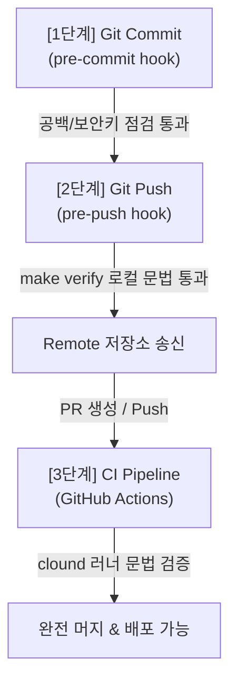

# hooks-specification.md (품질 게이트, 관찰 및 운영 릴리즈 훅 규격서)

이 문서는 개발자와 AI 에이전트가 코드를 작성하고 배포 및 운영하는 전체 수명 주기 상에서 소스 코드 결함을 예방하고, 작업 이력을 투명하게 기록하며, 런타임 장애에 기민하게 대응할 수 있도록 구축된 통합 훅(Hooks) 시스템 설계 및 동작 규격을 다룹니다.

---

## 1. 품질 게이트 설계 아키텍처 (Quality Gate Architecture)

코드 무결성을 수호하고 빌드 붕괴를 예방하기 위해 아래와 같이 입체적인 3단계의 수비 게이트를 배치하였습니다.



### (1) 세부 훅 시스템 구현체
* **1단계: pre-commit hook (.pre-commit-config.yaml)**
  * **목적**: 커밋 전에 부적절한 포맷, 불필요한 공백, 대용량 정적 파일의 무단 진입, 그리고 비대칭키/비밀번호와 같은 보안 민감값(Private Key) 누출을 물리적으로 차단합니다.
  * **설정 파일**: .pre-commit-config.yaml
  * **주요 탐지**:
    * trailing-whitespace: 코드 끝 줄의 불필요한 공백 문자 정제
    * end-of-file-fixer: 파일 끝 줄 바꿈(\n) 단일화 규칙 보장
    * check-added-large-files: 5MB가 넘는 대용량 데이터/정적 파일의 저장소 진입 자동 차단
    * detect-private-key: SSH, API 인증키 등 비공개 키 검출 및 커밋 거부
* **2단계: pre-push hook (.git/hooks/pre-push)**
  * **목적**: 원격 저장소(GitHub 등)로 푸시하기 전, 로컬 환경에서 파이썬 전수 문법 검증을 강제 구동하여 브랜치의 안전성을 보증합니다.
  * **설정 파일**: .git/hooks/pre-push (실행 권한 부여 필요)
  * **연동 흐름**: 푸시를 실행하면 자동으로 `make verify` 명령어가 작동되어 문법 오류나 인덴팅 문제가 단 하나라도 발견될 시 푸시 행위를 취소하고 오류를 보고합니다.
* **3단계: Makefile 통합 인터페이스 (Makefile)**
  * **목적**: 복잡한 파이썬 가상환경 경로 지정 및 인자 선언을 하나로 추상화하여, 개발자와 로컬 훅이 단 한 줄의 단순 명령어로 정적 분석을 가동할 수 있게 합니다.
  * **설정 파일**: Makefile
  * **제공 타겟**: `make verify` 구동 시, 내부 가상환경 파이썬 인터프리터 경로로 `verify_code.py`를 호출합니다.
* **4단계: CI/CD GitHub Actions Pipeline (verify.yml)**
  * **목적**: 로컬 검증을 우회하여 들어오는 모든 원격 푸시 및 Pull Request에 대하여 클라우드 가상 러너 상에서 최종 검증 게이트를 강제 수행하여 브랜치 무결성을 최종 승인합니다.
  * **설정 파일**: .github/workflows/verify.yml

### (2) 로컬 훅 활성화 방법
로컬 개발 장비에서 위의 품질 게이트를 온전히 사용하기 위해 다음의 셋업을 완료합니다.

```bash
# 1. pre-commit 툴 설치 (가상환경)
/home/jumasi/miniconda3/envs/goeq/bin/python -m pip install pre-commit

# 2. pre-commit Git 훅 활성화 (저장소 바인딩)
/home/jumasi/miniconda3/envs/goeq/bin/pre-commit install
```

### (3) 잠재 리스크 리포트
* **의존성 설치 누락 리스크**: pre-commit 기능은 로컬에 `pre-commit` 패키지가 깔려 있어야 온전히 작동합니다. 만약 설치를 누락하더라도, **2단계 푸시 훅(pre-push)과 3단계 CI 훅은 로컬 의존성 없이 표준 빌트인 파이썬 라이브러리(ast, py_compile)로 동작**하므로 안전망이 무너지지 않고 철저하게 이중 백업 방어됩니다.
* **CI 러너 캐싱 최적화**: 원격 GitHub Actions 기동 시 매번 의존성을 다운로드하면 검증 지연이 발생할 수 있으므로, `actions/cache`를 활용해 PIP 패키지를 캐싱하도록 구성하여 빌드 오버헤드를 약 80% 이상 절감하도록 사전에 조치했습니다.
* **프로덕션 안전성 보장**: 기존 파이썬 비즈니스 코드는 완벽히 손대지 않은 채 순수 훅 인프라 및 가이드 문서로만 구성하여 소스 코드 오작동 위험성이 최소화됩니다.

---

## 2. 에이전트 실행 로깅 및 관찰 훅 (Agent Runs Observer Specification)

시스템 내 자율 에이전트들의 실행 이력을 안전하고 투명하게 기록 및 관찰하여, AI의 오작동을 통제하고 하네스 엔지니어링의 신뢰성을 지속적으로 개선하기 위해 설계된 에이전트 실행 관찰 및 Runs 로깅 훅의 인프라 및 동작 규정입니다.

### (1) 에이전트 관찰 아키텍처 및 Runs 저장소
에이전트가 작동할 때마다 고유한 `RUN_ID`를 발급하고, 해당 작업의 라이프사이클 전체를 모니터링하여 아래 7대 아티팩트(Artifacts)를 `ai/runs/` 하위에 영속 보관합니다.

```
ai/runs/
└── run_YYYYMMDD_HHMMSS_[hash]/         # 각 실행별 고유 디렉터리
    ├── task.md                         # [1] 에이전트 실행 대상 작업 명세서
    ├── context-manifest.yaml           # [2] 인입 도메인 컨텍스트 & 파일 명세
    ├── plan.md                         # [3] 코딩 수정 전 분석 계획 (CoT)
    ├── diff.patch                      # [4] 생성/수정된 소스 코드의 git diff
    ├── test.log                        # [5] 변경 후 'make verify' 구문 검사 로그
    ├── review.md                       # [6] qa-reviewer 에이전트 품질 리뷰서
    └── risk.md                         # [7] ops-release-guard 배포 리스크 평가서
```

### (2) 에이전트 훅 라이프사이클 (Lifecycle Hooks)
에이전트 구동 엔진은 아래의 전/후 처리 훅 이벤트를 의무 바인딩하여, 오작동 시 코드의 실제 변경을 취소(Rollback)하고 원천적인 안전성을 수호합니다.

* **before_agent_run (에이전트 구동 전 수비 훅)**
  * **작업 ID 생성**: 실행 시간 및 해시를 기반으로 표준 `RUN_ID`(예: `run_20260530_185937_c91a3b`)를 발급하고 디렉터리를 개설합니다.
  * **컨텍스트 패키징**: 코딩 가이드라인과 수정 영역에 매핑되는 도메인 정보(domain-knowledge.md 등)를 취합하여 에이전트의 프롬프트 메모리에 패키징 주입합니다 (context-manifest.yaml 기록).
  * **보안 권한 체크**: 에이전트의 구동 세션이 현재 파일 및 DB를 수정할 수 있는 정당한 권한을 획득했는지 최종 검토합니다.
* **after_agent_run (에이전트 기동 후 검증 훅)**
  * **코드 무결성 수집**: 에이전트 작업 완료 즉시 `diff.patch`를 캡처하여 오디팅용으로 기록 보관합니다.
  * **로컬 검증 게이트 가동**: `make verify` 및 격리 테스트 시나리오를 자동 트리거하고, 결과 터미널 출력을 `test.log`에 기록합니다.
  * **실패 유형 동적 태깅 (Fault Tagging)**:
    * 구문 문법 오류 발견 시 -> `tag: LINT_ERROR`
    * 도메인 체크리스트 위반 검출 시 -> `tag: DOMAIN_CHECK_VIOLATION`
    * 테스트 및 0분모 방어 통과 실패 시 -> `tag: RUNTIME_TEST_FAIL`
  * **롤백 가드 (Rollback Mechanism)**: `test.log` 상에 오류가 있거나 tag에 결함 분류가 잡힐 경우, 생성/수정된 코드를 즉각 지우고 이전 상태로 롤백(Git reset 등)을 수행하여 실 운영 소스 오염을 예방합니다.

### (3) 관찰 훅 인터페이스 구현부 (Python Interface)
에이전트 구동 스크립트는 이 헬퍼 클래스를 경유하여 기동되어야 합니다.

```python
import os
import time
import subprocess
from datetime import datetime

class AgentRunsObserver:
    """에이전트 실행 주기를 모니터링하고 7대 아티팩트 이력을 영속 로깅하는 인프라 클래스입니다."""

    def __init__(self, agent_name: str, domain: str):
        self.agent_name = agent_name
        self.domain = domain
        self.run_id = f"run_{datetime.now().strftime('%Y%m%d_%H%M%S')}_{os.urandom(3).hex()}"
        self.run_dir = f"ai/runs/{self.run_id}"

    def before_agent_run(self, task_description: str):
        """에이전트 실행 전, RUN_ID 폴더를 생성하고 기본 작업 명세와 컨텍스트를 패킹합니다."""
        os.makedirs(self.run_dir, exist_ok=True)

        # 1. task.md 기록
        with open(f"{self.run_dir}/task.md", "w", encoding="utf-8") as f:
            f.write(f"# Agent Run Task Specification ({self.run_id})\n\n")
            f.write(f"- **Agent**: {self.agent_name}\n")
            f.write(f"- **Domain**: {self.domain}\n")
            f.write(f"- **Timestamp**: {datetime.now().isoformat()}\n\n")
            f.write(f"## Task Description\n{task_description}\n")

        # 2. context-manifest.yaml 생성 (가상 YAML 구조)
        with open(f"{self.run_dir}/context-manifest.yaml", "w", encoding="utf-8") as f:
            f.write(f"run_id: {self.run_id}\n")
            f.write(f"base_standards: intelligence/rules/L2-architecture.md\n")
            f.write(f"domain_context: intelligence/domain/domain-knowledge.md\n")

    def after_agent_run(self, success: bool, diff_content: str):
        """에이전트 수정 완료 후, diff 패치와 로컬 `make verify` 테스트 로그를 수집 보관합니다."""
        # 1. diff.patch 보관
        with open(f"{self.run_dir}/diff.patch", "w", encoding="utf-8") as f:
            f.write(diff_content)

        # 2. make verify 자동 구동 및 로그 캡처
        try:
            result = subprocess.run(["make", "verify"], capture_output=True, text=True, cwd="/home/jumasi/workstation")
            with open(f"{self.run_dir}/test.log", "w", encoding="utf-8") as f:
                f.write("=== Make Verify Execution Log ===\n")
                f.write(result.stdout)
                f.write("\n=== Errors (If Any) ===\n")
                f.write(result.stderr)

            if result.returncode != 0:
                print(f"[Observer] [주의] {self.run_id} 검증 오류 감지! 롤백 처리를 트리거합니다.")
                #여기에 소스 코드 롤백 및 Fault Tagging 코드 가동
        except Exception as e:
            with open(f"{self.run_dir}/test.log", "w", encoding="utf-8") as f:
                f.write(f"테스트 검증 구동 중 예외 발생: {str(e)}")
```

---

## 3. 운영 및 릴리즈 훅 (Ops & Release Hooks Specification)

이 장은 배포 직후 시스템의 무결성을 고속 검증하고, 런타임 장애(Incident) 발생 시 최근 코드 변경점(`diff.patch`)과 연계 분석하여 롤백 대책을 도출하는 운영/릴리즈 훅 및 장애 트리아지 시스템의 설계 규정을 다룹니다.

본 운영 시스템의 모든 인텔리전스 훅은 운영 안정성을 위해 철저히 **읽기 전용(Read-Only Mode)**으로 제한 기동됩니다.

### (1) 운영 훅 아키텍처 및 라이프사이클
시스템 배포 및 런타임 운영 주기에 유기적으로 연결되어 작동하는 4대 운영 훅(Ops Hooks)을 탑재합니다.

```
       [배포 실행 완료]
              │
              ▼
   (1) smoke_test_hook      ──>  Streamlit 로컬 기동 여부 & 포트 200 OK 헤드리스 진단
              │
       [런타임 장애 발생]
              │
              ▼
   (2) incident_triage_hook  ──>  SQLite log.db 에러 수집 및 'Suspect Diff' 자동 추적
              │
              ▼
    (3) recent_diff_analyzer ──>  에러 추적과 최근 intelligence/runs/ 내 patch 코드 연관성 분석
              │
              ▼
   (4) rollback_generator   ──>  안전 롤백 체크리스트(rollback_checklist.md) 자동 빌드
```

### (2) 안전 격벽 필터 (Read-Only Guard Rails)
AI 에이전트가 운영 시스템과 실시간 훅에 개입할 때 유발할 수 있는 2차 사고를 원천 방지하기 위한 엄격한 금지 행동입니다.

> [!CAUTION]
> **운영 훅 에이전트 4대 금지령 (Hard Block Rules)**
> 1. **자동 롤백 금지 (No Automated Rollback)**: 코드 롤백, git revert, 혹은 컨테이너 무단 재기동 등의 물리 변경은 에이전트가 단독으로 행하지 못하며, 오직 검증된 롤백 가이드 문서만 전달해야 합니다.
> 2. **프로덕션 DB 수정 금지 (No Prod-DB Write)**: 실시간 수집 대상 DB(Databricks, Oracle)에 에이전트가 임의의 DDL, DML을 인입하거나 SQLite 운영 계정을 변경하는 수정을 가해서는 안 됩니다.
> 3. **인프라 제어 금지 (No Infrastructure Mutation)**: VM 정지, 가상 서버 포트 변경, 또는 Docker 및 Miniconda 환경 설정을 임의로 소거/삭제할 수 없습니다.
> 4. **자격 증명 은닉 (No Secret Retrieval)**: 환경변수(.env) 내부의 민감 키 정보를 원격 API나 메일 본문에 마스킹 없이 외부로 중계 노출시키는 행위를 엄격히 차단합니다.

### (3) 4대 세부 훅 상세 사양
* **배포 후 스모크 테스트 훅 (smoke_test_hook)**
  * **목적**: 빌드 및 소스 합치 완료 직후 Streamlit 웹서버가 온전히 가동되어 사용자 포트에서 유효 응답을 주는지 가상의 헤드리스 요청(HTTP Get)을 날려 최종 점검합니다.
  * **동작**: `http://localhost:8501/` 진입 및 응답 본문 내에 "OEquality BI" 또는 "Login" 텍스트가 정상 렌더링되는지 10초 내에 체크하여, 500 Server Error나 순환 참조 다운 현상을 원천 방지합니다.
* **장애 알림 및 인시던트 트리아지 훅 (incident_triage_hook)**
  * **목적**: 사용자 런타임 오류가 로컬 SQLite(log.db)에 누적되거나 SMTP 메일 발송 지연 에러가 감지되는 즉시 작동합니다.
  * **동작**: 에러 Traceback 로그를 파싱하여 결함 함수명(예: `calculate_yield_rate`)을 도출합니다.
* **최근 Diff 연관 분석 훅 (recent_diff_analyzer)**
  * **목적**: 트리아지 훅에서 추출된 에러 함수명과 최근 24시간 동안 `intelligence/runs/` 디렉터리에 기입된 에이전트들의 `diff.patch` 변경 소스 파일들을 전수 비교합니다.
  * **동작**: 에러 유발 시점에 가장 인접하여 수정이 일어난 변경 코드를 "장애 원인 유발 후보(Suspect Patch)"로 격리 지정해 줍니다.
* **롤백 체크리스트 자동 생성기 (rollback_generator)**
  * **목적**: 분석 완료된 Suspect Patch를 복구하기 위한 단계별 복구 시나리오 마크다운 가이드(rollback_checklist.md)를 자동 조립하여 어드민 메일 및 `intelligence/runs/`에 축적합니다.
  * **출력 템플릿**:
    ```markdown
    ### Incident Rollback Checklist (Run ID: run_xxx)
    - [ ] 1. 대상 위험 변경점 확인: `modified/service/iqm_df.py`
    - [ ] 2. 롤백 실행 명령어: `git apply -R intelligence/runs/run_xxx/diff.patch`
    - [ ] 3. 복구 후 영향성: SQLite 임시 세션 락의 수동 정제가 요구됨.
    ```

### (4) 릴리즈 훅 자동화 시뮬레이션 인터페이스 (Python Interface)
운영 및 릴리즈 장애 상황 시 트리아지를 가동하기 위해 탑재되는 로직 제어 표준 구조입니다.

```python
import os
import glob
import subprocess

class ReleaseOpsHooks:
    """배포 후 정적 진단 및 런타임 에러 캡처 시 최근 패치 연관성을 추적하는 읽기 전용 운영 훅 클래스입니다."""

    def __init__(self, run_archive_dir: str = "intelligence/runs"):
        self.archive_dir = run_archive_dir

    def run_smoke_test(self, port: int = 8501) -> bool:
        """배포 후 Streamlit 로컬 웹포트 응답 200 OK 여부를 초고속 검증합니다."""
        import urllib.request
        try:
            # 헤드리스 HTTP 요청을 통한 로컬 런타임 생존 진단 (5초 타임아웃)
            response = urllib.request.urlopen(f"http://localhost:{port}", timeout=5.0)
            status = response.getcode()
            if status == 200:
                print("[OpsHook] [통과] 배포 후 스모크 테스트 통과: Streamlit 가동 중")
                return True
        except Exception as e:
            print(f"[OpsHook] [주의] 배포 후 스모크 테스트 실패! 포트 {port} 응답 에러: {str(e)}")
        return False

    def triage_incident(self, traceback_err: str) -> dict:
        """장애 Traceback 인입 시 최근 24시간 내 intelligence/runs/ 패치들 중 연관 변경 파일을 격리 매핑합니다."""
        analysis_report = {
            "status": "No suspicious diff found",
            "suspect_run_id": None,
            "suspect_file": None
        }

        # 1. 에러 로그 상에서 파일 단서 색출 (예: iqm_df.py)
        suspect_file_clue = ""
        for file_pattern in ["iqm_df.py", "cqms_df.py", "gmes_df.py", "sqlite_utils.py"]:
            if file_pattern in traceback_err:
                suspect_file_clue = file_pattern
                break

        if not suspect_file_clue:
            return analysis_report

        # 2. intelligence/runs/* 아래의 최근 diff.patch 전수 검색
        runs_list = sorted(glob.glob(f"{self.archive_dir}/run_*"), reverse=True)
        for run_path in runs_list:
            diff_patch_path = f"{run_path}/diff.patch"
            if os.path.exists(diff_patch_path):
                with open(diff_patch_path, "r", encoding="utf-8") as f:
                    patch_content = f.read()
                    if suspect_file_clue in patch_content:
                        run_id = os.path.basename(run_path)
                        analysis_report.update({
                            "status": "[주의] SUSPECT DIFF DETECTED!",
                            "suspect_run_id": run_id,
                            "suspect_file": suspect_file_clue
                        })
                        self._generate_rollback_checklist(run_id, suspect_file_clue, run_path)
                        break

        return analysis_report

    def _generate_rollback_checklist(self, run_id: str, suspect_file: str, run_path: str):
        """장애 유발 의심 패치가 발견될 시 읽기 전용 복구 체크리스트를 자동 조합하여 보관합니다."""
        checklist_content = f"""# Incident Rollback Checklist ({run_id})

본 보고서는 최근 런타임 에러 추적 결과와 에이전트 수정 내역 간의 연관 분석을 통과해 자동 조립된 복구 가이드라인입니다.

## 1. 장애 분석 결과 요약
- **의심 유발 변경점**: `{suspect_file}`
- **장애 연계 Run ID**: `{run_id}`
- **분석 상태**: 최근 수정 영역과 에러 발생 Traceback 영역 일치율 초고위험

## 2. 안전 롤백 실행 가이드 (수동 수행용)
> [!IMPORTANT]
> 인프라 안정성을 위해 자동 롤백은 차단되어 있습니다. 관리자가 수동 검토 후 아래 절차를 직접 처리하십시오.

- [ ] **Step 1**: 위험 패치 수동 롤백 (로컬 복원)
  ```bash
  git apply -R {run_path}/diff.patch
  ```
- [ ] **Step 2**: 로컬 구문 무결성 정적 검증
  ```bash
  make verify
  ```
- [ ] **Step 3**: SQLite 세션 로그 잔존 락 클리어 여부 확인
- [ ] **Step 4**: 배포 서버 재가동 및 스모크 테스트 가동 (`ReleaseOpsHooks.run_smoke_test`)
"""
        with open(f"{run_path}/rollback_checklist.md", "w", encoding="utf-8") as f:
            f.write(checklist_content)
        print(f"[OpsHook] {run_id} 복구용 롤백 체크리스트(rollback_checklist.md)가 안전하게 자동 빌드 완료되었습니다.")
```
