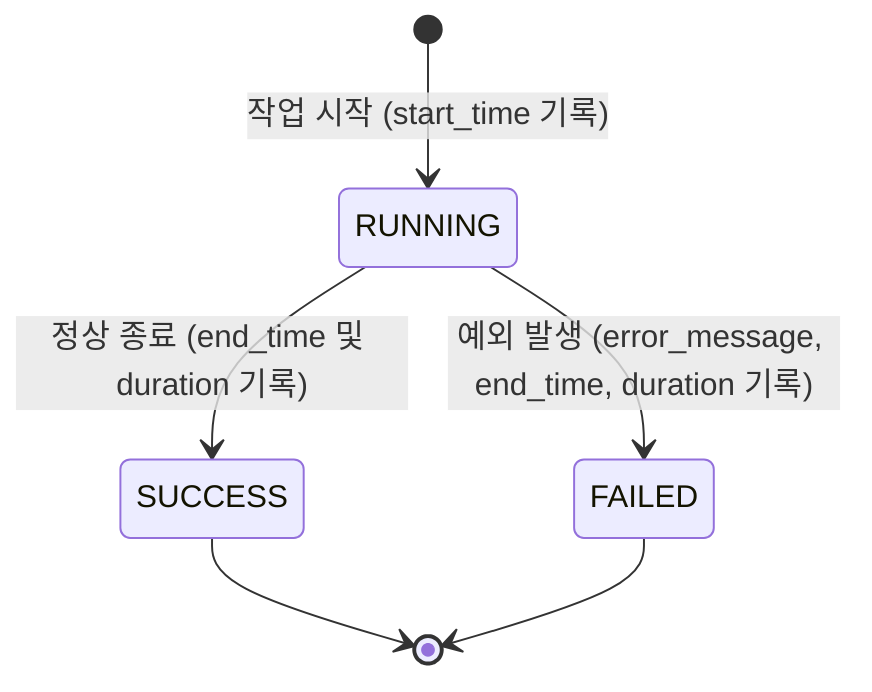

# Automation Execution Log System Specification (자동화 실행 로그 수집 체계 설계서)

이 문서는 시스템 내 자동 집계, 이메일 발송, 수동 집계 등 다양한 **Automation(자동화)** 기능이 수행될 때, 실행 시점, 소요 시간, 실행 방식(CRON/Manual), 사용자 정보 및 결과를 일관되게 기록하고 추적하기 위한 **Automation Execution Log** 체계의 상세 설계 사양을 정의합니다.

---

## 1. 설계 목적 및 필요성
- **작업 투명성 확보**: 백그라운드 크론(Cron) 작업이나 수동 실행(Manual) 작업의 성공/실패 여부와 소요 시간을 실시간 추적합니다.
- **성능 및 장애 모니터링**: 자동화 작업의 실행 주기 및 병목 구간(소요 시간 급증)을 진단하고, 장애 발생 시 원인 분석(Error Stack Trace)을 가속화합니다.
- **감사 추적성(Audit Trail)**: 수동으로 작업을 가동했을 경우, 어떤 사용자가 언제 실행했는지 상세히 기록하여 시스템 거버넌스를 강화합니다.

---

## 2. 데이터베이스 스키마 설계
기존 로그인 로그(`user_login`), 로그인 실패 로그(`user_login_failed`), 에러 감사 로그(`user_error_log`)가 보관되는 **SQLite `log.db`**에 일관성 있는 명명 규칙(`user_`)을 따라 **`user_automation_log`** 테이블을 설계합니다.

### 테이블 정의: `user_automation_log`

| 컬럼명 (Column Name) | 데이터 타입 (Data Type) | 제약 조건 (Constraints) | 설명 (Description) |
| :--- | :--- | :--- | :--- |
| **log_id** | `INTEGER` | PRIMARY KEY AUTOINCREMENT | 로그 레코드 고유 식별자 |
| **task_name** | `TEXT` | NOT NULL | 자동화 작업명 (예: `daily_aggregation`, `email_dispatch`, `manual_kpi_sync`) |
| **trigger_type** | `TEXT` | NOT NULL | 실행 유발 방식 (`CRON` or `MANUAL`) |
| **operator_id** | `TEXT` | NULLABLE | 실행 주체 사번 (MANUAL 실행 시 사번, CRON 실행 시 `SYSTEM` 또는 `NULL`) |
| **start_time** | `TEXT` | NOT NULL | 작업 시작 일시 (KST 기준 `YYYY-MM-DD HH:MM:SS`) |
| **end_time** | `TEXT` | NULLABLE | 작업 종료 일시 (KST 기준 `YYYY-MM-DD HH:MM:SS`) |
| **duration_seconds**| `REAL` | NULLABLE | 총 소요시간 (초 단위) |
| **status** | `TEXT` | NOT NULL | 작업 진행 상태 (`RUNNING`, `SUCCESS`, `FAILED`) |
| **error_message** | `TEXT` | NULLABLE | 작업 실패 시 예외 메시지 및 Stack Trace 요약 |
| **metadata_json** | `TEXT` | NULLABLE | JSON 형식의 동적 부가 정보 (예: 대상 일자, 이메일 수신자 수, 필터 옵션 등) |

```sql
-- 테이블 생성 DDL 구문
CREATE TABLE IF NOT EXISTS user_automation_log (
    log_id INTEGER PRIMARY KEY AUTOINCREMENT,
    task_name TEXT NOT NULL,
    trigger_type TEXT NOT NULL CHECK(trigger_type IN ('CRON', 'MANUAL')),
    operator_id TEXT,
    start_time TEXT NOT NULL,
    end_time TEXT,
    duration_seconds REAL,
    status TEXT NOT NULL CHECK(status IN ('RUNNING', 'SUCCESS', 'FAILED')),
    error_message TEXT,
    metadata_json TEXT
);

-- 효율적인 조회를 위한 인덱스 구성
CREATE INDEX IF NOT EXISTS idx_automation_task ON user_automation_log (task_name, start_time);
CREATE INDEX IF NOT EXISTS idx_automation_status ON user_automation_log (status);
```

---

## 3. 로깅 상태 및 생명 주기 (Life Cycle)

자동화 작업의 상태는 최초 가동 시점에 **`RUNNING`**으로 기록된 후, 최종 처리 성공/실패 여부에 따라 **`SUCCESS`** 또는 **`FAILED`**로 안전하게 업데이트되는 트랜잭션 수명 주기를 갖습니다.



---

## 4. 공통 로깅 유틸리티 (Python Interface)
개발자가 서비스 함수나 크론 스크립트에 이 시스템을 매우 손쉽게 통합할 수 있도록 **Decorator(데코레이터)** 및 **Context Manager(콘텍스트 매니저)** 두 가지 인터페이스를 제공하는 `AutomationLogger` 공통 헬퍼 클래스를 구성합니다.

> [!TIP]
> **Decorator**는 단일 함수 전체의 실행을 통째로 모니터링할 때 적합하며, **Context Manager**는 대규모 스크립트나 코드의 특정 블록만 감사하고 싶을 때 유용합니다.

```python
# app/core/utils/automation_logger.py (신규 제안 위치)
import time
import json
import traceback
import logging
from datetime import datetime
from contextlib import contextmanager
from typing import Callable, Any, Optional, Dict
import streamlit as st

from app.core.db.sqlite_utils import SQLiteDML, SQLiteDDL

logger = logging.getLogger(__name__)

class AutomationLogger:
    """자동화 작업(Cron/Manual)의 시작, 종료, 소요시간, 상태를 SQLite log.db에 영속 저장하는 헬퍼 클래스입니다."""
    
    _DB_NAME = "log"
    _TABLE_NAME = "user_automation_log"

    @classmethod
    def ensure_table(cls) -> None:
        """user_automation_log 테이블이 없으면 생성합니다."""
        try:
            ddl = SQLiteDDL(cls._DB_NAME)
            ddl.create_table(
                cls._TABLE_NAME,
                [
                    ("log_id", "INTEGER PRIMARY KEY AUTOINCREMENT"),
                    ("task_name", "TEXT NOT NULL"),
                    ("trigger_type", "TEXT NOT NULL"),
                    ("operator_id", "TEXT"),
                    ("start_time", "TEXT NOT NULL"),
                    ("end_time", "TEXT"),
                    ("duration_seconds", "REAL"),
                    ("status", "TEXT NOT NULL"),
                    ("error_message", "TEXT"),
                    ("metadata_json", "TEXT")
                ]
            )
            # 인덱스 추가 (직접 execute_script 활용)
            ddl.execute_script(f"CREATE INDEX IF NOT EXISTS idx_auto_task ON {cls._TABLE_NAME} (task_name, start_time);")
        except Exception as e:
            logger.error(f"Failed to ensure user_automation_log table: {e}")

    @classmethod
    def start_log(cls, task_name: str, trigger_type: str, operator_id: Optional[str] = None, metadata: Optional[Dict] = None) -> int:
        """작업 시작 로그를 RUNNING 상태로 기입하고 log_id를 반환합니다."""
        cls.ensure_table()
        start_time = datetime.now().strftime("%Y-%m-%d %H:%M:%S")
        metadata_str = json.dumps(metadata) if metadata else None
        
        dml = SQLiteDML(cls._DB_NAME)
        log_id = dml.execute_insert(
            f"INSERT INTO {cls._TABLE_NAME} (task_name, trigger_type, operator_id, start_time, status, metadata_json) VALUES (?, ?, ?, ?, ?, ?)",
            (task_name, trigger_type, operator_id, start_time, "RUNNING", metadata_str)
        )
        return log_id

    @classmethod
    def end_log(cls, log_id: int, status: str, error_message: Optional[str] = None, metadata_update: Optional[Dict] = None) -> None:
        """작업이 완료되었을 때 종료 상태(SUCCESS/FAILED)와 실제 소요시간을 산출하여 업데이트합니다."""
        end_time_dt = datetime.now()
        end_time_str = end_time_dt.strftime("%Y-%m-%d %H:%M:%S")
        
        dml = SQLiteDML(cls._DB_NAME)
        # 시작 시간 조회하여 소요 시간 계산
        try:
            df_start = dml.fetch_query(f"SELECT start_time, metadata_json FROM {cls._TABLE_NAME} WHERE log_id = ?", (log_id,))
            if not df_start.empty:
                start_time_str = df_start.iloc[0]["start_time"]
                start_time_dt = datetime.strptime(start_time_str, "%Y-%m-%d %H:%M:%S")
                duration = (end_time_dt - start_time_dt).total_seconds()
                
                # 메타데이터 병합 처리
                existing_metadata = {}
                if df_start.iloc[0]["metadata_json"]:
                    try:
                        existing_metadata = json.loads(df_start.iloc[0]["metadata_json"])
                    except Exception:
                        pass
                
                if metadata_update:
                    existing_metadata.update(metadata_update)
                
                metadata_str = json.dumps(existing_metadata) if existing_metadata else None
                
                dml.execute_dml(
                    f"UPDATE {cls._TABLE_NAME} SET end_time = ?, duration_seconds = ?, status = ?, error_message = ?, metadata_json = ? WHERE log_id = ?",
                    (end_time_str, duration, status, error_message, metadata_str, log_id)
                )
        except Exception as e:
            logger.error(f"Failed to update end log for ID {log_id}: {e}")

    @classmethod
    @contextmanager
    def monitor(cls, task_name: str, trigger_type: str, operator_id: Optional[str] = None, metadata: Optional[Dict] = None):
        """Context Manager 패턴으로 로그 수명 주기를 제어합니다.
        
        Usage:
            with AutomationLogger.monitor("sync_task", "CRON") as tracker:
                # 비즈니스 로직 수행
                tracker['metadata']['processed_rows'] = 1500
        """
        log_id = cls.start_log(task_name, trigger_type, operator_id, metadata)
        tracker_context = {'metadata': metadata or {}}
        try:
            yield tracker_context
            cls.end_log(log_id, "SUCCESS", metadata_update=tracker_context['metadata'])
        except Exception as e:
            error_msg = f"{str(e)}\n{traceback.format_exc()}"
            cls.end_log(log_id, "FAILED", error_message=error_msg, metadata_update=tracker_context['metadata'])
            raise e

    @classmethod
    def track(cls, task_name: str, trigger_type: str, get_operator_fn: Optional[Callable[[], Optional[str]]] = None):
        """Decorator 패턴으로 함수 전체 실행을 모니터링합니다.
        
        Usage:
            @AutomationLogger.track("daily_aggregation", "CRON")
            def run_aggregation():
                # 집계 로직
        """
        def decorator(func: Callable[..., Any]) -> Callable[..., Any]:
            def wrapper(*args, **kwargs) -> Any:
                operator_id = get_operator_fn() if get_operator_fn else None
                
                # Streamlit 환경에서 실행되는 경우 세션 사번 자동 획득 시도
                if not operator_id and trigger_type == "MANUAL":
                    try:
                        operator_id = st.session_state.get("personnel_id", None)
                    except Exception:
                        pass
                
                log_id = cls.start_log(task_name, trigger_type, operator_id)
                try:
                    result = func(*args, **kwargs)
                    cls.end_log(log_id, "SUCCESS")
                    return result
                except Exception as e:
                    error_msg = f"{str(e)}\n{traceback.format_exc()}"
                    cls.end_log(log_id, "FAILED", error_message=error_msg)
                    raise e
            return wrapper
        return decorator
```

---

## 5. UI 모니터링 연계 설계 (Streamlit Dashboard)

수집된 Automation 로그는 기존에 설계된 로그인 및 에러 모니터링 허브인 **`app/pages/_80_admin/assess_log_temp_page.py`**에 새로운 탭인 **`Automation Audit`**으로 확장 연계하여 가시성을 확보합니다.

### 5.1. UI 레이아웃 설계안
- **Metrics 요약**: 총 실행 횟수, 크론 실행 vs 수동 실행 비중, 작업 성공률(Success Rate), 평균 소요시간을 요약 표출합니다.
- **Trend 차트**: 
  - 일자별 자동화 작업 실행 상태 및 실패 현황(시계열 라인 또는 누적 막대 차트)
  - 작업명(Task Name)별 평균 소요시간(Duration Seconds) 비교 차트
- **인터랙티브 데이터 그리드**: 
  - 실시간 실행 이력 리스트업 (on_select 활성)
  - `FAILED` 상태인 행을 선택했을 시, 하단에 에러 Traceback 전문을 볼 수 있는 다이얼로그 연동 모달 제공

```
+-------------------------------------------------------------------------+
| [System Log Analysis Hub]                                               |
|                                                                         |
| (Tab 1) Visitors  (Tab 2) Security  (Tab 3) Error Audit  (Tab 4: NEW!)  |
|                                                     [ Automation Audit ]|
| +---------------------------------------------------------------------+ |
| | [ Metric Cards ]                                                    | |
| | Total Execs: 142 | SUCCESS Rate: 98.6% | Avg Duration: 14.5s        | |
| +---------------------------------------------------------------------+ |
| | [ Plots ]                                                           | |
| | [Daily Execution Trends (Status)]   [Avg Execution Time by Task]    | |
| +---------------------------------------------------------------------+ |
| | [ Real-time Automation Logs ]                                       | |
| | [ID] [Task Name]   [Trigger] [Start Time]   [Status]  [Operator]    | |
| | #101 daily_agg     CRON      10:00:00       SUCCESS   SYSTEM        | |
| | #102 manual_sync   MANUAL    10:15:12       FAILED    KIM (213003)  | |
| +---------------------------------------------------------------------+ |
| | 💡 #102 FAILED 로그가 선택되었습니다.                                   | |
| | [ View Error Details & Metadata Button ]                            | |
| +---------------------------------------------------------------------+ |
+-------------------------------------------------------------------------+
```

---

## 6. 개발 및 반영 실행 계획 (Action Items)

```mermaid
gantt
    title Automation 로그 도입 일정 계획
    dateFormat  YYYY-MM-DD
    section 스키마 및 가이드 수립
    설계서 정의 & 아키텍처 협의       :active, p1, 2026-06-10, 1d
    section 하네스 검증
    tests/ 하위에 독립 테스트 수행   :after p1, p2, 1d
    section 프로덕션 반영 (승인 후)
    app/core/ 내 공통 로깅 모듈 추가  :after p2, p3, 1d
    app/pages/ 대시보드 탭 연계       :after p3, p4, 1d
```

> [!IMPORTANT]
> **프로덕션 코드 안전성 확보 수칙 (Safety Guardrails)**
> `GEMINI.md` 수칙에 의거하여, 사용자의 명시적인 수정 허가(예: "공통 모듈 생성 및 대시보드 반영을 진행해 주세요")를 획득하기 전까지 프로덕션 디렉터리(`app/core/`, `app/pages/`) 내 코드는 일체 직접 수정하지 않습니다. 
> 허가 전까지는 독립된 공간인 **`tests/test_automation_log.py`**를 활용하여 블랙박스 스탠드얼론 방식으로 모킹 검증을 안전하게 마친 후 보고합니다.
