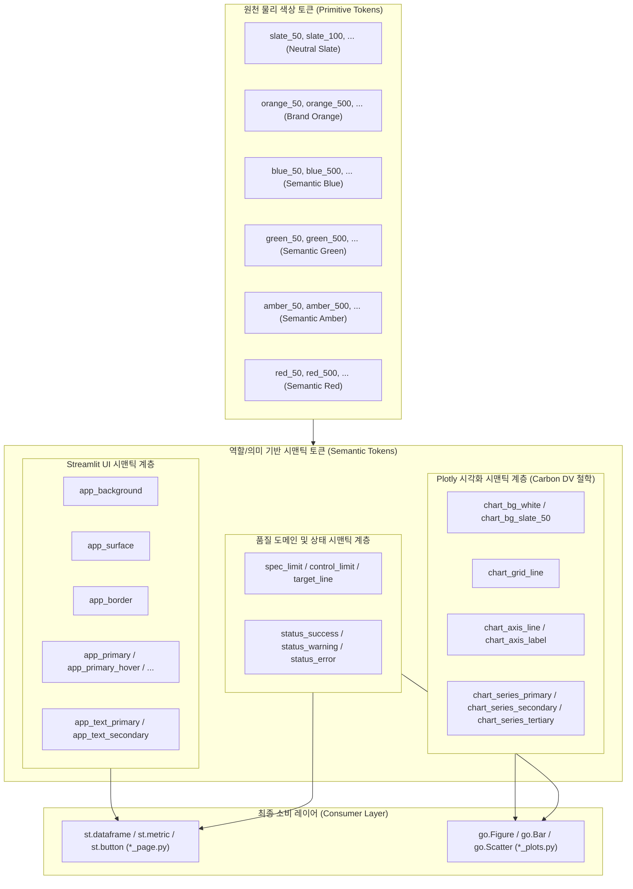

# L2-color-system.md (L2 대시보드 컬러 및 시각화 디자인 시스템 규칙)

이 문서는 프로젝트 전반에서 사용되는 UI(Streamlit) 및 데이터 시각화(Plotly) 요소의 색상 사용을 통제하는 단일 진실 공급원(SSOT) 규칙 정의서입니다.

---

## 1. 기본 아키텍처 및 철학

본 프로젝트의 컬러 시스템은 다음 두 가지 핵심 디자인 철학을 기반으로 엄격하게 분리하여 통제합니다.

> **Streamlit UI는 프로젝트 자체 원천 컬러셋을 적용하고,**  
> **Plotly 데이터 시각화 팔레트는 Carbon Data Visualization 철학을 철저히 따른다.**



---

## 2. 컬러 시스템 핵심 원칙

### 2.1 원천 물리 색상 토큰 (Primitive Tokens)의 은닉 및 간접 참조
- `slate_50`, `orange_500`, `red_700`처럼 직관적인 이름을 사용하는 Primitive Token은 시스템 가독성과 넓은 표현 범위를 위해 다수 정의되어도 무방합니다.
- **[핵심 의무 제약]**: **개별 페이지(`*_page.py`) 및 시각화 플롯(`*_plots.py`) 코드에서는 Primitive Token을 절대 직접 호출하여 사용하지 않습니다.**
- 모든 요소는 반드시 추상화된 **Semantic Token**을 통해 간접 참조되어야 합니다.

```text
[올바른 참조 흐름]
Primitive Token  ──>  Semantic Token  ──>  Page / Plot / Table

[절대 금지 흐름]
Primitive Token  ──x──  Page / Plot / Table
```

---

### 2.2 Primary 컬러의 주황색 고정 및 용도 제한
앱의 브랜드 아이덴티티와 주요 사용자 동작(Action)을 담당하는 Primary 컬러는 **주황색(Orange) 계열**로 고정합니다.

```python
# app/core/constants/ui.py 정의 표준
app_primary = orange_500
app_primary_hover = orange_600
app_primary_active = orange_700
app_primary_soft = orange_50
```

- **[사용처 제한]**: 주황색 컬러는 오직 다음 용도로만 극도로 제한되어 적용되어야 하며, 데이터 일반 카테고리나 구분선 등에 무분별하게 퍼지는 것을 금지합니다.
  1. Primary Button (주요 조작 버튼)
  2. 필터 및 메뉴의 선택 상태 (Active State)
  3. UI 상의 핵심 정보 강조 (Highlight)
  4. 파일럿(Pilot) 단계 등 도메인 상 주황색이 특수한 의미를 내포하는 경우

---

### 2.3 Streamlit UI와 Plotly 데이터 시각화의 물리적/논리적 영역 분리

#### ① Streamlit UI 색상 관리
Streamlit 영역은 웹 어플리케이션의 뼈대와 컨텍스트를 구성하는 영역으로, **웹 표준 계층 시맨틱**으로 엄격하게 가두어 사용합니다.
- `app_background`: 전체 화면 배경색
- `app_surface`: 주요 카드, 컨테이너, 모달, 익스팬더 등의 배경 표면색
- `app_border`: 카드 테두리, 구분선 및 테이블 격자 경계선
- `app_text_primary` / `app_text_secondary`: 폰트 가독성을 지배하는 주/부 텍스트 색상
- `status_success` / `status_warning` / `status_error`: 시스템 성공, 경고, 실패 토스트 및 테이블 조건부 서식 음영색

#### ② Plotly 시각화 색상 관리
Plotly 영역은 정밀 데이터를 시각 분석하는 데이터 캔버스로, **IBM Carbon Data Visualization 철학**에 기반하여 설계 및 시인성을 유지해야 합니다.
- **차트 기본 구성 요소**:
  - `chart_bg_white` / `chart_bg_slate_50`: 차트 도화지(Plot Background) 배경색
  - `chart_grid_line`: 가독성을 위한 그리드 선색
  - `chart_axis_line` / `chart_axis_label`: 축 기준선 및 축 눈금 라벨 색상
- **데이터 시리즈 (Categorical Colorway)**:
  - 다중 카테고리(Categorical)나 연도별 트렌드를 그릴 때, 물리적 색상을 직접 순서대로 지정하는 것을 지양하고, **의미론적 시리즈 계층 토큰**을 반드시 우선 적용합니다:
    - **`chart_series_primary`**: 현재 연도 데이터, 가장 중요하게 강조해야 할 핵심 데이터 시리즈 (Brand Orange)
    - **`chart_series_secondary`**: 비교군 연도, 차순위 중요도를 가진 대비 시리즈 (Slate-400 중간 톤)
    - **`chart_series_tertiary`**: 2개년 전 과거 데이터, 흐름만 제공하는 최하위 백그라운드 보조 시리즈 (Slate-200 밝은 톤)
- **도메인 참조선 (Reference Line Style)**:
  - 품질 규격 상하한선, 관리 임계선 및 평균/목표 기준선 등은 도메인 전용 토큰을 매핑합니다:
    - **`spec_limit`**: 규격 한계선 (USL/LSL)
    - **`control_limit`**: 관리 한계선 (UCL/LCL)
    - **`target_line`**: 목표치 라인
    - **`mean_line`**: 전체 데이터 평균선

---

### 2.4 IBM Carbon Categorical Palette 적용 규칙 (Categorical Palettes)
- **[공식 14-색 시퀀스]**: 다중 범주형 데이터(Categorical) 시각화 시, neighboring 색상 간의 시각적 식별성과 웹 접근성(WCAG) 규격을 보장하기 위해 반드시 아래 정의된 **IBM Carbon 14-색 공식 sequence**를 엄격히 준수하여 적용해야 합니다.
- **[강제 순서 적용]**: 범주 수에 따라 단일 색상을 오버라이드하거나 전체 목록을 주입할 경우, 임의로 순서를 뒤섞거나 특정 색상만 단독 발췌하여 사용하는 행위를 금지하며, 무조건 1번부터 순차적으로 주입해야 합니다.
- **[Alert 컬러와의 격리]**: `carbon_red_50_seq` (Red 50, `#fa4d56`) 등은 일반 범주 시각화에만 사용하며, 에러나 통과 실패 등 상태 경고(Alert)를 강조할 때는 이 범주색이 아닌 `status_error` (`#dc2626`) 또는 `spec_limit` (`#b91c1c`)과 같은 전용 상태 시맨틱 토큰을 사용해 기능적 의미를 완전히 격리해야 합니다.

| Order | 토큰명 | 컬러 이름 | HEX 코드 | 주용도 |
| :--- | :--- | :--- | :--- | :--- |
| 01 | `carbon_purple_70` | Purple 70 | `#6929c4` | 1순위 범주 그룹색 |
| 02 | `carbon_cyan_50` | Cyan 50 | `#1192e8` | 2순위 범주 그룹색 |
| 03 | `carbon_teal_70_seq` | Teal 70 | `#005d5d` | 3순위 범주 그룹색 |
| 04 | `carbon_magenta_70` | Magenta 70 | `#9f1853` | 4순위 범주 그룹색 |
| 05 | `carbon_red_50_seq` | Red 50 | `#fa4d56` | 5순위 범주 그룹색 |
| 06 | `carbon_red_90_seq` | Red 90 | `#570408` | 6순위 범주 그룹색 |
| 07 | `carbon_green_60_seq` | Green 60 | `#198038` | 7순위 범주 그룹색 |
| 08 | `carbon_blue_80_seq` | Blue 80 | `#002d9c` | 8순위 범주 그룹색 |
| 09 | `carbon_magenta_50_seq` | Magenta 50 | `#ee538b` | 9순위 범주 그룹색 |
| 10 | `carbon_yellow_50` | Yellow 50 | `#b28600` | 10순위 범주 그룹색 |
| 11 | `carbon_teal_50_seq` | Teal 50 | `#009d9a` | 11순위 범주 그룹색 |
| 12 | `carbon_cyan_90` | Cyan 90 | `#012749` | 12순위 범주 그룹색 |
| 13 | `carbon_orange_70` | Orange 70 | `#8a3800` | 13순위 범주 그룹색 |
| 14 | `carbon_purple_50` | Purple 50 | `#a56eff` | 14순위 범주 그룹색 |
