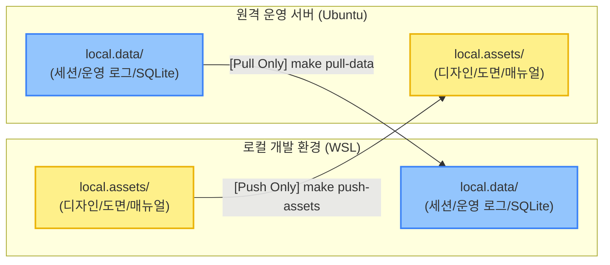

# L2-sync-policy.md (L2 로컬 폴더 동기화 및 Rsync 운영 규칙)

이 문서는 개발 환경(WSL/Local)과 운영 서버(Ubuntu) 간에 Git으로 관리되지 않는 로컬 데이터(`local.` 접두사 폴더)를 안전하고 신속하게 동기화하기 위한 **Rsync 동기화 정책 및 운영 규칙**을 정의하는 **단일 진실 공급원(SSOT) 동기화 가이드라인**입니다.

---

## 1. 동기화 기본 아키텍처 및 원칙 (Core Principles)

본 프로젝트는 소스 코드의 이력 관리를 담당하는 **Git**과, 대용량 정적 자원 및 세션/운영 실데이터를 관리하는 **Rsync**를 엄격히 분리하여 사용합니다. `local.`으로 시작하는 모든 폴더는 Git 형상 관리 대상에서 제외(`.gitignore`에 등록)되며, 오직 이 규칙에서 정의하는 단방향 Rsync 정책을 통해서만 동기화됩니다.



### ① 단방향 방향성 준수 (Strict One-Way Direction)
각 로컬 폴더는 고유의 "마스터(Master) 환경"을 가지며, 동기화 방향은 언제나 한 방향으로만 흐릅니다. 역방향 동기화(예: 서버의 애셋을 로컬로 덮어쓰거나, 로컬의 테스트 데이터를 서버 운영 데이터에 덮어쓰는 행위)는 원본 데이터 유실 및 운영 장애의 원인이 되므로 **절대로 금지**됩니다.

---

## 2. 폴더별 동기화 상세 규정 (Folder Sync Specifications)

### ① `local.assets/` (로컬 애셋 - Push Only)
* **목적 및 구성**: 품질 매뉴얼, 설계 도면, UI 이미지, 기획서 등 용량이 크고 변하지 않는 정적인 로컬 참조 자원들을 관리합니다.
* **동기화 방향**: **로컬 개발 환경(WSL) ➔ 원격 운영 서버(Ubuntu)**
* **마스터 권한(Master)**: 로컬 개발 환경(WSL)
  * 로컬에서 애셋 파일을 추가, 변경, 삭제하고 이를 서버로 밀어넣는(Push) 구조입니다.
* **실행 명령어**:
  ```bash
  make push-assets
  # 내부 실행: bash automation/sync_local_assets.sh
  ```
* **Rsync 핵심 옵션 및 동작 방식**:
  - `rsync -avz --progress --delete` 옵션을 사용합니다.
  - `--delete` 옵션이 적용되어 있으므로, **로컬(WSL)에서 삭제된 파일은 원격 서버에서도 자동으로 삭제**되어 완벽한 싱크를 유지합니다. 따라서 서버 환경에서 파일을 임의로 수정/추가하더라도 로컬에서 Push가 실행되면 모두 덮어씌워지거나 삭제됩니다.

### ② `local.data/` (로컬 데이터 - Pull Only)
* **목적 및 구성**: 운영 및 테스트 과정에서 실시간으로 축적되는 세션 로그, SQLite DB(메타데이터, 로그), 운영 데이터 집계 스냅샷 등을 보관합니다.
* **동기화 방향**: **원격 운영 서버(Ubuntu) ➔ 로컬 개발 환경(WSL)**
* **마스터 권한(Master)**: 원격 운영 서버(Ubuntu)
  * 운영 서버의 실제 축적 데이터를 수신하여 로컬 개발 환경에서 동일한 데이터 컨텍스트로 테스트 및 디버깅을 수행할 수 있게 합니다.
* **실행 명령어**:
  ```bash
  make pull-data
  # 내부 실행: bash automation/sync_local_data.sh
  ```
* **Rsync 핵심 옵션 및 동작 방식**:
  - `rsync -avz --progress --delete` 옵션을 사용합니다.
  - `--delete` 옵션이 적용되어 있으므로, **원격 서버에 존재하지 않는 로컬(WSL) 내의 임시 데이터는 동기화 시 자동으로 삭제**됩니다. 로컬에서 임시로 생성한 데이터가 유실되지 않도록 주의해야 합니다.

---

## 3. 환경 변수 및 보안 수칙 (Environment & Security Standards)

서버의 접속 정보 및 인증 키가 소스코드 또는 쉘 스크립트 상에 직접 노출될 경우 심각한 보안 취약점이 될 수 있습니다. 따라서 아래 규정을 반드시 준수합니다.

### ① `.env` 파일 관리 및 은닉
* 원격 서버 접속을 위한 모든 변수는 프로젝트 루트의 `.env` 파일에만 정의하며, 절대 Git에 커밋되지 않도록 처리합니다.
* `.env` 파일은 오직 로컬(WSL)과 원격 서버 환경에 개별적으로 수동 배치하여 관리해야 합니다.

### ② 필수 및 보완 환경 변수 명세
`.env` 파일에 정의되어야 하는 변수명과 역할은 아래와 같습니다.

| 변수명 | 설명 | 기본값 / 예시 |
| :--- | :--- | :--- |
| **`DEPLOY_SERVER_IP`** | 원격 운영 서버의 IP 주소 (필수 설정) | `192.168.x.x` |
| **`DEPLOY_SERVER_USER`** | SSH 및 Rsync 접속용 서버 사용자 계정 | `jumasi` |
| **`DEPLOY_SERVER_PORT`** | SSH 접속 포트 번호 | `22` |
| **`DEPLOY_SERVER_KEY`** | SSH 개인키 파일 절대/상대 경로 | `~/.ssh/id_ed25519` |
| **`DEPLOY_SERVER_PATH`** | 원격 서버의 `local.assets/` 저장 경로 | `/home/jumasi/workstation/local.assets/` |
| **`DEPLOY_DATA_SERVER_PATH`**| 원격 서버의 `local.data/` 저장 경로 | `/home/jumasi/workstation/local.data/` |

---

## 4. 예외 상황 및 핵심 금지 제약 (Forbidden Practices)

### [CRITICAL] 역방향 rsync 직접 실행 금지
* `local.assets/`에 대해 서버에서 파일을 Pull 해오거나 (`rsync`로 서버 ➔ 로컬 실행), `local.data/`에 대해 로컬에서 서버로 Push 해버리는 명령어(`rsync`로 로컬 ➔ 서버 실행)는 **데이터 정합성을 깨뜨리고 실데이터를 유실시킬 수 있으므로 절대 엄금**합니다.
* 동기화 수행 시 반드시 검증된 스크립트(`automation/sync_local_assets.sh`, `automation/sync_local_data.sh`) 또는 매핑된 단축 명령어(`make push-assets`, `make pull-data`)만 활용하여 예기치 못한 인적 실수를 방지합니다.

### [주의] `.gitignore` 등록 및 형상 관리 격리
* `local.assets/` 및 `local.data/` 폴더 하위의 모든 내용은 Git의 추적 대상에서 영구 격리되어야 합니다.
* 단, 빈 폴더 구조를 유지하기 위해 필요한 최소한의 `.gitkeep` 파일 생성을 제외하고는 어떠한 바이너리나 대용량 파일도 Git 리포지토리에 업로드해서는 안 됩니다.

---

## 5. AI 에이전트(Antigravity)를 위한 강제 준수 사항

1. **임의의 rsync 명령어 실행 통제**: 에이전트는 사용자의 동의 없이 직접 `rsync` 명령어를 독자적으로 호출할 수 없습니다. 동기화가 필요한 경우 반드시 `make push-assets` 또는 `make pull-data`를 사용할 것을 **제안하거나 유도**해야 합니다.
2. **동기화 실패 트러블슈팅 가이드**: 동기화 실행 중 오류가 발생하는 경우, `.env` 파일의 유효성, SSH 키의 권한 및 접속 상태, 대상 IP의 방화벽 등을 순차적으로 분석하도록 유도합니다.
3. **규칙 문서의 무단 변경 차단**: 본 문서는 동기화 핵심 규칙을 보관하는 공간이므로, 이 규칙을 수정 및 갱신할 때도 `GEMINI.md`에 명시된 **Safety Lock** 프로세스를 거쳐 사용자의 명시적인 동의 하에 `[RULE]` 태그를 달아 커밋 및 적용해야 합니다.
